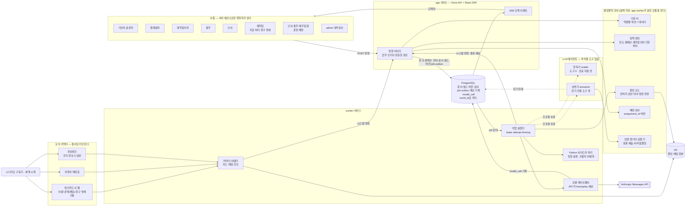
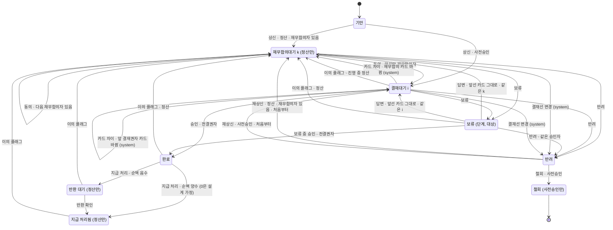
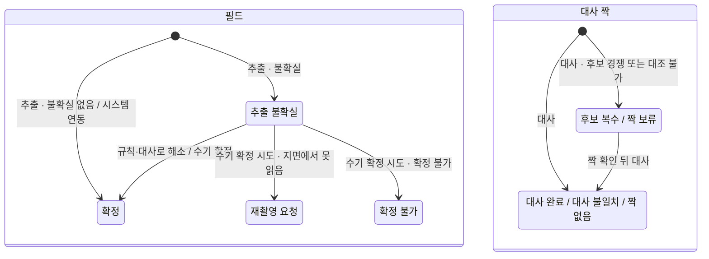

# 아키텍처 — 에이전트·코드·사람·모의 커넥터의 경계

- **날짜**: 2026-09-22
- **맥락 티켓**: #10 (에이전트 아키텍처), #9 (기술 스택), #17 (상태 어휘 — §5·§7)
- **상태**: #10·#17 결정 반영. 이 문서는 지도다. 논증은 ADR과 비교 문서가 갖고, 여기서는 구성과 흐름을 보여 주고 그쪽을 가리킨다.

## 1. 읽는 법

- **범위.** 이 MVP(`docs/PRD.md`)의 출장 사전승인·정산 흐름에서 LLM 에이전트·결정론적 코드·사람·모의 커넥터가 어디서 갈리는가.
  제품 코드는 없다. 코드 블록은 모두 설명용 스케치이고 구현이 아니다.
- **용어**는 `CONTEXT.md`가 정한다. **결정**은 ADR이 정한다. 이 문서의 문장과 ADR이 어긋나면 ADR이 이긴다.
- **비교 문서**는 `docs/research/agent-architecture-comparison.md`다. A1–A15(합의)는 `:48-62`, U1–U6(사용자 결정)은 `:175-180`, C1–C9(코디네이터 결정)는 `:191-199`에 있다. #17의 비교 문서(`docs/research/state-vocabulary-comparison.md`)는 **상태 비교 문서**라고 부르고, 그 번호는 주로 ADR-0023–0028을 거쳐 가리키고, §12는 그 줄을 직접 가리킨다.
  레인 인용(codex·grok·claude §N)은 비교 문서 §0(`:11-19`)이 가리키는 #10 제안서의 절이다. `slipscan:`은 `/Users/astralpig/DEV/fc-Agentic-Workflow-prac`의 파일이다.
- `[설계 가정]`은 규정·ADR·비교 문서의 결정이 아니라 이 문서가 구현을 위해 둔 자리다. 이름·수치·세부는 구현에서 바꿀 수 있다.

| ADR | 한 줄 |
| --- | --- |
| [0011](adr/0011-messages-api-direct-waits-are-document-state.md) | Messages API 직접 호출, 내구 실행 계층 없음, 사람 대기는 문서 상태, 미정 전이는 이름 붙은 거부 |
| [0012](adr/0012-transition-audit-provenance-in-one-transaction.md) | 전이·감사·출처·job·outbox는 한 트랜잭션, 행위자와 책임자를 따로 적는다 |
| [0013](adr/0013-postgres-object-storage-isolated-by-world-id.md) | PostgreSQL + R2, `world_id` 격리, 기한은 저장하지 않는다 |
| [0014](adr/0014-apv-9-3-exposed-declaratively.md) | 재무합의 설정값(`APV-9-3`)은 읽기 전용 표시, 판 1 조합만 실행 |
| [0015](adr/0015-typescript-web-stage-sse-no-unverified-answer-text.md) | TypeScript·Hono, 단계만 SSE, 검증 전 답변 문장 비노출, Python 사이드카 자리 |
| [0016](adr/0016-record-and-replay-model-calls.md) | 모든 모델 호출을 기록·재생, `REPLAY_MISS` |
| [0017](adr/0017-public-demo-single-vm-replay-default-capped-live.md) | 단일 VM compose, 공개 링크는 재생 기본, 실시간 판독 상한 |
| [0018](adr/0018-two-model-contracts-no-side-effect-tools.md) | LLM 에이전트는 판독기·답변기 둘, 호출 지점 다섯, 부작용 도구 없음 |
| [0019](adr/0019-non-approval-owner-is-assigned-operations-person.md) | 비결재 조작의 책임자는 팀장이 배정한 업무 운영 담당자 |
| [0020](adr/0020-hold-answer-slots-and-server-templates.md) | 보류 답변은 슬롯 + 서버 템플릿, 읽기 전용 도구 셋 |
| [0021](adr/0021-three-read-only-mock-connectors-no-erp.md) | 모의 커넥터 셋, 모두 읽기 전용, ERP 없음, 카드 이용 내역 매일 |
| [0022](adr/0022-policy-amendment-by-ceo-no-in-app-publishing.md) | 규정 개정권자는 대표이사, 앱 안 게시 없음, 판 적재 이벤트 |
| [0023](adr/0023-document-and-evidence-axes-named-rejections.md) | 업무 상태는 문서 축과 증빙 축 둘, 되돌림은 문서 축에만, 거절에는 이유를 말하는 이름 |
| [0024](adr/0024-rejection-resubmission-and-card-bound-approvals.md) | 반려는 문서 전체를 기안자에게, 재상신은 처음부터, 같은 차수 안은 카드 차이, 부분 승인 불채택 |
| [0025](adr/0025-withdrawal-only-for-preapproval.md) | 반려된 사전승인만 철회(출장 취소), 정산은 닫지 못한다 |
| [0026](adr/0026-hold-answer-deadline-time-changes-no-state.md) | 시간은 상태를 바꾸지 않는다, 기안자 답변 기한, 보류 중 결정 |
| [0027](adr/0027-reopen-returns-to-first-finance-consent.md) | 정산 재심은 재무합의 첫 단계부터, 바뀐 것이 없으면 원 완료, 사전승인은 다시 열지 않는다 |
| [0028](adr/0028-negative-net-goes-to-repayment-pending.md) | 순액 음수는 `반환 대기` → 반환 확인 → `지급 처리됨` |

## 2. 구성도



구성도는 claude §1의 그림을 결정에 맞게 고친 것이다. 책임자 해석기는 배정 검사로(U1), 판독기의 호출 지점은 넷으로(U6) 바뀌었다.

- **DB로 들어가는 쓰기 길은 명령 처리기 하나다.** 사람·작업 실행기·커넥터 어댑터가 모두 명령을 낸다. 에이전트는 명령을 내지 않고 값을 돌려줄 뿐이다(A1, [ADR-0018](adr/0018-two-model-contracts-no-side-effect-tools.md) 결정 5).
- **서비스 배치**는 [ADR-0017](adr/0017-public-demo-single-vm-replay-default-capped-live.md)의 compose다 — app, worker, postgres, 외부 R2(`docs/adr/0017-public-demo-single-vm-replay-default-capped-live.md:26-32`).
  API 키는 worker만 쓴다(`:41`).
- **SSE는 단계만 보낸다.** 이벤트의 `id`는 영속 순번이고, 보류 답변은 토큰을 흘리지 않는다(`docs/adr/0015-typescript-web-stage-sse-no-unverified-answer-text.md:23-26`).
- **Python 사이드카**는 `job`의 한 종류로 붙는 자리다(`docs/adr/0015-typescript-web-stage-sse-no-unverified-answer-text.md:29`). 방향 분류기 가중치는 지금 채택하지 않는다(A13, §10).
- **시나리오 구동기**는 무대다. 제품 코어는 구동기를 모르고 커넥터 출력만 본다(claude §1, §4.4.5) `[설계 가정]`.

## 3. 경계 정당화 표

경계마다 이유를 실패 격리·권한·책임 중 하나로 댄다. 셋 중 어느 것으로도 설명되지 않는 경계는 두지 않았다(아래 "없앤 경계").

| 경계 | 이유 | 이 경계가 없으면 생기는 구체적 실패 | 근거(파일:줄) |
| --- | --- | --- | --- |
| 판독기 ↔ 답변기 | 실패 격리 | 영수증·여행사 메일에 심긴 지시문이, 계산 기록을 읽고 승인자에게 문장을 내는 맥락에 들어간다 | `docs/design/receipt-pipeline.md:261`, 비교 문서 `:80`. 여행사 입력이 메일이라는 것은 `docs/company/tools.md:15` |
| LLM 호출 ↔ 명령 처리기 | 권한 | 모델이 전이·라우팅·값 확정을 일으킨다. 결재 행위자가 에이전트인 이벤트가 생기고, A1의 업무 쓰기 권한 경계를 어긴다. 사람 확인·반복 확인·보상까지 함께 필요해지면 ADR-0011 반증 1도 열린다(§4.2) | `CONTEXT.md:331`, `docs/adr/0012-transition-audit-provenance-in-one-transaction.md:35-36`, `docs/PRD.md:141`, `docs/adr/0011-messages-api-direct-waits-are-document-state.md:89` |
| 판독값 ↔ 판정 | 실패 격리 | 모델의 오독이 한도·수취 의무 판정에 곧바로 들어간다 | `docs/adr/0008-extraction-uncertainty-is-first-class.md:32`, `PRC-11-2`(`docs/company/travel-procedure.md:192`) |
| 분류 스키마 ↔ 추출 스키마 (에이전트 경계가 아니라 스키마 경계, C1) | 실패 격리 | 한 응답이 유형과 금액을 같이 쓰면 검산을 통과하는 유형 쪽으로 금액을 맞춘다(grok §3.3 1행) | `docs/design/receipt-pipeline.md:65-66`, 비교 문서 `:77`, `:191` |
| 정책 엔진 ↔ 답변기 | 책임 | 승인자에게 보인 숫자가 계산 기록으로 거슬러 가지 않고, 답변이 새 판정 입력을 만든다 | `docs/PRD.md:45`, `:154`, `docs/adr/0012-transition-audit-provenance-in-one-transaction.md:43` |
| 명령 처리기 ↔ 작업 실행기 (API 호출은 트랜잭션 밖) | 실패 격리 | 모델 응답 지연이 DB 트랜잭션과 행 잠금을 붙든다. 결재 클릭이 모델 호출 뒤에 줄을 선다 | `docs/adr/0011-messages-api-direct-waits-are-document-state.md:46` |
| 사람 결재 ↔ 실행 `job` | 책임 | 재시도한 워커가 승인자 행위를 재생하거나, 사람 대기 때문에 임대를 붙든다(codex §1.3) | `docs/adr/0011-messages-api-direct-waits-are-document-state.md:31-32`, `docs/adr/0012-transition-audit-provenance-in-one-transaction.md:35-36` |
| 모델 게이트웨이 | 권한 | 키가 app·브라우저로 새거나, 재생 중 몰래 live 호출이 나가거나, 예산 상한이 우회된다 | `docs/adr/0017-public-demo-single-vm-replay-default-capped-live.md:41`, `:42-45`, `docs/adr/0016-record-and-replay-model-calls.md:31` |
| 답변 검증기 ↔ 화면 | 실패 격리 | 인용·숫자 검사를 통과하지 못한 문장이 승인자에게 먼저 보인다 | `docs/adr/0015-typescript-web-stage-sse-no-unverified-answer-text.md:26` |
| 커넥터 어댑터 ↔ 명령 처리기 | 책임 | 카드 줄·조직 정보가 출처·책임자 없이 행으로 생긴다. S11의 누락 0을 어긴다 | `docs/PRD.md:161`, `CONTEXT.md:345`, `docs/adr/0012-transition-audit-provenance-in-one-transaction.md:41` |
| 커넥터 어댑터 사이 | 실패 격리 | 카드 파일의 지연·깨진 줄이 여행사 메일 수신이나 조직 스냅샷 동기화까지 멈춘다 `[유도]`(codex §1.3 7행을 커넥터 셋에 옮김) | [ADR-0021](adr/0021-three-read-only-mock-connectors-no-erp.md) 결정 6, `docs/company/tools.md:11-16` |
| 한성워크 모의 ↔ 앱의 결재 상태 | 책임 | 결재 상태가 두 곳에 살아 큐와 감사가 어긋나고, 어느 쪽이 원장인지 가를 수 없다 | A8, `docs/PRD.md:24`. 내구 실행 계층의 이중 상태(`docs/adr/0011-messages-api-direct-waits-are-document-state.md:74-75`)에서 끌어온 것은 유추다 |
| 바깥으로 쓰기 없음 (모의 커넥터 읽기 전용) | 실패 격리 | 커밋 전 외부 부작용의 재시도를 멱등 key로 막지 못한다(ADR-0011 반증 3) | `docs/adr/0011-messages-api-direct-waits-are-document-state.md:93`, [ADR-0021](adr/0021-three-read-only-mock-connectors-no-erp.md) 결정 2 |
| 운영 배정 ↔ 실행 | 책임 | 책임자 없는 조작이 먼저 돌고, 뒤에 기안자·admin 같은 기본값으로 책임자가 채워진다 | `docs/adr/0012-transition-audit-provenance-in-one-transaction.md:44`, [ADR-0019](adr/0019-non-approval-owner-is-assigned-operations-person.md) 결정 6·7 |
| 업무 담당자 ↔ 내부감사(admin) | 권한 | 감사자가 값을 고치고 자기 변경을 감사한다 | `docs/adr/0002-admin-read-only-audit-axis.md:23-27` |
| 사람 역할 사이 | 권한 | 자기 결재, 결재선 밖 사람의 결재가 생긴다 | `APV-8-2`(`docs/company/approval-matrix.md:176`), `:317` |
| 세계(`world_id`) | 권한 | 한 방문자·평가 시나리오의 명령이 다른 세계의 결재·카드 줄을 읽거나 바꾼다 | `docs/adr/0013-postgres-object-storage-isolated-by-world-id.md:31-32` |
| 결재 ↔ 인사·총무 인계 | 책임 | 예약·근태 반영에 결재선이 생겨 판단 봉우리가 늘어난다 | `PRC-8-3`(`docs/company/travel-procedure.md:152`), `docs/company/approval-matrix.md:317` |
| 방향 분류 사이드카 ↔ 추출 | 실패 격리 | 검증되지 않은 자산이나 사이드카 장애가 추출 전체를 멈춘다. 그래서 자산이 없으면 EXIF만 쓰고 진행한다(C4) | `docs/adr/0015-typescript-web-stage-sse-no-unverified-answer-text.md:29`, `:70-72` |
| 시나리오 구동기 ↔ 제품 코어 | 실패 격리 | 제품이 무대의 정답(진짜 짝, 진짜 금액)을 읽으면 독립 재계산과 #11의 판정이 오염된다(claude §2.2 B11) | `docs/adr/0013-postgres-object-storage-isolated-by-world-id.md:37`, `docs/PRD.md:147` |

**없앤 경계.** 세 이유 중 어느 것으로도 설명되지 않아 두지 않았다. 논증은 [ADR-0018](adr/0018-two-model-contracts-no-side-effect-tools.md) 근거와 claude §2.3에 있다.

| 없앤 경계 | 왜 |
| --- | --- |
| 인사·총무·재무 부서 에이전트, 오케스트레이터 에이전트 | 인사·총무의 일은 사람의 상태 전이이고 재무의 판정은 코드다(`PRC-8-3`, `docs/design/receipt-pipeline.md:74`). A2 |
| 영수증 판독기 ↔ 여행사 메일 판독기 | 둘 다 신뢰할 수 없는 문서 1건을 도구 없이 읽는다. 산출물을 닫는 사람이 다른 것은 책임자 표의 행이 다른 것이다. A4 |
| 정책 판정 에이전트 | 규정의 값은 기계 판독 블록에 산다(`docs/adr/0005-policy-source-of-truth.md:30-32`). A6 |
| 승인 카드 요약 에이전트 | 카드 본문은 구조화 필드와 원문 인용이다(`CONTEXT.md:370`, `docs/PRD.md:43`) |

## 4. 모델 계약

"에이전트 하나"는 (시스템 프롬프트, 출력 스키마, 도구 허용 목록)의 묶음이다(A3). LLM 에이전트는 판독기와 답변기 둘이다(C1).
결정과 근거는 [ADR-0018](adr/0018-two-model-contracts-no-side-effect-tools.md)이다.

### 4.1 호출 지점 다섯

| # | 호출 지점 | 에이전트 | 입력 | 출력 | 근거 |
| --- | --- | --- | --- | --- | --- |
| 1 | 증빙 ① 분류 | 판독기 | 증빙 이미지 | 지면 단서·공급 국가·유형 추정 | `docs/design/receipt-pipeline.md:65` |
| 2 | 증빙 ② 유형별 추출 | 판독기 | 같은 이미지 + 코드가 고른 경로 | 세 칸 필드(`raw`·값·`_status`)·항목·바운딩 박스 | `docs/design/receipt-pipeline.md:66`, `docs/adr/0008-extraction-uncertainty-is-first-class.md:27` |
| 3 | 여행사 메일 판독 | 판독기 | 메일 원문·첨부 1건 | 세 칸 값. 출처는 `에이전트 추출` | `CONTEXT.md:345`, A4 |
| 4 | 기안 초안 구조화 | 판독기 | 기안자가 준 서술·첨부 | 폼 후보(초안 artifact). 판정 입력이 아니다 | U6, codex §5.3 |
| 5 | 보류 답변 | 답변기 | 승인자의 질문 + 작업 행에 고정된 문서 revision | 슬롯 답변 | `docs/PRD.md:45`, [ADR-0020](adr/0020-hold-answer-slots-and-server-templates.md) |

- 판독기의 넷은 **별도 호출·별도 스키마**다(C1). 판독기에게 도구는 없다.
- [ADR-0011](adr/0011-messages-api-direct-waits-are-document-state.md)은 넷을 셌고, U6으로 기안 초안이 더해졌다(`docs/adr/0011-messages-api-direct-waits-are-document-state.md:16-17`의 보완).
- 기안 초안은 정책 판단·초과 사유의 인정·빠진 사실의 창작을 하지 않는다. 기안자가 고쳐 상신하고, 상신은 사람의 명령이다(codex §5.3, 비교 문서 `:184`).

### 4.2 부작용 도구

**에이전트에게 부작용 도구가 있는가: 아니오**(A1). 판독기는 도구가 0개, 답변기는 읽기 전용 셋이다.
에이전트의 출력은 작업 행에 고정된 결과 수락 계약에 따라 코드가 저장한다(§5).

그래서 ADR-0011 반증 1은 열리지 않는다. 반증 1은 (a) 실행 전 사람 확인이 필요한 부작용 도구, (b) 한 작업 안의 사람 확인 지점 둘 이상, (c) 그 사이의 보상 동작이 함께 성립해야 열린다(`docs/adr/0011-messages-api-direct-waits-are-document-state.md:89`).
이 설계에는 셋 다 없다. 조건별 표는 [ADR-0018](adr/0018-two-model-contracts-no-side-effect-tools.md) 근거에 있다. 기안 초안도 이 답을 바꾸지 않는다 — 에이전트는 초안을 돌려줄 뿐이다(비교 문서 `:184`).

### 4.3 답변기 — 슬롯·템플릿·도구 셋

결정은 [ADR-0020](adr/0020-hold-answer-slots-and-server-templates.md)이다.

- 답변은 조각의 목록이다. 숫자와 인용은 렌더러가 계산 기록과 조항 원문에서 채운다. 금액·기한·결재선·판정의 방향을 단정하는 문장은 서버 템플릿에서만 나온다. 모델은 이음말만 쓴다(U2).
- 재량 조항이 걸린 질문은 판단하지 않고 되돌린다. `facts_to_ask`·`decided_by`는 코드가 조항 블록에서 복사한다(`docs/PRD.md:45`, `docs/adr/0005-policy-source-of-truth.md:76-77`).
- 도구는 계산 기록(입력 revision 포함)과 조항 원문을 읽는 셋이다(C2). 셋을 어떻게 나누고 무엇이라 부를지는 `[설계 가정]`이다(ADR-0020 "세 도구의 나눔").
- 루프 상한은 설정값이다. 초기값은 `[설계 가정]`이고 #11이 반증한다 — 레인 제안은 codex 요청 3회·도구 6회, grok 턴 4회·도구 8회, claude 요청 4회였다(A5).
- 검증을 통과한 완성 답변만 보인다. 실패하면 원기록과 조항만 보이고, 새 사람 확인을 자동으로 만들지 않는다(ADR-0020 결정 8).

```ts
// 설명용 스케치 — 구현 아님. claude §3.3의 슬롯에 codex §2.2의 서버 템플릿을 더했다.
type AnswerSegment =
  | { kind: "text"; text: string }                                   // 이음말. 숫자 리터럴·권고·방향 단정 없음
  | { kind: "calc"; ref: { calcId: string; path: string } }          // 렌더러가 계산 기록의 값으로 채운다
  | { kind: "quote"; clause: { code: string; edition: number; id: string }; span: [number, number] } // 원문에서 잘라 채운다
  | { kind: "template"; templateId: string; calcId: string };        // [설계 가정] 방향 단정 문장. 계산 기록의 의미 태그에 대응

type HoldAnswer = {
  outcome: "answered" | "needs_drafter" | "discretion_returned" | "cannot_answer"; // claude §3.3
  segments: AnswerSegment[];
  discretionClause?: { code: string; edition: number; id: string }; // facts_to_ask·decided_by는 코드가 복사한다
};
```

템플릿 목록·의미 태그·조각 스키마의 이름은 구현에서 정한다 `[설계 가정]`.

### 4.4 ADR-7("숫자는 SQL, 서술만 Claude")의 채택 방식

**수정 채택이다**([ADR-0020](adr/0020-hold-answer-slots-and-server-templates.md) 결정 9). 계약은 계산 언어가 아니라 LLM이 계산의 원본이 되지 않는다는 것이다(codex §2.2).
계산은 정책 엔진이 하고, 결과는 입력 revision·계산기 버전·적용 조항을 가진 계산 기록으로 남는다(`docs/adr/0012-transition-audit-provenance-in-one-transaction.md:43`).

SlipScan의 방식은 받지 않는 부분이 있다. 지시문이 "그대로 인용합니다"라고 적을 뿐이고(`slipscan:lib/claude/prompts/report.ts:11`), 스트림 조각을 검증 없이 흘리며(`slipscan:lib/claude/report.ts:205-212`), 저장 전에 보는 것은 `stopReason === "end_turn"`뿐이다(`:144-148`. API 필드 `stop_reason`은 `:201`).
그래서 이 설계는 숫자를 슬롯으로, 방향 문장을 템플릿으로 옮기고, 토큰 스트리밍을 하지 않는다(비교 문서 `:69`).

## 5. 명령 처리기

업무 상태를 바꾸는 쓰기는 명령 처리기만 한다. 사람의 명령, 작업 결과를 제출하는 시스템 명령, 커넥터 어댑터의 시스템 명령이 모두 이 길로 들어온다.
행위자 식별자는 서버 세션에서 꺼내고(`docs/adr/0012-transition-audit-provenance-in-one-transaction.md:37`), 같은 `command_id`가 다시 오면 기존 결과를 돌려준다(`:24`).

```text
설명용 계약 — 구현 아님 (codex §6.3)
command_envelope = world + actor_from_session + operation + input_revision
                   + assignment_id/version + responsible_person_id + command_id
job = envelope + input_hash + policy_edition + model/prompt/schema_versions
      + lease + attempt + fence
허용 순서: 세계/권한 → 사람 책임 배정 → 입력/정책 판 → 전이 정의 → 작업 생성
결과 수락: assignment 유효 + fence 일치 + 기대 revision 일치 + 결과 검증
한 트랜잭션: 문서/필드 새 버전 + 감사 + 계산 계보 + 후속 job + outbox
```

- **한 트랜잭션**은 [ADR-0012](adr/0012-transition-audit-provenance-in-one-transaction.md) 결정 1이다(`docs/adr/0012-transition-audit-provenance-in-one-transaction.md:23`).
- **모델 호출은 트랜잭션 밖이다.** API exactly-once는 주장하지 않고, 업무 반영을 revision·명령 key로 한 번만 받는다(`docs/adr/0011-messages-api-direct-waits-are-document-state.md:46-47`).

| 이름 붙은 거부 | 언제 | 근거 |
| --- | --- | --- |
| `RESPONSIBLE_UNASSIGNED` | 그 업무 종류에 유효한 배정이 없다. **API 호출·파일 판독·커넥터 가져오기 전에** 거절하고, 운영 로그에 요청자와 사유만 남긴다 | [ADR-0019](adr/0019-non-approval-owner-is-assigned-operations-person.md) 결정 7, codex §6.3 |
| `STALE_REVISION` | 명령이 건 기대 revision이 현재와 다르다 | C8 |
| `UNDEFINED_BY_17` | #17이 정하지 않고 다른 티켓에 넘긴 전이다 — 재무합의자 0명 정산의 재심, 재심 정정 뒤 차액의 지급 처리(#20), 재량 판단이 결재선 입력을 바꾼 뒤의 동의·승인(#21) | `docs/adr/0011-messages-api-direct-waits-are-document-state.md:35-37`, [ADR-0023](adr/0023-document-and-evidence-axes-named-rejections.md) 결정 8 |
| `REDRAFT_REQUIRED` | 상신 뒤 `결재대기`·`재무합의대기` 중에 기안자가 폼 항목이나 값을 직접 고친다 | [ADR-0024](adr/0024-rejection-resubmission-and-card-bound-approvals.md) 결정 8 |
| `PARTIAL_APPROVAL_NOT_ADOPTED` | 항목별 부분 승인 | [ADR-0024](adr/0024-rejection-resubmission-and-card-bound-approvals.md) 결정 10 |
| `WITHDRAW_NOT_ALLOWED` | 정산의 철회 | [ADR-0025](adr/0025-withdrawal-only-for-preapproval.md) 결정 3 |
| `REOPEN_IN_PROGRESS` | 재심이 열린 정산의 지급 처리 | [ADR-0027](adr/0027-reopen-returns-to-first-finance-consent.md) 결정 5 |

`STALE_REVISION`은 SlipScan의 상태 전이 패턴을 절반만 받은 것이다. 현재 상태를 조건에 걸고 행을 잠그는 부분은 받는다(`slipscan:lib/pipeline/process-document.ts:292-303`).
상태가 바뀌어 있으면 로그만 남기고 조용히 돌아가는 부분(`:305-307`)은 받지 않는다(claude §3.3, C8).
그 밖의 거부 — 자기 결재(`docs/adr/0012-transition-audit-provenance-in-one-transaction.md:35`), 재량 관문이 열린 동안의 승인·동의(`:46`), 다른 세계 — 의 이름은 구현에서 정한다 `[설계 가정]`.

## 6. 책임자 배정

규칙은 [ADR-0019](adr/0019-non-approval-owner-is-assigned-operations-person.md)다(U1). 비결재 조작의 책임자는 그 업무 종류에 배정된 업무 운영 담당자이고, 사람이 한 조작의 책임자는 그 사람이다.
배정은 세계마다 인사·총무·재무 팀장이 실명 사람 ID로 한다. 자동 대체는 없고, 미배정은 실행 전에 막는다.

아래 표는 codex §6.2의 표에서 U3으로 ERP·환율 참조 동기화 행과 전표 분류를 빼고, U4·U5·U6을 반영한 것이다(비교 문서 `:185`).
**이 표는 U1이 채택한 업무별 책임 배정에 U3·U4·U5·U6을 반영한 결정이다.** 규정에 원래 있던 배정이라는 뜻은 아니며, 예시 인물과 배정 레코드의 구현 형식만 `[설계 가정]`이다(비교 문서 `:175`, `:185`).

| 조작 | 행위자 | 책임자 | 근거 |
| --- | --- | --- | --- |
| 증빙 분류·추출 | 에이전트(판독기) + `model_call` | 배정된 재무 증빙 운영 담당 | codex §6.2 1행, `docs/company/tools.md:40-44` |
| 원본 전처리·방향 처리 | 시스템(전처리) | 증빙은 재무 증빙 운영 담당, 여행사 첨부는 총무 예약 담당 | codex §6.2 3행, `docs/design/receipt-pipeline.md:64` |
| 검산·자동 대사·법정 판정 | 시스템(증빙 코드) | 배정된 재무 증빙 운영 담당 | codex §6.2 4행, `docs/company/approval-matrix.md:239-243`. 법적 하자의 처리 판단자를 정하는 것은 아니다(#20) |
| 한도·환산·안분·정산 차이 계산 | 시스템(정책 엔진) | 배정된 재무 계산 운영 담당 | codex §6.2 5행, `docs/company/approval-matrix.md:242` |
| 조직 정보·출장 일정 반영, 결재선 계산 | 시스템(정책 엔진) | 배정된 인사 절차 운영 담당 | codex §6.2 6행, `docs/company/org.md:11`, `docs/company/approval-matrix.md:178`. codex 행의 "기한"은 아래 결정으로 뺐다 |
| 카드 이용 내역 매일 가져오기·파싱 | 시스템(카드 어댑터) | 배정된 카드 수집 담당(총무 또는 재무 중 팀장이 배정) | U4, 비교 문서 `:185`, `docs/company/tools.md:16` |
| 청구 명세 가져오기 | 재무팀 담당자 | 그 사람 | U4, [ADR-0019](adr/0019-non-approval-owner-is-assigned-operations-person.md) 결정 2 |
| 청구 명세 파싱 | 시스템(카드 어댑터) | 그 batch에 배정된 재무 수집 담당 | codex §6.2 7행 |
| 한성워크 조직 정보 스냅샷 동기화 | 시스템(한성워크 어댑터) | 배정된 인사 담당 | codex §6.2 8행("조직·계획"에서 U3으로 조직만), `docs/company/tools.md:13` |
| 여행사 메일 수신 | 시스템(메일 어댑터) | 배정된 총무 담당 | codex §6.2 10행, `docs/company/tools.md:15` |
| 여행사 메일 판독 | 에이전트(판독기) | 배정된 총무 예약 담당 | codex §6.2 2행, `docs/company/tools.md:25-32` |
| 기안 초안 구조화 | 에이전트(판독기) | 작성을 요청한 기안자 | U6, codex §6.2 11행 |
| 보류 답변 작성·검증·표시 | 에이전트(답변기), 시스템(검증기) | 질문한 승인자 | U1, codex §6.2 13행 |
| 계산 결과 수락·작업 재시도·outbox 발행 | 시스템 | 원 명령·`job`의 배정 | codex §6.2 24행, `docs/adr/0012-transition-audit-provenance-in-one-transaction.md:23-33` |
| 판 적재(세계마다) | 시스템(부팅 적재) | 대표이사 | U5, [ADR-0022](adr/0022-policy-amendment-by-ceo-no-in-app-publishing.md) |
| 운영 복구·세계 생성 | 실행한 운영자 | 그 사람 | codex §6.2 25행, `docs/adr/0017-public-demo-single-vm-replay-default-capped-live.md:35` |
| 운영 배정·재배정 | 인사·총무·재무 팀장 | 그 팀장 | [ADR-0019](adr/0019-non-approval-owner-is-assigned-operations-person.md) 결정 4·5 |
| 초안 수정·채택·상신 | 기안자 | 그 사람 | codex §6.2 12행, `docs/company/travel-procedure.md:192` |
| 기안자의 보류 답변 | 질문받은 기안자 | 그 사람 | `CONTEXT.md:86-88` |
| 수기 확정 | 확정한 사람 | 그 사람 | `docs/adr/0012-transition-audit-provenance-in-one-transaction.md:54` |
| 짝 확인(경쟁·대조 불가) / (값 모순) | 기안자 / 재무합의자 | 그 사람 | `CONTEXT.md:310`, codex §6.2 16·17행 |
| 재량 판단 기록 | 조항의 `decided_by`로 해소된 사람 | 그 사람 | `docs/adr/0005-policy-source-of-truth.md:76-77`. 결재권자가 여럿일 때는 #20(C5) |
| 승인·동의·반려·보류 | 현재 단계의 승인자 | 그 사람 | `docs/adr/0012-transition-audit-provenance-in-one-transaction.md:35` |
| 예약 확정 연결 / 근태 반영 | 총무 / 인사 | 그 사람 | `PRC-8-1`·`PRC-8-2`(`docs/company/travel-procedure.md:148`, `:150`) |
| 지급 처리 | 재무팀 | 그 사람 | `docs/PRD.md:25`, `:86` |
| 이의 플래그 | 내부감사 | 그 사람 | `docs/adr/0002-admin-read-only-audit-axis.md:27-29` |
| 재상신·철회 / 반환 확인 | 기안자 / 재무팀 | 그 사람 | [ADR-0024](adr/0024-rejection-resubmission-and-card-bound-approvals.md) 결정 4, [ADR-0025](adr/0025-withdrawal-only-for-preapproval.md) 결정 1, [ADR-0028](adr/0028-negative-net-goes-to-repayment-pending.md) 결정 3 |

예시 인물 `[설계 가정]`: 재무 남윤호, 총무 진서후, 인사 오하린(`docs/company/org.md:54-56`). 배정하는 팀장은 인사 홍채연, 총무 서정목, 재무 임가온이다(`:57-59`).

```text
설명용 스케치 — 구현 아님 [설계 가정]
assignment = world_id + assignment_id + version + operation_kind + scope
             + person_id + assigned_by(팀장) + valid_from/valid_to + reason
재배정 = 같은 assignment_id의 새 version. 과거 감사 이벤트는 그때의 person_id를 유지한다.
실행 중 job의 배정이 취소되면 결과 수락을 막고 새 배정으로 새 job을 만든다(ADR-0019 결정 5).
```

### 기한 계산을 표에 두는가 — 두지 않는다

비교 문서가 이 세부를 이 문서에 넘겼다(`:186`). **기한 계산은 책임자 표에 두지 않는다.** 근거는 넷이다.

1. **기한은 저장하지 않는다.** 기준일·주입한 시계·공휴일 달력·판을 저장하고 매번 계산한다(`PRC-3-1`, `docs/company/travel-procedure.md:48`; `docs/adr/0013-postgres-object-storage-isolated-by-world-id.md:35`).
   새 필드 버전도 전이도 없으므로 감사 이벤트가 없고, 책임자를 적을 행이 없다(claude §6.4 "기한 계산" 행).
2. **기한 경과는 표시만 한다.** 규정은 경과한 사실을 표시하고 불이익을 정하지 않는다(`PRC-15-1`·`PRC-15-2`, `docs/company/travel-procedure.md:289-291`). 자동 반려·자동 승인도 없다(codex §5.2 마지막 행).
3. **기한을 닫는 사건은 사람의 행위다.** 다섯 기한에는 모두 닫는 사람이 있다(`docs/PRD.md:47`). 다섯은 현행 규정의 기한이다. #17이 신설한 기안자 답변 기한은 #20이 값과 문언을 정한 뒤 계산한다([ADR-0026](adr/0026-hold-answer-deadline-time-changes-no-state.md) 결정 3–4). 그 사건의 책임자는 표의 사람 행이 이미 준다.
4. **정확성은 독립 재계산으로 잰다.** S10은 저장된 입력으로 기한을 다시 계산해 비교한다(`docs/PRD.md:160`, `docs/adr/0013-postgres-object-storage-isolated-by-world-id.md:37`).

결재선 계산은 표에 남긴다. 결재선은 기안 시점에 계산되어 확정되고 진행 중에 바뀌지 않는다(`APV-11-1`, `docs/company/approval-matrix.md:254`). 그래서 저장되는 산출물이 있다 `[유도]`.
기한이 저장되거나 기한 경과가 자동 전이를 일으키게 되면(#17의 타임아웃 에스컬레이션) 그 전이의 책임자 행을 다시 둔다. **#17의 판정**: 그 조건은 생기지 않았다. #17이 새로 둔 기안자 답변 기한도 저장하지 않는 계산값이고, 시간은 문서 상태를 바꾸지 않는다. 그래서 타임아웃의 책임자 행은 두지 않는다([ADR-0026](adr/0026-hold-answer-deadline-time-changes-no-state.md) 결정 1·4·8).

## 7. 상태 기계와 사람 승인 지점

상태는 세 층이다 — 업무 상태, 실행 상태(`job`), 표시 상태(`docs/adr/0011-messages-api-direct-waits-are-document-state.md:43`). 사람 결재 대기는 문서 상태이고 에이전트 프로세스가 대기를 붙들지 않는다(`:31-32`).
업무 상태는 두 축이다. 문서 축은 누구의 차례인가이고, 증빙 축은 증빙·필드·대사 짝의 값 상태다. 되돌아가는 전이는 문서 축에만 있고, 두 축은 가드와 system의 변경 수락으로만 이어진다([ADR-0023](adr/0023-document-and-evidence-axes-named-rejections.md) 결정 1–3).
저장 상태의 목록은 ADR-0023 결정 9의 표다. `진행중`은 저장 상태가 아니라 `재무합의대기`·`결재대기`·`보류`를 묶어 부르는 표시어다(결정 4). 시간은 상태를 바꾸지 않는다([ADR-0026](adr/0026-hold-answer-deadline-time-changes-no-state.md) 결정 1).

**가드**(A9·A10·C3).

- 재무합의의 순차·차단은 명령 가드이고, 그 값은 `APV-9-3` 블록에서 읽는다(`docs/company/approval-matrix.md:228`, [ADR-0014](adr/0014-apv-9-3-exposed-declaratively.md)).
- **반려·보류는 늘 받는다.** 재량 관문(`gate=on`)이 열린 동안에는 승인·동의만 막는다(`docs/adr/0012-transition-audit-provenance-in-one-transaction.md:46`).
- 상신 뒤 새로 생긴 짝 보류(A10)와 재무합의자에게 배정된 짝 확인(값 모순)도 현재 단계의 승인·동의만 막는다(C3). 문서 상태는 바꾸지 않는다. 이 대기를 도메인 용어로 올릴지는 #22다.
- 반려된 문서는 기안자의 `반려`에 있고, 재상신은 결재선의 처음부터다([ADR-0024](adr/0024-rejection-resubmission-and-card-bound-approvals.md) 결정 4). 보류의 답변은 열린 질문을 닫고, 입력을 바꾸지 않았거나 결재선과 이미 승인한 카드가 그대로면 같은 승인자의 대기로 돌아간다. 그 밖의 입력을 바꾼 답변과 상신 뒤의 값 수정·짝 보류 해소는 카드 차이 규칙을 따른다(ADR-0024 결정 5, [ADR-0026](adr/0026-hold-answer-deadline-time-changes-no-state.md) 결정 7).
- 상신 뒤 `재무합의대기`·`결재대기` 중에 기안자가 폼 항목이나 값을 직접 고치면 `REDRAFT_REQUIRED`다. 기안자가 상신 뒤에 값을 바꾸는 길은 보류 답변·짝 확인·수기 확정 같은 배정된 일뿐이다(ADR-0024 결정 8).

**문서 축.**



설명용 스케치이고 구현이 아니다. 정산과 사전승인을 함께 그렸다. 사전승인 문서에는 `재무합의대기`·`지급 처리됨`·`반환 대기`가 없고, 상신·재상신하면 곧바로 결재선 1단계로 간다(`APV-9-1`, `docs/company/approval-matrix.md:205`). `철회`는 사전승인에만 있다([ADR-0025](adr/0025-withdrawal-only-for-preapproval.md)).
그림을 단순하게 두려고 생략한 화살표가 있다. 보류 중의 동의·승인은 그 단계 대기에서 한 결정과 같은 곳에 닿는다(그림에는 전결권자의 승인 하나만 그렸다). 입력을 바꾼 답변, 앞 재무합의자의 카드 변경, `보류`에서의 결재선 변경은 카드 차이·결재선 변경 화살표와 같은 곳에 닿는다(결재선과 앞선 카드가 그대로인 답변은 같은 대기로). 정산 `재무합의대기`에서의 이의 플래그(첫 단계로)도 생략했다. `지급 처리됨`은 보통의 끝이지만 이의 플래그를 받으므로 끝 화살표를 그리지 않았다. 재심 표지가 붙은 대기가 바뀐 것 없이 닫히면 복귀점으로 돌아간다([ADR-0027](adr/0027-reopen-returns-to-first-finance-consent.md) 결정 4).
`APV-9-4`로 재무합의자가 없는 정산은 상신·재상신하면 곧바로 `결재대기`(1)로 간다(아래 전이 표). 이 그림에서는 생략했다. 그 귀결의 규정 보완은 #20의 몫이고(`docs/company/approval-matrix.md:217`, `:233`), 그 정산의 재심은 `UNDEFINED_BY_17`로 거절한다(ADR-0027 결정 10).
사전승인에 걸린 이의 플래그는 상태를 바꾸지 않는다. 진행 중이면 현재 결재권자의 대기에 재심 표지를 붙이고, 완료 건은 플래그를 그 출장의 정산 카드로 넘긴다(ADR-0027 결정 11–12).

**증빙 축.** 되돌아가는 화살표가 없다. 값을 고치면 새 필드 revision이 생기고 검산·대사를 다시 계산한다. 추출이 도는 중인지는 업무 상태가 아니라 `job`이다([ADR-0023](adr/0023-document-and-evidence-axes-named-rejections.md) 결정 2).



이름은 `CONTEXT.md:303`, `:310`, `:317`과 `docs/adr/0013-postgres-object-storage-isolated-by-world-id.md:38`에 있던 것이다. 두 축은 가드로 이어진다. 정산 상신은 판정 입력 필드가 모두 닫혀야 하고(`PRC-11-2`), 상신 뒤 짝 보류는 현재 단계의 승인·동의만 막는다.
값 변경이 문서를 되돌리는지는 그 변경을 수락하는 system 전이가 정한다(아래 표의 "변경 수락" 행).

**전이 표.** 문서 축의 전이 전부다. 모든 명령은 기대 revision을 싣고, 어긋나면 `STALE_REVISION`이다(§5). 표에 없는 명령 — 자기 결재, 협조자·총무·재무팀·내부감사·기안자의 반려, `기안`·`반려`·`철회`에서의 이의 플래그 같은 것 — 은 §5의 권한·상태 거부다.
근거 칸의 "#17 표 N행"은 이슈 #17 범위 확장 코멘트의 정리 표에서 그 행이 답하는 줄이다 — 1행 반려, 2행 답 없는 보류와 시간, 3행 완료 건의 이의 플래그, 4행 값만 수정 후 재개, 5행 항목별 부분 승인.

| 출발 | 사건 | 행위자 | 가드 | 도착 | 거절 이름 | 근거 |
| --- | --- | --- | --- | --- | --- | --- |
| `기안` | 상신 | 기안자 | 정산은 판정 입력 필드가 모두 닫혔다(`PRC-11-2`, `docs/company/travel-procedure.md:192`). 결재선 계산 성공 | 정산은 재무합의자가 있으면 `재무합의대기`(1), `APV-9-4`로 없으면 `결재대기`(1). 사전승인은 `결재대기`(1) | — | `CONTEXT.md:128`, `docs/company/approval-matrix.md:205`, `:233` |
| `재무합의대기`(k) | 동의 | 재무합의자 k | 현재 단계 담당자, 자기 결재 아님. 재량 관문·상신 뒤 짝 보류·배정된 짝 확인(값 모순)이 없다. 재량 판단이 결재선 입력을 바꾸지 않았다(바꿨으면 아래 #21 거절 행). 정산 재심 표지가 없다(있으면 아래 재심 행) | `재무합의대기`(k+1), 마지막이면 `결재대기`(1) | 권한·상태 거부(§5) | `CONTEXT.md:66`, `docs/adr/0012-transition-audit-provenance-in-one-transaction.md:35`, `:46` |
| `결재대기`(i) | 승인 | 결재권자 i | 동의와 같다. 사전승인의 재심 표지는 막지 않는다 — 이 행을 따른다 | `결재대기`(i+1), 전결권자면 `완료` | 권한·상태 거부(§5) | `CONTEXT.md:74`, ADR-0027 결정 11 |
| `재무합의대기`·`결재대기` | 보류(질문, 대상은 기안자 또는 에이전트) | 그 단계 승인자 | 현재 단계 담당자. 관문·짝 보류는 막지 않는다 | `보류`(단계, 대상) | — | `CONTEXT.md:86-88` |
| `보류` | 답변 — 입력을 바꾸지 않음 | 기안자 / 답변기(`job`) | 열린 질문이 있다 | 열린 질문을 닫고 같은 승인자의 대기. 그날이 새 도달일(`PRC-14-2`) | — | [ADR-0026](adr/0026-hold-answer-deadline-time-changes-no-state.md) 결정 7, `docs/company/travel-procedure.md:283` |
| `보류` | 답변 — 입력을 바꿈(새 증빙·값) | 기안자 | 열린 질문이 있다 | 열린 질문을 닫고 변경을 수락한다. 결재선이 바뀌면 `반려`(사유: 결재선 변경) `[설계 가정]`, 이미 승인한 단계의 카드가 바뀌면 바뀐 가장 앞 단계의 대기, 둘 다 아니면 같은 승인자의 대기. 다시 차례가 된 날이 새 도달일(`PRC-14-2`) | — | ADR-0026 결정 7, ADR-0024 결정 5, `docs/company/travel-procedure.md:283` |
| `보류` | 답 없이 동의·승인·반려 | 같은 승인자 | 대기에서 결정할 때와 같다. 정산 재심 표지가 붙은 `보류`의 동의·승인은 아래 재심 행의 가드를 따른다. 열린 질문은 답변 없이 종결 | 대기에서 한 결정과 같은 도착. 정산 재심 표지가 붙었으면 재심 행의 도착 | 권한·상태 거부(§5) | ADR-0026 결정 5, ADR-0027 결정 2·4·7. #17 표 2행 |
| 모든 대기·`보류` | 시간 경과 — 기한, 기안자 답변 기한 | — | — | 전이 없음. 경과를 표시하고, 답변 기한이 지나면 새 도달일을 계산한다 | — | ADR-0026 결정 1–4. #17 표 2행 |
| `재무합의대기`·`결재대기`·`보류` | 반려(사유 필수) | 그 단계 승인자 | 현재 단계 담당자. 관문·짝 보류는 막지 않는다 | `반려` — 기안자에게 | — | [ADR-0024](adr/0024-rejection-resubmission-and-card-bound-approvals.md) 결정 1–2. #17 표 1행 |
| `반려` | 재상신 | 기안자 | 상신 가드와 같다. 결재선을 다시 계산한다 `[설계 가정]` | 상신과 같다 — 정산은 재무합의자가 있으면 `재무합의대기`(1), 없으면 `결재대기`(1). 사전승인은 `결재대기`(1). 앞선 승인은 잇지 않는다 | — | ADR-0024 결정 4. #17 표 1행 |
| `반려` | 철회 | 기안자 | 사전승인이다 | `철회` — 닫힘, 출장 취소 | 정산이면 `WITHDRAW_NOT_ALLOWED` | [ADR-0025](adr/0025-withdrawal-only-for-preapproval.md) 결정 1–3. #17 표 1행 |
| `재무합의대기`·`결재대기`·`보류` | 변경 수락 — 답변이 아닌 값 수정·짝 해소 | system | 결재선이 그대로이고 이미 승인한 단계의 카드가 바뀌었다. 바뀐 카드가 없으면 전이 없이 현재 상태에 머물고, `보류`의 열린 질문도 닫히지 않는다 | 바뀐 가장 앞 단계의 대기. 그 단계와 뒤의 승인은 효력을 잃는다. `보류`에서의 되돌림이 문서를 보류한 결재자의 단계 밖으로 옮기면 그 보류는 답 없이 닫힌다 — 질문은 닫힌 기록으로 남고, 문서가 다시 그 결재자에게 오면 다시 보류할 수 있다 `[설계 가정]`. 바뀐 가장 앞 단계가 보류한 결재자의 단계 자신이면(재심 첫 단계의 보류처럼 그 결재자의 원 승인이 아직 효력이 있을 때) 문서는 그 `보류`에 머물고 질문도 열려 있다 `[설계 가정]` | — | ADR-0024 결정 5–7. #17 표 4행 |
| `재무합의대기`·`결재대기`·`보류` | 변경 수락 — 결재선이 바뀜(답변이 아닌 변경) | system | 다시 계산한 결재선이 확정 결재선과 다르다(`APV-11-2`) | `반려`(사유: 결재선 변경) `[설계 가정]` | — | ADR-0024 결정 5·7. #17 표 4행 |
| `재무합의대기`·`결재대기` | 폼 항목·값 직접 수정 | 기안자 | — | 거절 | `REDRAFT_REQUIRED` | ADR-0024 결정 8. #17 표 4행 |
| `재무합의대기`·`결재대기`(정산) | 항목별 부분 승인 | 승인자 | — | 거절 | `PARTIAL_APPROVAL_NOT_ADOPTED` | ADR-0024 결정 10. #17 표 5행 |
| `재무합의대기`·`결재대기` | 재량 판단이 결재선 입력을 바꾼 뒤의 동의·승인 | 승인자 | — | 거절 | `UNDEFINED_BY_17` (#21) | ADR-0024 결정 12 |
| `완료`(정산) | 지급 처리 — 순액 기록 | 재무팀 | 재심 표지가 없다. 지급 처리를 거친 적이 없다(있으면 아래 차액 행) | 순액이 양수면 `지급 처리됨`, 0이면 `지급 처리됨` `[설계 가정]`(D10에서 갈림), 음수면 `반환 대기`. 부호와 관계없이 지급 기한(`PRC-16-1`)을 닫는다 | — | [ADR-0028](adr/0028-negative-net-goes-to-repayment-pending.md) 결정 1–2 |
| `반환 대기` | 반환 확인 | 재무팀 | — | `지급 처리됨` | — | ADR-0028 결정 3 |
| 정산의 `완료`·`지급 처리됨`·`반환 대기`·진행 중인 대기·`보류` | 이의 플래그 | 내부감사 | 자기가 관여한 건이 아니다(`docs/adr/0002-admin-read-only-audit-axis.md:47-49`). 재심이 열려 있지 않다 | `재무합의대기`(1)과 재심 표지. 복귀점을 저장한다 | 재무합의자 0명이면 `UNDEFINED_BY_17` (#20) | [ADR-0027](adr/0027-reopen-returns-to-first-finance-consent.md) 결정 2–3·6·10. #17 표 3행 |
| 정산 재심 표지가 붙은 대기·`보류` | 이의 플래그 | 내부감사 | 자기가 관여한 건이 아니다(`docs/adr/0002-admin-read-only-audit-axis.md:47-49`) | 상태 그대로. 쟁점을 열린 재심에 합친다. 복귀점과 원 완료 시각은 덮어쓰지 않는다. 합친 쟁점이 재심 범위를 넓힐 때 어느 단계부터 다시 보는지는 열려 있다 | — | ADR-0027 결정 6. #17 표 3행 |
| 사전승인의 대기·`보류` | 이의 플래그 | 내부감사 | 자기가 관여한 건이 아니다 | 상태 그대로. 현재 결재권자의 대기에 재심 표지. 표지가 이미 있으면 쟁점을 합친다 `[설계 가정]` | — | ADR-0027 결정 11. #17 표 3행 |
| 사전승인의 `완료` | 이의 플래그 | 내부감사 | 자기가 관여한 건이 아니다 | 상태 그대로. 플래그는 그 출장의 정산 카드로 간다. 정산이 아직 없으면 기안될 때 붙고 `[설계 가정]`, 끝내 없으면 기다린다 `[설계 가정]` | — | ADR-0027 결정 12–13. #17 표 3행 |
| 정산 재심 표지가 붙은 대기 | 재심 단계의 동의·승인 | 그 단계 승인자 | 현재 단계 담당자, 자기 결재 아님. 재량 관문·상신 뒤 짝 보류·배정된 짝 확인(값 모순)이 없다. 재량 판단이 결재선 입력을 바꾸지 않았다(바꿨으면 위 #21 거절 행). 재심 표지는 이 행의 출발 조건이다 | 재심 범위에 다음 단계가 남았으면 그 단계. 범위의 마지막 단계에서는 재심 중 바뀐 카드가 없으면 복귀점과 원 완료 시각(지급 뒤 상태로의 복귀는 `[설계 가정]`), 바뀐 카드가 있으면 새 `완료`와 새 완료 시각. 재무 범위만의 쟁점이면 범위의 마지막은 마지막 재무합의자다. 카드가 바뀌면 범위는 결재선 끝까지 넓어진다 | — | ADR-0027 결정 2·4·7. #17 표 3행 |
| 재심 표지가 붙은 정산 | 지급 처리 | 재무팀 | — | 거절 | `REOPEN_IN_PROGRESS` | ADR-0027 결정 5 |
| 재심 정정 뒤 새 `완료`(이미 지급 처리를 거친 정산) | 지급 처리 — 차액 | 재무팀 | — | 거절 | `UNDEFINED_BY_17` (#20) | ADR-0027 결정 9 |

**3자 승인 루프의 골격.** 루프의 세 당사자는 기안자·재무합의자·결재권자다. 에이전트는 **보류의 한 대상**으로만 루프에 들어오고 결재 행위를 하지 않는다(A9).

```text
설명용 스케치 — 구현 아님 (claude §5.5)
      ┌───────────── 보류(대상=기안자) / 답변 ─────────────┐
      │                                                   │
  기안자 ──상신──▶ 재무합의자 k ──동의──▶ … ──동의──▶ 결재권자 i ──승인(전결권자)──▶ 완료 ──▶ 지급 처리
      ▲              │  │                               │  │
      │              │  └─ 보류(대상=에이전트) ─▶ 답변기 ─┘  └─ 보류(대상=에이전트) ─▶ 답변기
      │              │                                    │
      │            반려                                  반려
      │              ▼                                    ▼
      └──── [반려 → 재상신: 처음부터] ◀──── 반려 ───────────┘
```

**사람이 확인·결재·확정하는 자리.**

| 자리 | 누가 | 무엇을 | 시스템은 어떻게 기다리나 | 근거 |
| --- | --- | --- | --- | --- |
| 기안 초안 채택·상신 | 기안자 | 판독기의 초안을 고쳐 상신한다 | 문서 상태 `기안`. 초안은 판정 입력이 아니다 | U6 |
| 수기 확정 | 기안자 | `추출 불확실`을 백지 입력으로 닫는다 | 필드가 열려 있고 정산 상신이 막힌다 | `CONTEXT.md:315-317`, `PRC-11-2` |
| 짝 확인(경쟁·대조 불가·후보 복수) | 기안자 | 같은 지출인지, 어느 줄인지 | 대사 상태 `짝 보류`·`후보 복수`(영속) | `CONTEXT.md:310`, `docs/adr/0013-postgres-object-storage-isolated-by-world-id.md:38` |
| 짝 확인(값 모순) | 재무합의자 | 같은 거래인지 | 현재 단계의 승인·동의만 막는다(C3). 확인 담당자는 재무합의자이며 반려·보류는 받는다 | `CONTEXT.md:310`, 비교 문서 `:193` |
| 재량 판단 기록 | 조항의 `decided_by` | 판단과 사유 | `gate=on` — 승인·동의만 막는다 | `docs/adr/0012-transition-audit-provenance-in-one-transaction.md:46` |
| 결재 | 결재권자 / 재무합의자 | 승인·반려·보류 / 동의·반려·보류. 보류 중에도 답 없이 결정한다 | 문서 상태와 현재 단계 | `docs/adr/0003-approver-actions-three.md:23`, [ADR-0026](adr/0026-hold-answer-deadline-time-changes-no-state.md) 결정 5 |
| 보류 답변 | 기안자, 또는 답변기(작업) | 승인자의 질문에 답한다 | 문서 상태 `보류`. 대상이 에이전트면 같은 트랜잭션에서 답변 `job`을 넣는다. 대상이 기안자면 답변 기한을 계산해 표시한다(값은 #20) | `docs/adr/0003-approver-actions-three.md:25-26`, claude §5.1, ADR-0026 결정 3–4 |
| 답변 기한이 지난 보류의 결정 | 결재권자 / 재무합의자 | 새 도달일에 다시 앞에 선 건을 승인(동의)·반려하거나 더 기다린다 | 전이 없음. 기한과 새 도달일은 계산값 | ADR-0026 결정 4–5 |
| 앞 단계 카드가 바뀐 뒤의 재검토 | 카드가 바뀐 단계의 승인자(주로 재무합의자) | 바뀐 카드를 다시 본다 | system이 그 단계의 대기로 되돌린다 | [ADR-0024](adr/0024-rejection-resubmission-and-card-bound-approvals.md) 결정 5–7 |
| 재상신 | 기안자 | 반려 사유를 보고 고쳐 결재선의 처음부터 다시 올린다 | 문서 상태 `반려` | ADR-0024 결정 4 |
| 철회 | 기안자(사전승인만) | 반려된 사전승인을 닫는다. 출장 취소로 본다 | 문서 상태 `반려` | [ADR-0025](adr/0025-withdrawal-only-for-preapproval.md) 결정 1–2 |
| 예약 확정 연결 | 총무 | 확정 예약을 사전승인 문서에 연결하고 벗어난 항목의 사유를 적는다 | 인계 상태(결재 아님) | `PRC-8-1`, `PRC-8-3` |
| 근태 반영 | 인사 | 확정 일정으로 반영한다 | 인계 상태 | `PRC-8-2` |
| 청구 명세 가져오기 | 재무팀 | 월 청구 명세를 가져온다 | 대사는 이용 내역으로 이미 돌고, 청구 원화만 기다린다 | U4 |
| 지급 처리 | 재무팀 | 순액을 기록해 지급 기한을 닫는 상태 전이. 음수면 `반환 대기`로 간다 | 문서 상태 `완료` | `docs/PRD.md:25`, `:86`, [ADR-0028](adr/0028-negative-net-goes-to-repayment-pending.md) 결정 1–2 |
| 반환 확인 | 재무팀 | 반환된 사실을 기록한다 | 문서 상태 `반환 대기` | ADR-0028 결정 3 |
| 이의 플래그 | 내부감사 | 재심을 연다 | 정산은 `재무합의대기` 첫 단계로 가고 복귀점을 저장한다. 사전승인은 상태를 바꾸지 않는다 | `docs/adr/0002-admin-read-only-audit-axis.md:29`, [ADR-0027](adr/0027-reopen-returns-to-first-finance-consent.md) 결정 2·11–12 |
| 재심 표지가 붙은 대기의 판단 | 정산은 재심 단계의 재무합의자·결재권자, 사전승인은 현재 결재권자 | 내부감사의 질문을 카드와 함께 본다 | 대기와 재심 표지. 정산은 복귀점을 저장한다 | ADR-0027 결정 2·4·11 |
| 운영 배정 | 팀장 | 업무 종류의 담당자를 배정·재배정한다 | 미배정이면 그 업무가 `RESPONSIBLE_UNASSIGNED`로 멈춘다 | U1 |

사람에게 보내는 양은 H1~H11과 R1~R4로 잰다. 책임 배정은 확인 요청이 아니다 — 배정됐다고 건마다 확인 버튼이 생기지 않는다(`docs/PRD.md:162`, [ADR-0019](adr/0019-non-approval-owner-is-assigned-operations-person.md) 결정 8).
넘치면 미완료·대기 수를 공개하고 처리를 멈춘다(`docs/adr/0010-human-routing-bounded-by-structure-measured-by-ratio.md:36-37`).

## 8. 감사와 출처

- **행위자와 책임자.** 감사 이벤트는 `actor_kind`(사람·에이전트·시스템)·`actor_id`와 `responsible_person_id`를 따로 갖는다(`docs/adr/0012-transition-audit-provenance-in-one-transaction.md:29-30`).
  에이전트 행위자는 계약 이름과 `model_call_id`로 적고, 책임자는 늘 사람이다(A7).
- **책임의 근거**는 배정 식별자와 그 버전이다. claude가 제안한 `responsible_rule` 칸은 두지 않는다([ADR-0019](adr/0019-non-approval-owner-is-assigned-operations-person.md) 결정 9, 비교 문서 `:185`).
  감사 조회는 그 업무를 운영하는 것과 그 값을 확인한 것을 구별해 보인다(ADR-0019 결정 8).
- **출처는 3값이다** — `에이전트 추출` / `사람 수기 확정` / `시스템 연동`. 계산값은 네 번째 출처가 아니라 계산 기록이다(A14, `docs/adr/0012-transition-audit-provenance-in-one-transaction.md:41-43`).

| 값의 원천 | 출처 | 근거 |
| --- | --- | --- |
| 증빙에서 판독기가 읽은 값 | `에이전트 추출`. 판정에는 `Confirmed<T>`로만 간다 | `docs/adr/0008-extraction-uncertainty-is-first-class.md:32` |
| 여행사 메일에서 판독기가 읽은 값 | `에이전트 추출` | `CONTEXT.md:345` |
| 수기 확정 입력 | `사람 수기 확정` | `CONTEXT.md:315` |
| 기안 폼 입력, 기안자가 채택한 에이전트 초안 값 | `사람 수기 확정` + `entry_mode` | C9 |
| 카드 이용 내역·청구 명세 줄, 조직 정보 스냅샷 | `시스템 연동` | `CONTEXT.md:345` |
| 한도·결재선·환산·차이 | 출처가 아니다. 계산 기록 | `docs/adr/0012-transition-audit-provenance-in-one-transaction.md:43` |

- **`entry_mode`** 는 ADR-0012 반증 2(새 출처 값)를 열지 않고 입력 방식을 가르는 칸이다(C9). 값은 `[설계 가정]`이다.
  claude는 `form`·`blind_entry`·`candidate_choice`를 제안했고(claude §8 ADR-0024 후보), 채택한 초안을 가를 값이 하나 더 필요하다. `CONTEXT.md:315`의 정의 보정은 #22다.
- **판 적재 이벤트.** 세계마다 규정 판을 적재할 때 남긴다. 행위자는 시스템, 책임자는 대표이사다(U5, [ADR-0022](adr/0022-policy-amendment-by-ceo-no-in-app-publishing.md)).
  대표이사는 이름 있는 등장인물이 아니라서 세계에 직책만 가진 사람 행이 필요하다 `[설계 가정]`(`docs/company/org.md:48-61`, claude §7.2).
- **감사 조회의 길**은 ‘이 승인에서 읽은 카드 revision → 계산 → 입력 필드 → 원문/커넥터 → 사람/에이전트 행위·책임’이다(codex §6.4).

## 9. 커넥터

결정은 [ADR-0021](adr/0021-three-read-only-mock-connectors-no-erp.md)이다. 셋 다 들어오기만 하고 ERP는 없다(U3). 한성워크 모의에 두 번째 결재 상태를 두지 않는다(A8).
아래 표의 세부(도착 시점·함정·흉내 내지 않는 것)는 claude §4.4의 것이고 `[설계 가정]`이다.

| 커넥터 | 주는 것 | 주기·방식 | 책임자 | 흉내 내는 실패·지연 | 흉내 내지 않는 것 |
| --- | --- | --- | --- | --- | --- |
| 법인카드사 웹 | 이용 내역 파일(승인 기준, 청구 원화 없음), 청구 명세 파일(청구 원화·할부 회차 확정) | 이용 내역은 매일 시스템 작업, 청구 명세는 월 1회 재무의 명령(U4) | 카드 수집 담당 / 가져온 재무 담당자 | 게시 전 조회, 같은 파일 재수신(해시 같음 → 무동작), 정정 재발행, 깨진 줄, 부분 취소 음수 줄, 할부, DCC | 카드사 API, 실시간 승인 알림, 전체 카드번호 |
| 여행사 메일함 | 견적·확정·변경 통보 메일의 원문과 첨부 | 수신해 원문 보존, 판독은 판독기 | 총무 담당 / 판독은 총무 예약 담당 | 확정 지연, 변경 통보의 대체, 재발송, 견적·확정 금액 차이, 예약번호 누락, 주입 픽스처 | 우리 쪽 발신, 요금 검색·발권·변경(`docs/PRD.md:133`), 결제 |
| 한성워크 | 조직 정보 스냅샷(사람·소속 경로·직급·직책·발령 유효기간) | 스냅샷 동기화, 기준 시각을 붙인다 | 인사 담당 | 진행 중 발령. 결재선은 기안 시점 조직 정보로 고정된다(`APV-8-3`, `APV-11-1`) | 결재 문서·근태 기록 읽기·쓰기, 휴일 달력, SSO |

- **as-is 문서는 고치지 않는다.** `docs/company/tools.md:16`의 "월 단위 수동 다운로드"는 as-is 기록이고, 매일 가져오기는 to-be 개선이다(U4).
- **깨진 줄은 그 줄만 격리한다.** 파일 전체를 거부하지 않고, 격리한 줄은 0건으로 치지 않고 드러낸다(C6, [ADR-0021](adr/0021-three-read-only-mock-connectors-no-erp.md) 결정 6).
- **아직 오지 않은 것과 없는 것을 가른다.** 카드 명세 미도착을 `짝 없음`으로 처리하지 않는다(`docs/design/receipt-pipeline.md:68`). codex는 `pending`·`invalid`·`absent`로 갈랐다(codex §4.1) `[설계 가정]`.
- **가져오기 봉투** `[설계 가정]`(codex §4.1): `world_id, source_system, source_record_id, source_revision, received_at, effective_at, payload_hash, batch_id`.
  같은 키·같은 해시는 무동작이고, 같은 키·다른 해시는 정정 revision이 없으면 충돌이다. codex의 "결손 행이 있는 batch는 staging 상태로 남긴다"는 C6으로 받지 않는다.
- **조직 스냅샷을 가져오지 못하면 기안을 막는다.** 오래된 스냅샷으로 결재선을 계산하지 않는다(claude §4.4.3) `[설계 가정]`.

**§7.5 요구 칸 대조.** `docs/design/receipt-pipeline.md` §7.5(`:2218-2225`)의 여섯 칸은 모두 충족하고, `CardLine`(`:1798-1810`)이 요구하는 셋을 더 준다(ADR-0021 결정 8).

| 칸 | `CardLine` | 이용 내역 | 청구 명세 | 비고 |
| --- | --- | --- | --- | --- |
| 이용일(청구일 아님) | `usedAt` | ✓ | ✓ | 청구 명세의 청구일을 고르면 대사가 깨지게 심는다 |
| 이용금액 + 원거래 통화 | `original` | ✓ | ✓ | 대사의 비교축(`CONTEXT.md:309`) |
| 승인번호 | `approvalNumber` | ✓ 일부 공란 | ✓ | `null` 허용 |
| 가맹점 사업자등록번호 | `merchantRegNo` | 국내 ✓ | 국내 ✓ | `null` 허용 |
| 가맹점 소재국 | `merchantCountry` | ✓ | ✓ | 통화로 추측하지 않는다 |
| 할부 개월 | `installmentMonths` | ✓ | ✓ + 회차 | |
| §7.5 밖 — 카드 끝 4자리 | `cardLast4` | ✓ | ✓ | 더 준다 |
| §7.5 밖 — 청구 원화 | `billedKrw` | 없음 | ✓ | 청구 명세에서만 |
| §7.5 밖 — 가맹점명 | `merchantName` | ✓ | ✓ | 더 준다 |
| §7.5 밖 — 가맹점 업종 | 칸 없음 | — | — | #18 후속(비교 문서 `:214`) |

표는 claude §4.5를 옮겼다. 파일 칸의 함정은 `[설계 가정]`이다.

일별 이용 내역은 `billedKrw`가 없어 현행 `CardLine` 입력 계약과 바로 호환되지 않는다(`docs/design/receipt-pipeline.md:1806`).
청구 전 대사 입력과 청구 후 값의 구분은 #18 후속에서 정하며, 이 문서는 그 타입을 확정하지 않는다.

## 10. `job`과 실패 격리

- **`job`은 임대·시도 횟수·멱등 key·fencing 값을 갖는다**(`docs/adr/0011-messages-api-direct-waits-are-document-state.md:30`). 입력 revision·정책 판·모델·프롬프트·스키마 판·시도 번호를 고정한다(`:44`).
  임대가 끝난 뒤의 늦은 결과는 fencing 값으로 거절한다(`:46`). 동시 LLM 작업 상한은 설정값이다(`:34`).
- **작업 종류는 호출 지점·커넥터마다 따로다** `[설계 가정]`. 한 커넥터 어댑터의 실패가 다른 어댑터와 판독 작업을 멈추지 않는다(§3 "커넥터 어댑터 사이").
- **모델 호출의 실패.** 추출의 스키마 검증 실패는 `unparsable`로 한 번 재시도한다(`docs/design/receipt-pipeline.md:66`). 재생에서 기록을 못 찾으면 `REPLAY_MISS`로 실패하고 몰래 live로 넘어가지 않는다(`docs/adr/0016-record-and-replay-model-calls.md:31`).
  예산이 모자라면 새 실시간 실행만 막는다(`docs/adr/0017-public-demo-single-vm-replay-default-capped-live.md:43-45`).
- **보류 답변의 실패.** 검증에 실패하면 원기록과 조항만 표시하고 이유를 남긴다. 새 사람 확인을 자동으로 만들지 않는다([ADR-0020](adr/0020-hold-answer-slots-and-server-templates.md) 결정 8).
- **EXIF가 없는 이미지**(C4). 방향은 EXIF만 쓰고, EXIF가 없으면 `방향 미보정`을 기록한 채 진행한다. 방향 자산이 준비됐다고 표시하지 않는다.
  4-class 가중치는 지금 채택하지 않고 사이드카 자리만 둔다. 자산 검증은 #18 후속이다(A13, `docs/adr/0015-typescript-web-stage-sse-no-unverified-answer-text.md:70-72`).
  분류 스키마에 회전각 칸을 두는 안(claude §7.4)은 #11의 측정 후보이고, grok의 기각 사유(grok §8.4)를 함께 넘긴다.
- **미배정은 실행 전에 멈춘다**(§5 `RESPONSIBLE_UNASSIGNED`). 멈춘 작업은 대기 수에 드러난다(`docs/adr/0010-human-routing-bounded-by-structure-measured-by-ratio.md:36-37`).

## 11. 세계 격리·기록 재생·공개 데모

- **세계.** 방문자 한 명, 평가 시나리오 하나가 각각 세계 하나다. 업무 행은 `world_id`를 갖고 조회와 명령은 한 세계 안에서만 돈다(`docs/adr/0013-postgres-object-storage-isolated-by-world-id.md:31-32`).
  커넥터가 가져온 행과 원문, 운영 배정, 판 적재 이벤트도 세계에 묶인다.
- **세계 시계.** 기한 계산은 주입한 시계를 쓴다(`docs/adr/0013-postgres-object-storage-isolated-by-world-id.md:35`). 시나리오 구동기가 세계 시계 위에서 명세 게시·메일 도착·발령을 만든다(claude §4.4.5) `[설계 가정]`.
- **기록 재생.** 호출 지점 다섯 모두 `model_call`로 기록한다(`docs/adr/0016-record-and-replay-model-calls.md:24`). 재생되는 것은 모델 응답뿐이고, 검산·대사·결재선·감사는 지금 코드가 돈다(`:34`).
  커넥터 출력은 모델 응답이 아니라 세계의 데이터이고 시드로 재현된다(claude §4.4 원칙 4) `[설계 가정]`.
- **공개 데모.** 첫 화면은 "기록된 실행"이고 실시간 판독은 미리 고른 합성 표본에만 있다. 임의 업로드와 자유 대화는 없다(`docs/adr/0017-public-demo-single-vm-replay-default-capped-live.md:38-39`).
  그래서 공개 데모의 보류 질문은 미리 고른 목록뿐이다(C7).

## 12. 이 문서가 닫지 않은 것

아래는 다른 티켓의 몫이다. 이 문서와 #10의 ADR은 그 결정을 미리 하지 않는다. 목록은 비교 문서 §7.4(`:211-215`)다. "#17에서"로 시작하는 행은 상태 비교 문서 §7(`:245-254`)이 출처이고, #17의 ADR(0023–0028)도 그 결정을 미리 하지 않는다.

| 티켓 | 넘기는 것 | 출처 |
| --- | --- | --- |
| #20 | 결재권자가 여럿일 때의 `decided_by`(C5). grok의 교착 지적 — 전결권자만 기록하면 앞 결재권자의 승인이 관문에 막혀 교착할 수 있다(grok §10.2). 기존 규정은 전결권자가 앞 단계보다 먼저 재량 판단을 기록할 수 있는지 정하지 않아, 조건부 위험이다 | 비교 문서 `:143`, `:195`, `docs/adr/0012-transition-audit-provenance-in-one-transaction.md:46`, `docs/company/approval-matrix.md:187` |
| #20 | 재무팀 담당자 본인의 청구 총액 500만 원 이하 정산에서 `APV-9-4`로 재무합의가 사라지는 귀결 | 비교 문서 `:161`, `docs/company/approval-matrix.md:216-217`, `:233` |
| #20 | 규정 문언에 개정권 조항을 넣는 일(U5) | 비교 문서 `:187`, [ADR-0022](adr/0022-policy-amendment-by-ceo-no-in-app-publishing.md) 결정 6 |
| #20 | #17에서: 기안자 답변 기한의 값. 재무합의자 0명 정산의 재심. 재심 정정 뒤 차액의 사건과 기한. 정산이 끝내 없는 출장의 사전승인 플래그를 볼 자리. 반환 방법·기한. 위약금·재기안 차수의 적용 판·반려 사유 의무 같은 규정 초안 | 상태 비교 문서 `:248-249`, [ADR-0023](adr/0023-document-and-evidence-axes-named-rejections.md) 결정 8 |
| #21 | #17에서: 재량 판단이 결재선 입력을 바꿀 때 재기안·선 연장·최악값 중 무엇인가. 그때까지 그 판단에 기대는 동의·승인은 `UNDEFINED_BY_17` | 상태 비교 문서 `:247`, [ADR-0024](adr/0024-rejection-resubmission-and-card-bound-approvals.md) 결정 12 |
| #22 | #17에서: 재기안 차수·효력 상실·결재선 변경 되돌림·재심 표지·답변 기한 경과·반환 대기·반환 확인의 표시 이름. `진행중`·`결재선 진행`·`결재대기`의 정리 | 상태 비교 문서 `:250` |
| #18 후속 | `CardLine`의 가맹점 업종 칸. 여행사 결제가 걸리는 카드와 그 줄의 짝 확인 담당 | 비교 문서 `:67`, `:164`, `:214` |
| #18 후속 | 일별 이용 내역(U4)과 `CardLine`의 타입 공백. 이용 내역은 `billedKrw`가 없어 현행 입력 계약과 바로 호환되지 않는다. 청구 전 대사 입력과 청구 후 값의 구분 | `docs/design/receipt-pipeline.md:1806`, 비교 문서 `:178` |
| #18 후속 | 방향 분류기 실행 자산의 검증 | A13 |
| #22 | 상신 뒤 짝 보류·값 모순 짝 확인·재량 관문을 한 이름("열린 의무")으로 올릴지(C3). 수기 확정의 정의 보정(C9, `CONTEXT.md:315`) | 비교 문서 `:193`, `:199` |
| #11 | codex의 구현 검증 계약 7개(미배정 차단, 주입 문장, 방향 반대 서술 등). 루프 상한·회전각 칸의 측정 | codex §11, 비교 문서 `:160`, `:194` |
