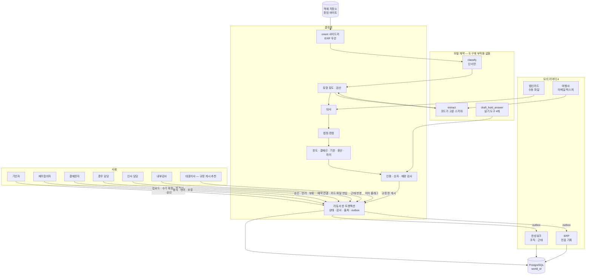

# 에이전트 아키텍처 제안 — grok 레인

- **상태**: 제안. Issue #10의 독립 레인 산출물이다. `docs/adr/`에 쓰지 않았고, ARCHITECTURE 문서의 초안과 그 논증을 이 파일 하나에 둔다.
- **날짜**: 2026-09-22
- **티켓**: [#10](https://github.com/DHChe/E2EAI_business_proj/issues/10). 전제는 #9의 [ADR-0011](../adr/0011-messages-api-direct-waits-are-document-state.md)~[ADR-0017](../adr/0017-public-demo-single-vm-replay-default-capped-live.md), #8의 통합안, #18 파이프라인, #16 규정 3종이다.
- **한 줄**: 모델 계약은 `classify` · `extract` · `draft_hold_answer` 셋이고, 셋 모두 부작용 도구가 없으며, 비결재 조작의 책임자는 기안자 고정이 아니라 규정에 이미 있는 자리이고 그 자리가 비면 실행 전에 막는다.

이 문서는 제품 코드가 아니다. 아래 코드 블록은 설명용 스케치이고, 구현·스키마·상태 기계의 확정이 아니다.

출처 표기: 저장소 문서는 `파일:줄`, 이 세션에서 연 SlipScan 원문은 `slipscan:파일:줄`, 1차 URL은 확인일을 붙인다. 확인하지 못한 문장은 `[미확인]`, 이 제안이 고른 값은 `[설계 가정]`이다. 다른 레인의 제안서는 읽지 않았다.

## 0. 추천

| 물음 | 추천 | 틀리면 관측될 것 |
| --- | --- | --- |
| ① 수와 경계 | 모델 계약 3개. 그 외 판정·전이·커넥터는 결정론적 코드 | 분류와 금액이 한 응답에서 같이 나와 유형이 금액에 맞춰 바뀌거나, 보류 답변 호출이 증빙 픽셀을 다시 읽는다 |
| ② 책임 | 숫자의 계산과 조항 적용은 코드. 모델은 단서·후보 값·검증 전 문장만 만든다. Issue #10 갱신 2의 ADR-7 패턴은 **채택**하되, 카드 본문은 문장이 아니라 구조화 필드다 | 한도·결재선·기한·환산 숫자가 모델 출력에서만 나오고 계산 기록이 없다 |
| ③ 도구 | 에이전트에게 부작용 도구는 **없다**. 보류 답변만 읽기 전용 도구 4개. 모의 커넥터는 as-is 4계통 | 한 모델 작업 안에 사람 확인이 둘 생기고 그 사이 보상 동작이 필요해진다 (ADR-0011 반증 1) |
| ④ 사람 | 결재 4행위, 수기 확정, 짝 확인, 예약 연결, 근태 반영, 지급 처리, 카드 파일 반입. 대기는 문서 상태 | 에이전트 프로세스가 승인자를 붙들고 있거나, 재무합의 전에 결재권자 명령이 성공한다 |
| ⑤ 감사 | 전이·감사·필드 출처·outbox는 한 트랜잭션. 책임자 표는 §5. 배정 실패는 실행 전 차단 | 책임자가 비어 있는데 커밋되거나, 책임자 칸에 에이전트 id가 들어간다 |

## 1. 이미 닫힌 구속 — 이 제안이 다시 열지 않는 것

- 에이전트는 결재 행위(승인·동의·반려·보류)의 행위자가 되지 않는다 (`CONTEXT.md:331`, `docs/PRD.md:141`). 기안 쪽은 그 문장이 거두지 않았다 (`docs/adr/0011-messages-api-direct-waits-are-document-state.md:100-101`, `docs/PRD.md:111`).
- 재량 조항 자동 확정 금지 (S5, `docs/PRD.md:155`). 재량 조항은 `TRV-7-1` · `TRV-12-1` · `TRV-13-4` · `PRC-13-5` (`docs/adr/0005-policy-source-of-truth.md:78`).
- 인용은 조항 원문의 연속 부분문자열이고, 보류 답변의 숫자는 계산 기록과 같다 (S4, `docs/PRD.md:154`).
- 결재선·한도·기한은 독립 재계산이 된다 (S2·S3·S10, `docs/PRD.md:152-153`, `:160`). 제품 함수를 두 번 부르는 것은 독립이 아니다 (`docs/adr/0013-postgres-object-storage-isolated-by-world-id.md:37`).
- 판정에 쓰인 것은 카드에 있다 (S15, `docs/PRD.md:165`). 카드 본문은 자연어 요약이 아니다 (`docs/PRD.md:43`, `CONTEXT.md:370`).
- 사람에게 보내는 양은 H1~H11로 막고 R1~R4로 잰다 (S12, `docs/adr/0010-human-routing-bounded-by-structure-measured-by-ratio.md:26-37`).
- 검증 전 답변 문장은 화면에 없다 (`docs/adr/0015-typescript-web-stage-sse-no-unverified-answer-text.md:26`).
- 모델 호출은 기록하고 재생한다 (`docs/adr/0016-record-and-replay-model-calls.md:24-34`). 재생 중에도 검산·대사·결재선·감사는 지금 코드가 돈다 (`:34`).
- 격리는 `world_id`다 (`docs/adr/0013-postgres-object-storage-isolated-by-world-id.md:31-32`).
- 상태 전이·감사·필드 출처·outbox는 한 트랜잭션이다 (`docs/adr/0012-transition-audit-provenance-in-one-transaction.md:23-24`). 책임자는 NOT NULL인 사람이고, 배정되지 않은 조작은 실행 전에 막는다 (`:44-45`).
- 모델을 파이프라인에서 부르는 자리는 분류와 추출 둘이고, 검산·대사·법정 판정·정책 대조는 코드다 (`docs/design/receipt-pipeline.md:64-74`). 그 밖의 모델 호출은 보류 답변과 여행사 이메일 판독이다 (`docs/adr/0011-messages-api-direct-waits-are-document-state.md:16-17`, `docs/PRD.md:45`, `CONTEXT.md:345`).
- 내구 실행 계층은 없다. 사람 대기는 문서 상태다 (`docs/adr/0011-messages-api-direct-waits-are-document-state.md:25-32`).
- 인사·총무의 예약·근태는 결재가 아니다 (`PRC-8-3`, `docs/company/travel-procedure.md:152`). 재무합의는 정산에만, 기안자와 첫 결재자 사이에, 순차·차단이고 반려는 항상 가능하다 (`APV-9-1`~`APV-9-5`, `docs/company/approval-matrix.md:205-235`).

## 2. 구성도



모델 호출은 워커가 Messages API로 하고, 응답을 받은 뒤에만 리듀서가 쓴다. 워커는 compose의 별도 서비스다 (`docs/adr/0011-messages-api-direct-waits-are-document-state.md:34`). 화면으로 가는 진행은 단계 이벤트다 (`docs/adr/0015-typescript-web-stage-sse-no-unverified-answer-text.md:23-26`).

## 3. 물음 ① — 수와 경계

### 3.1 에이전트를 세는 법

이 제안에서 에이전트 하나는 **모델 계약** 하나다. 계약은 시스템 프롬프트, 도구 허용 목록, 출력 스키마, 그 계약을 큐에 넣을 수 있는 코드다. 프로세스 수, 역할극의 인원수, 부서 수가 아니다.

추천은 계약 **3개**다.

| 계약 | 하는 일 | 하지 않는 일 |
| --- | --- | --- |
| `classify` | 증빙 이미지에서 지면 단서·공급 국가 단서·모델의 유형 *추정*을 구조화 출력으로 낸다 (`docs/design/receipt-pipeline.md:222`, `:511`) | 금액·날짜의 확정값, 증빙 유형의 최종 선택, 정책 문장, 상태 전이 |
| `extract` | 코드가 이미 고른 스키마로 필드 후보(`raw` · 값 · `_status` · 박스)를 낸다. 스키마는 국내 증빙·국외 증빙·여행사 이메일 중 워커가 고른다 | 스키마 선택, 검산 선고, 대사 확정, 한도·결재선, 승인 문장 |
| `draft_hold_answer` | 핀된 계산 기록과 조항 원문을 읽어 보류 답변 *초안*을 낸다. 화면 노출은 검사 통과 후다 | 픽셀 재독, 필드 갱신, 재량 판단, 판정 권고, 커넥터 호출 |

`classify`와 `extract`는 시스템 프롬프트 문자열을 공유할 수 있다. 파이프라인이 캐시를 위해 같은 시스템 프롬프트와 단계 지시문을 쓰라고 했다 (`docs/design/receipt-pipeline.md:341-342`). 경계는 문장 차이가 아니라 **출력 스키마와 그 사이의 코드**다. `classifySchema`는 금액·날짜의 값을 받지 않고, 공급가액·부가세 칸이 채워졌는지의 단서만 받는다 (`docs/design/receipt-pipeline.md:536-574`). 국내 추출 스키마에는 `doc_type`이 없다 (`:586-613`). 경로는 워커가 고른 스키마가 정한다.

여행사 이메일을 넷째 계약으로 나누지 않는다. 입력 채널(메일함 픽스처)이 이미 종류를 정하고, 실패는 같은 것이다. 비정형 글을 후보 필드로 잘못 읽는 실패다. 권한도 같다. 도구가 없고 구조화 출력만 있다. 채널이 다른데 계약을 나누면 이유는 "역할이 달라 보여서"가 된다.

부서별 에이전트(인사·총무·재무)를 두지 않는다. 그 세 자리의 행위자는 사람이다 (`docs/PRD.md:23-28`, `PRC-8-3`). 모델을 그 자리에 앉히면 결재·인계의 행위자가 에이전트가 된다.

오케스트레이터 에이전트를 두지 않는다. 다음에 무엇을 돌릴지는 문서 상태와 `job` 종류가 정한다 (`docs/adr/0011-messages-api-direct-waits-are-document-state.md:29-30`).

### 3.2 결정론적 구성 요소

| 구성 요소 | 하는 일 | 하지 않는 일 |
| --- | --- | --- |
| 전처리 | EXIF, PDF 래스터화, 조각, pre-resize (`docs/design/receipt-pipeline.md:79-91`) | 모델 호출 (`:64`) |
| `orient` | EXIF가 없을 때의 방향 분류 자리. Python `job` 사이드카 (`docs/adr/0015-typescript-web-stage-sse-no-unverified-answer-text.md:29`). 자산 공백의 처리은 §8.4 | 금액 추출, DB 자격 |
| 유형 유도 · 정규화 · 검산 | 단서에서 증빙 유형을 고르고, `검산 성공 / 검산 실패 / 검산 불가`를 가른다 | 모델의 유형 추정을 그대로 채택 |
| 대사 | `CardLine`과 증빙의 짝. 자동 `대사 완료`는 세 조건 모두일 때 (`docs/design/receipt-pipeline.md:1782-1789`) | 모델 호출 (`:68`) |
| 법정 판정 · 정책 엔진 | 수취 의무 3값, 한도, 결재선, 기한, 환산, 두 봉우리 차이, 재량 *미결* 표시 | 재량 값 확정, 장부 원화 확정 (`TRV-14-3`) |
| 인용 조립 | 카드의 근거 문구를 조항 본문·블록에서 그대로 붙인다 (`docs/adr/0005-policy-source-of-truth.md:109-110`, S4) | 문장 생성 |
| 보류 답변 검사 | 숫자 = 계산 기록, 인용 = 부분문자열, 재량 판단·권고·새 판정 입력 없음 | 검사 전 문장의 노출 |
| 리듀서 | 현재 상태를 `WHERE`에 넣고 한 트랜잭션으로 전이·감사·출처·outbox·후속 `job` | #17이 정하지 않은 전이의 성공 처리 (`UNDEFINED_BY_17`, `docs/adr/0011-messages-api-direct-waits-are-document-state.md:35-37`) |
| 모의 커넥터 | §6. 워커의 outbox만 부른다 | 모델이 직접 호출 |

ADR-7 패턴 — Issue #10 갱신 2가 가리킨 것 — 은 채택한다. SlipScan은 집계를 코드로 끝내고, 프롬프트에 넘기는 비율을 화면과 같은 표시 문자열로 고정한다 (`slipscan:lib/claude/report.ts:80-98`, 주석 `:96` "프롬프트가 숫자를 그대로 인용하라고 하므로 화면과 같은 표시 문자열로 넘긴다"). 이 MVP에서 그 자리는 계산 기록이다. 모델이 "12만 원"을 만들 자리가 없다. 카드에는 그 문장을 다시 쓰지 않는다. 숫자는 필드로, 근거는 원문 인용으로 둔다 (`docs/PRD.md:43`). 모델 문장이 사는 곳은 보류 답변 하나다 (`docs/PRD.md:45`).

추출된 금액은 이 패턴의 예외가 아니다. 그 금액은 *계산*이 아니라 *지면에서 읽은 후보*다. 후보는 `_status`를 갖고, 정책 숫자는 확정값만 받는다 (`docs/adr/0008-extraction-uncertainty-is-first-class.md:27-32`). 후보를 정책 숫자로 승격하는 것은 검산·대사·수기 확정이다.

### 3.3 경계 정당화

이유가 실패 격리·권한·책임 중 하나가 아니면 경계를 두지 않았다. 아래가 그 전부다.

| 경계 | 이유 | 이 경계가 없으면 생기는 구체적 실패 | 근거 |
| --- | --- | --- | --- |
| `classify` 출력 스키마와 `extract` 출력 스키마 | 실패 격리 | 한 응답이 유형과 금액을 같이 쓰면, 모델이 검산을 통과하는 유형 쪽으로 금액을 맞춘다. 택시 영수증이 세금계산서가 되고 부가세 칸이 채워진다 | `docs/design/receipt-pipeline.md:38-42`, `:222` |
| `extract`와 정책 엔진 | 권한 | 모델이 한도·결재선·기한을 말하면 S2·S3·S10의 독립 재계산 입력이 모델 문장이 된다 | `docs/PRD.md:152-153`, `:160`, `docs/design/receipt-pipeline.md:71-74` |
| `draft_hold_answer`와 증빙 픽셀 | 권한 | 보류 답변이 이미지를 다시 읽어 이미 대사로 닫힌 금액을 다른 값으로 인용한다. 답변이 새 판정 입력이 된다 | `docs/PRD.md:45`, S5 `docs/PRD.md:155` |
| 모델 계약과 리듀서 | 권한 | 모델 도구가 상태 행을 쓰면 결재 행위의 행위자가 에이전트가 될 경로가 생긴다 | `CONTEXT.md:331`, `docs/adr/0012-transition-audit-provenance-in-one-transaction.md:35-36` |
| 모델 계약과 모의 커넥터 | 권한 | 영수증 문구가 도구 호출로 ERP 전표나 근태 반영을 실행한다 | `docs/company/tools.md:55-58`, `docs/PRD.md:132` |
| 사람 결재와 모델 작업 | 책임 | 승인·동의의 책임자를 사람 NOT NULL로 남길 수 없다 | `docs/adr/0012-transition-audit-provenance-in-one-transaction.md:29-36`, S11 `docs/PRD.md:161` |
| 재무합의 단계와 결재권자 단계 | 책임 | 근거의 충분성과 업무상 필요가 한 사람의 한 버튼으로 접힌다 | `APV-10-1`~`APV-10-3`, `docs/company/approval-matrix.md:239-250` |
| 한성워크 모의와 이 제품의 결재 상태 | 실패 격리 | 결재 상태가 둘이면 큐와 감사가 어긋난다. 내구 실행 계층을 버린 이유와 같다 | `docs/adr/0011-messages-api-direct-waits-are-document-state.md:74-75` |
| `orient`와 `extract` | 실패 격리 | 방향 분류 가중치가 금액 추출과 한 호출에 있으면, 회전 실패가 금액 환각과 한 응답에서 구분이 안 된다 | `docs/design/receipt-pipeline.md:79-83`, `docs/adr/0015-typescript-web-stage-sse-no-unverified-answer-text.md:29` |
| 필드 출처 3값과 계산 기록 | 책임 | 원사실의 출처와 계산 계보가 한 칸에 섞여 독립 재계산 입력을 되짚지 못한다 | `docs/adr/0012-transition-audit-provenance-in-one-transaction.md:41-43`, `:62-64` |

### 3.4 분할 후보 비교

구속은 §1이다. "통과"는 그 안이 구속을 지킬 수 있다는 뜻이고, 지키도록 구현했다는 뜻이 아니다.

| 안 | 경계의 이유 | 결재 행위자 금지 · S5 | S4 · 검증 전 비노출 | S2·S3·S10 · S15 | H1~H11 · 한 트랜잭션 · `world_id` · 재생 | 깨지는 실패 |
| --- | --- | --- | --- | --- | --- | --- |
| **추천. 계약 3개, 부작용 도구 없음** | 실패 격리(분류/추출), 권한(초안/픽셀, 모델/리듀서) | 통과. 결재 명령은 리듀서의 사람 세션만 | 통과. 문장은 검사 뒤에만 저장 | 통과. 숫자는 계산 기록, 카드는 그 기록의 필드 | 통과. 모델이 사람에게 가는 자리를 늘리지 않음. 대기는 문서 상태 | 보류 질문이 열린 사실이라 템플릿으로 안 닫히면 초안 계약이 남는다. 그 비용을 감수한다 |
| **더 적게 A. 계약 2개** (`classify`+`extract`를 한 스키마) | 나눌 이유가 실패 격리가 아니면 이 안이 맞다 | 통과 | 통과 | 통과 | 통과 | 유형과 금액의 상호 조정. §3.3 첫 행. #18이 호출을 둘로 나눈 이유와 맞는다 (`docs/design/receipt-pipeline.md:64-66`) |
| **더 적게 B. 계약 1개 + 보류 답변은 템플릿** | 권한. 문장 생성 자체를 없앤다 | 통과. S5는 더 안전 | 통과. 검사할 문장이 없음 | 통과 | 통과 | ADR-0011이 보류 답변을 모델의 수동 루프로 두었다 (`docs/adr/0011-messages-api-direct-waits-are-document-state.md:27`). 이 안은 그 결정을 개정해야 한다. 열린 질문("이 숙박은 어느 날 업무인가")은 템플릿에 없고, 그 질문은 재량이라 모델이 답하면 S5가 깨진다. 그래서 추천은 템플릿이 아니라 **재량은 답하지 않는** 초안 계약이다 |
| **더 많이 C. 부서 에이전트 + 오케스트레이터 + 대사 에이전트** | 이유가 "역할이 달라 보여서"다 | 실패. 오케스트레이터가 전이 도구를 가지면 결재 행위자가 된다 | 실패. 권고 문장을 쓰기 쉽다 (`docs/PRD.md:141`) | 실패. 대사·결재선을 모델이 하면 독립 재계산이 아니다 | 실패. 한 작업 안의 사람 확인이 둘로 늘어 ADR-0011 반증 1이 열린다 | 같은 규정이 세 프롬프트에서 갈라지고, 감사의 행위자가 부서 모델이 된다 |

추천이 틀리는 조건은 §0의 ①이다. 추가로, 분류와 추출을 나눈 뒤에도 같은 이미지 탈옥이 두 호출 모두에서 스키마 밖 필드를 저장소에 쓰면 스키마 벽이 실패한 것이다. 그때는 호출을 합치는 것이 아니라 저장 경로를 막아야 하고, 계약 수를 줄이는 근거가 되지 않는다.

## 4. 물음 ② — 누가 숫자를 만들고 누가 문장을 만드는가

채택하는 패턴은 이것이다.

1. 정책 엔진이 계산 기록을 쓴다. 입력 revision, 계산기 버전, `(문서코드, 판, 조항 식별자)`, 달력 판, 환율 근거 (`docs/adr/0012-transition-audit-provenance-in-one-transaction.md:43`).
2. 카드는 그 기록의 필드와 원문 부분문자열만 보여 준다 (S15, S4).
3. `draft_hold_answer`는 그 기록에 있는 숫자만 인용한다. 검사기가 문자열을 계산 기록과 대조하고, 다르면 문장을 버린다.
4. 재량 조항의 `must_not_auto_decide`는 값이 아니라 빈 판단으로 남고, `facts_to_ask`와 `decided_by`만 카드에 오른다 (`docs/adr/0005-policy-source-of-truth.md:76-77`).

모델이 만드는 숫자 후보는 추출 칸뿐이다. 그 후보는 출처 `에이전트 추출`이고, 같은 사실의 `시스템 연동` 값이 있으면 판정 입력은 시스템 연동이다 (`CONTEXT.md:337`).

계산의 행위자는 `system`이다. `CONTEXT.md:331`은 추출·대사·계산을 결재 밖 조작의 *예*로 들고, 그 경계는 #10이 정한다고 적는다. 이 제안은 계산·자동 대사의 행위자를 `system`으로, 모델이 내용을 만든 분류·추출·보류 초안의 행위자를 그 계약 이름으로 정한다. 책임자는 어느 쪽이든 사람이다 (§5).

**틀리면:** 카드나 보류 답변에 계산 기록에 없는 금액·날짜·단계가 검사기를 통과한다. 또는 재량 네 조항 중 하나의 `must_not_auto_decide` 항목이 모델 출력에서 확정값으로 저장된다.

## 5. 물음 ③ — 도구, 그리고 부작용은 없는가

### 5.1 답

**없다.** 에이전트 계약의 도구 목록에 부작용 도구를 넣지 않는다.

부작용 도구란, 모델의 도구 목록에 있고 성공 반환이 내구 상태나 외부 시스템을 바꾸는 도구다. 구조화 출력은 도구가 아니다. 워커가 응답을 검증한 뒤 리듀서로 커밋하는 쓰기는 모델의 도구가 아니다. 읽기 전용 `SELECT`는 부작용이 아니다.

이 답과 ADR-0011 반증 1의 관계: 반증 1은 "실행 전에 사람 확인이 필요한 부작용 도구를 주고, 한 작업 안에 사람 확인이 둘 이상이며, 그 사이에 보상 동작이 필요할 때" 내구 실행 계층을 다시 보라는 조건이다 (`docs/adr/0011-messages-api-direct-waits-are-document-state.md:89-90`). 전제가 성립하지 않으므로 반증 1은 열리지 않고 ADR-0011은 유지된다. 나중에 그 세 조건이 같이 관측되면 이 추천은 틀리고 ADR-0011을 다시 연다. 반증 3(멱등 key로 막을 수 없는 커밋 전 부작용, `:93`)도 모델 도구로는 열리지 않는다. 커넥터 쓰기는 커밋된 outbox 뒤에서만 일어나고, 명령 key로 한 번만 받는다 (`docs/adr/0011-messages-api-direct-waits-are-document-state.md:47`).

### 5.2 도구 표

소유가 모델 계약인 행만 모델이 호출한다. 나머지 행은 같은 표에 두되 리듀서·워커의 명령이다.

| 도구 | 소유 | 읽기/부작용 | 입력 → 출력 | 권한 범위 | 실패 시 |
| --- | --- | --- | --- | --- | --- |
| (도구 없음) 구조화 출력 | `classify` | 읽기. 호출 자체는 `model_call`로 기록 | 이미지 sha256 → 단서 스키마 | 해당 `world_id`의 객체 1건. 다른 세계·다른 문서 금지 | API 표는 파이프라인 §2.10 (`docs/design/receipt-pipeline.md:347-353`). 스키마 실패는 `unparsable`, 1회 재시도 (`:66`). 문장·필드를 추정으로 채우지 않음 |
| (도구 없음) 구조화 출력 | `extract` | 읽기 | 이미지 또는 이메일 본문 + 워커가 고정한 스키마 id → 후보 필드 | 그 스키마의 칸만. 정책 원문·결재 상태 접근 없음 | 위와 같음. 늦은 응답은 fencing으로 거절 (`docs/adr/0011-messages-api-direct-waits-are-document-state.md:46`) |
| `read_calculation` | `draft_hold_answer` | 읽기 | `(world_id, document_id, calc_id)` → 계산 기록 원문 | 작업 시작 시 핀된 revision·판. 다른 세계 금지 | 없으면 `HOLD_ANSWER_TOOL_FAILED`. 초안을 저장하지 않고 화면에 문장 없음 (`docs/adr/0015-typescript-web-stage-sse-no-unverified-answer-text.md:26`) |
| `read_clause` | `draft_hold_answer` | 읽기 | `(code, edition, clause_id)` → 조항 원문 | 문서에 핀된 판만 (`PRC-2-2`, `docs/company/travel-procedure.md:33`) | 같음 |
| `read_field` | `draft_hold_answer` | 읽기 | 문서의 필드 버전 → 값·출처·검증 수준 | 픽셀·`raw` 이미지 없음. 확정 전 후보는 "미확정"으로만 | 같음 |
| `read_card_snapshot` | `draft_hold_answer` | 읽기 | 문서 → S15 항목이 이미 계산된 스냅샷 | 권고 문장 칸은 스키마에 없음 | 같음 |
| `submit` · `approve` · `agree` · `reject` · `hold` · `record_discretion` · `confirm_field` · `affirm_pair` · `link_reservation` · `reflect_attendance` · `import_card_file` · `mark_paid` · `raise_objection` · `publish_edition` | 리듀서. 행위자는 서버 세션의 사람 (`docs/adr/0012-transition-audit-provenance-in-one-transaction.md:37`) | 부작용 | 명령 → 새 상태 또는 이름 붙은 거부 | 현재 단계 담당자, 문서의 `world_id`, 자기 결재 거부 (`APV-8-2`) | 상태 불일치는 기존 결과 또는 거부. #17 미정 전이는 `UNDEFINED_BY_17` (`docs/adr/0011-messages-api-direct-waits-are-document-state.md:35-37`) |
| outbox `write_attendance` · `write_voucher` | 리듀서가 커밋한 뒤의 워커 | 부작용 | 커밋된 명령 key → 모의 커넥터의 행 | 그 세계의 커넥터 픽스처만. 실 API 없음 (`docs/company/tools.md:55-58`) | 커넥터 거부는 업무 상태를 되돌리지 않고 실패 행을 남긴다. 재시도는 같은 명령 key (`docs/adr/0011-messages-api-direct-waits-are-document-state.md:47`) `[설계 가정]` |
| `orient` | Python 사이드카 `job` | 읽기 (바이트 변환 결과는 워커가 저장) | 이미지 → 4-class 또는 `unknown` | DB 계정 없음. 임시 파일과 반환 라벨만 | 타임아웃·미적재 가중치면 `orientation_unverified`를 남기고 EXIF/무회전으로 진행 (§8.4) `[설계 가정]` |

보류 답변 루프의 한계 `[설계 가정]`: 모델 턴 4회, 도구 호출 8회. 그 안에 스키마에 맞는 초안이 없으면 `HOLD_ANSWER_BUDGET`. 루프 중간에 사람을 기다리지 않는다. 그래서 반증 1의 "한 작업 안 확인 지점 둘"이 생기지 않는다. 도구 목록은 ADR-0011이 #10에 넘긴 그 목록이다 (`docs/adr/0011-messages-api-direct-waits-are-document-state.md:27`). 계산 기록과 조항 원문 둘을 포함하고, 카드 스냅샷과 필드 버전은 그 둘을 문서에 고정하기 위한 읽기다. 웹·파일·Bash·추출 재실행·커넥터는 목록에 없다.

### 5.3 모의 커넥터 — 목록과 충실도

4계통을 유지한다. 넷이 인사·총무·재무 경계를 만드는 최소라고 무대가 정했다 (`docs/company/tools.md:47-50`). 다섯째 계통, 실 API, 송금·발권·요금 검색은 만들지 않는다 (`docs/PRD.md:132-133`).

값의 출처에 칸을 더하지 않는다. 커넥터가 넘긴 구조화 값은 `시스템 연동`이고, 여행사 이메일에서 읽은 값은 `에이전트 추출`이다 (`CONTEXT.md:345`).

| 커넥터 | 주는 칸 | 흉내 내는 as-is 형태 | 흉내 내지 않는 것 | 실패·지연 |
| --- | --- | --- | --- | --- |
| 한성워크 | 기안 시점의 소속·직급·직책 (`APV-8-3`). 근태 반영 결과 행 | 결재 문서와 근태가 같은 계통에 있다 (`docs/company/tools.md:13`). 결재 *상태*는 이 제품의 DB가 지고, 그룹웨어 모의는 조직과 근태만 진다 | 그룹웨어 결재 엔진, 합의·후결·후열, 알림 메일, 문서 편집기 | 조직 스냅샷이 없으면 상신을 거부한다 (`ORG_SNAPSHOT_MISSING`). 지연을 따로 넣지 않는다. 틈 ①의 대기는 총무의 사람 전이로 충분하다 (`docs/company/tools.md:25-32`) |
| 여행사 메일 | 견적·확정·변경 통지의 이메일 본문과 첨부 (`docs/company/tools.md:15`) | 구조화 API가 아니라 메일. 확정은 사전승인 완료 순간에 자동 도착하지 않는다 `[설계 가정: 시드의 도착 시각]` | 검색·비교·추천·발권·변경/취소 처리 (`docs/PRD.md:133`) | 메일 없음 = 예약 미연결. 금액이 카드와 다른 메일은 정상 픽스처다 (`docs/company/tools.md:36-38`). 판독 실패는 `extract`의 `unparsable`이고 총무가 수기 확정한다 |
| 법인카드 파일 | §6.4의 헤더를 가진 CSV/XLSX. 세계별 파일 | **월 단위 수동 다운로드** (`docs/company/tools.md:16`). 사람이 `import_card_file`을 실행하기 전에는 명세가 없다 | 카드사 웹 로그인, 스크래핑, 한도·포인트·이의 워크플로, 실시간 웹훅 | 파일 없음 → 대사 대기 (`docs/design/receipt-pipeline.md:68`). 필수 헤더 누락 → 파일 전체 거부 `CARD_FILE_COLUMN_MISSING`. 셀이 빈 값은 행 거부가 아니라 null. 상신 뒤에 도착한 파일이 새 `짝 보류`를 만들면 승인·동의를 멈추고 이후 상태는 `UNDEFINED_BY_17` (#8이 재개 시점을 #10과 #17에 공동으로 넘김) |
| ERP | 계정 분류가 붙은 전표 초안. 외화 줄의 장부 원화는 비움 (§8.3) | 재무가 전표를 **수기로** 넣는다 (`docs/company/tools.md:42-44`). 지급 처리 전이 뒤에만 outbox가 한 장 기록한다. 송금은 없다 (`docs/PRD.md:132`) | 결산, 세금 신고, 역분개, 더존·SAP 화면, 계정과목 전체 | 같은 명령 key의 재기록은 거절. 부분 전기는 없다 `[설계 가정]` |

한성워크에 두 번째 결재 상태 기계를 두지 않는 이유는 §3.3이다.

### 5.4 §7.5 요구 칸 대조

요구 표는 `docs/design/receipt-pipeline.md:2218-2225`다. 카드 줄 타입은 `:1798-1810`이고, 키 2순위는 끝4를 포함한다 (`:1766`).

| §7.5 칸 | 요구 이유 (`:2218-2225`) | 이 제안의 파일 헤더 | 빈 셀 | 판정 |
| --- | --- | --- | --- | --- |
| `이용일` (청구일 아님) | 날짜 창 | `used_on` | 거부하지 않음. 빈 이용일이면 그 행은 날짜 대조 불가로 대사에 들어간다 | 충족 |
| `이용금액` + 원거래 통화 | 할부·환율을 통과하는 비교축 | `original_amount`, `original_currency` | 금액·통화가 없으면 그 행은 금액 키에서 빠진다 | 충족 |
| `승인번호` | 1순위 키 | `approval_number` | null 허용. 승인번호만으로 자동 확정하지 않는 것은 파이프라인 규칙 (`:1765`) | 충족 |
| `가맹점 사업자등록번호` | 좁히기 | `merchant_reg_no` | null 허용 | 충족 |
| `가맹점 소재국` | 날짜 창·공급 장소 | `merchant_country` | 없으면 소재국 모순 검사를 건너뛰고 그 사실을 행에 남긴다 `[설계 가정]` | 충족 |
| `할부 개월` | 분할 청구와 이용금액의 구분 | `installment_months` | 없으면 0으로 대체하지 않는다. null로 두고 청구 원화와 이용금액을 섞지 않는다 | 충족 |

§7.5 표에 없으나 `CardLine`과 키 2순위가 요구해서 **추가로 필수 헤더**로 받는 칸:

| 칸 | 왜 타입에 있는가 | 헤더 | §7.5 표 |
| --- | --- | --- | --- |
| 카드 끝4 | 자동 확정 조건의 대조 축 (`:1766`, `:1776-1777`) | `card_last4` | 없음. 모순 절에 적음 |
| 청구 원화 | 타입의 `billedKrw` (`:1806`). 대사 키는 이용금액이라 청구액으로 짝을 닫지 않는다 | `billed_krw` | 없음 |
| 가맹점명 | 4순위 접두 비교 (`:1768`) | `merchant_name` | 없음 |

가맹점 업종은 받지 않는다. §8.1이 공급 분류의 대사 칸에 `가맹점 업종`을 적지만 (`docs/design/receipt-pipeline.md:2242`) `CardLine`에는 그 필드가 없다. 공급 분류는 증빙 쪽 단서와 수기 확정에 남긴다.

**틀리면:** 시드 카드 파일이 끝4·이용금액·이용일 없이 이름과 청구액만 가지고 자동 `대사 완료`가 발생한다. 그때 §7.5가 경고한 퇴화가 온 것이다 (`:2216`).

## 6. 물음 ④ — 사람 승인 지점

사람은 문서 상태를 바꾸는 명령으로만 개입한다. 에이전트 프로세스는 그 명령을 기다리지 않는다 (`docs/adr/0011-messages-api-direct-waits-are-document-state.md:31-32`). 큐는 문서 기한의 최솟값으로 정렬한 평평한 목록이다 (#8 결과 1, Issue #8 확정 댓글).

| 지점 | 누구 | 명령 | 문서가 있는 상태 | 에이전트가 기다리는 방식 |
| --- | --- | --- | --- | --- |
| 수기 확정 | 기안자(제출자) | `confirm_field` | 추출 불확실이 정책 대조 전에 열려 있음. 백지 입력 (`CONTEXT.md:313-318`) | 기다리지 않음. `job`은 이미 끝남. 다음 검산은 명령 커밋이 큐에 넣음 |
| 짝 확인 | 값 모순이면 재무합의자, 그 밖은 기안자 (`docs/design/receipt-pipeline.md:2138-2143`) | `affirm_pair` | `후보 복수` · `짝 보류`. 승인 카드 도달 전 (#8 결과 7) | 같음. 이 상태가 남아 있으면 `submit` 거부 |
| 재량 기록 | `decided_by`. 복수 결재권자는 §10의 질문, 가정은 그 줄의 **첫 결재권자** | `record_discretion` | `gate=on` (`docs/adr/0012-transition-audit-provenance-in-one-transaction.md:46`) | 모델이 재량을 채우지 않음 |
| 재무합의 | `APV-9-2`의 현재 단계 (항상 재무팀 담당, 청구 총액 5,000,000원 초과면 재무팀장, `docs/company/approval-matrix.md:215-218`) | `agree` · `reject` · `hold` | `재무합의대기` | 실행이 끝나 있고 슬롯은 반환됨 (`docs/adr/0011-messages-api-direct-waits-are-document-state.md:32`) |
| 전결선 | 현재 결재권자 | `approve` · `reject` · `hold` | `결재대기` | 같음 |
| 보류의 질문 | 그 승인자 | `hold` | 대기 상태가 `보류`로 바뀌고 같은 사람의 큐에 남음 (`docs/adr/0003-approver-actions-three.md:25-26`) | 초안 `job`만 돈다. 사람 대기와 분리 |
| 예약 연결 | 총무 담당 | `link_reservation` | 사전승인 `완료` 이후. 결재선 없음 (`PRC-8-3`) | 없음 |
| 근태 반영 | 인사 담당 | `reflect_attendance` | 예약 확정 후, 예약이 없는 출장은 사전승인 일정으로 (`PRC-8-2`) | 없음 |
| 카드 파일 | 총무 또는 재무 중 세션의 그 사람 | `import_card_file` | 세계 안의 언제든. 상신 후 신규 `짝 보류`는 위 §5.3 | 없음 |
| 지급 처리 | 재무 담당 | `mark_paid` | 정산 `완료` 후. 결재가 아님 (`docs/PRD.md:86`) | 없음. 송금 명령은 스키마에 없음 |
| 이의 | 내부감사 | `raise_objection` | `완료` 또는 진행 중 → `재무합의대기` (`CONTEXT.md:365`) | 재심의 *끝*은 #17. 아래 스케치 |
| 규정 게시 | §8.2의 개정권자 | `publish_edition` | 세계 부팅 입력. 판 1만 적재하는 동안 (`docs/adr/0013-postgres-object-storage-isolated-by-world-id.md:34`) 다른 조합은 `APV_9_3_UNSUPPORTED` (`docs/adr/0014-apv-9-3-exposed-declaratively.md:31-32`) | 없음 |

### 6.1 상태 기계 스케치

설명용이다. 제품 코드가 아니다. 상태 이름은 용어집의 말을 쓴다.

```text
사전승인 문서
  작성중 --submit--> 결재대기[첫 결재권자]
  결재대기 --approve / 전결권자 아님--> 결재대기[다음]
  결재대기 --approve / 전결권자--> 완료
  결재대기 --reject--> 반려
  결재대기 --hold--> 보류
  보류 --답변 게시--> 같은 결재대기
  반려 --(재상신 등)--> UNDEFINED_BY_17

정산 문서
  작성중 --submit--> 재무합의대기[APV-9-2 첫 단계]
  재무합의대기 --agree / 다음 재무 단계 있음--> 재무합의대기[다음]
  재무합의대기 --agree / 재무 단계 끝--> 결재대기[첫 결재권자]
  재무합의대기 또는 결재대기 --reject--> 반려
  재무합의대기 또는 결재대기 --hold--> 보류 --> 같은 대기
  결재대기 --approve / 전결권자--> 완료
  완료 --mark_paid--> 지급기록됨
  반려의 다음, 지급이 순액 반환인 건의 지급 의미 --> UNDEFINED_BY_17
```

비대칭은 명령 가드로 표현한다.

- `agree`는 `재무합의대기`의 현재 재무 단계 담당자만 성공한다. `approve`는 그 상태에서 거부한다 (`APV-9-1` 차단, `docs/company/approval-matrix.md:205`).
- 재무 단계가 둘이면 둘째의 `agree`는 첫째가 `agree`이기 전에 거부한다 (`sequential: true`, `:226-227`).
- `reject`는 `재무합의대기`와 `결재대기` 모두에서, `gate=on`인 동안에도 성공한다 (`reject_always_allowed`, `:228`, `docs/adr/0012-transition-audit-provenance-in-one-transaction.md:46`).
- `hold`도 관문 중에 받는다 (같은 결정).
- `approve`와 `agree`는 이 단계의 `decided_by`가 재량을 기록하기 전에는 거부한다 (`gate=on`, #8 결과 5). 기록 주체가 이 단계가 아니면 그 사람은 재량 구획을 읽기만 한다 (`APV-10-3`).
- 기안자의 자기 결재·자기 재무합의는 거부한다 (`APV-8-2`, `APV-9-4`).
- 행위자 id는 요청 본문이 아니라 서버 세션이다 (`docs/adr/0012-transition-audit-provenance-in-one-transaction.md:37`).

3자 루프의 골격은 부서별 결재 노드가 아니다.

```text
기안자 상신
  정산이면 재무합의 (동의 | 반려 | 보류)     ← 재무. 차단
  이어서 결재선 (승인 | 반려 | 보류)         ← 전결. 전결권자에서 문서 완료
사전승인 완료 이후
  총무 link_reservation                      ← 결재 아님
  인사 reflect_attendance                    ← 결재 아님
정산 완료 이후
  재무 mark_paid                             ← 결재 아님. 송금 아님
반려 이후
  자리만: resubmit → UNDEFINED_BY_17
  #17이 상태를 정하면 리듀서에 행을 추가한다 (docs/adr/0011:96).
  재기안이 결재선 입력을 바꾸면 선은 다시 계산된다 (APV-11-2).
  그 계산의 구현은 #17 상태를 받은 뒤다.
```

이의 플래그는 진입만 용어집대로 한다. `raise_objection`은 `완료`와 진행 중 대기에서 `재무합의대기`로 옮긴다 (`CONTEXT.md:365`). 재심 표식 `rehearing`이 켜져 있는 동안 `agree`·`approve`·`reject`는 `UNDEFINED_BY_17`이다 `[설계 가정]`. `hold`와 보류 답변은 종결이 아니라서 받는다. 복귀 경로와 완료 건의 효력은 #17이다 (`CONTEXT.md:365`, `docs/PRD.md:177`).

SlipScan의 잠금은 채택한다. 완료 직전에 현재 상태를 `WHERE`에 넣고 `SELECT … FOR UPDATE`로 행을 잠근 뒤 같은 트랜잭션에서 쓴다 (`slipscan:lib/pipeline/process-document.ts:292-308`). 갱신 2가 "실패 판정은 조회 시 계산 (`:167-204`)"이라고 한 부분은 원문과 다르다. 그 범위의 `expireStaleDocuments`는 조회가 아니라 `processing`이면서 업로드 시각이 컷오프보다 오래된 행을 `failed`로 갱신한다 (`slipscan:lib/pipeline/process-document.ts:167-187`). 이 MVP의 기한 경과는 저장하거나 `failed`로 쓰지 않는다. 기한은 계산값이고 (`docs/adr/0013-postgres-object-storage-isolated-by-world-id.md:35`, `PRC-3-1`), 경과에는 불이익이 없고 표시만 한다 (`PRC-15-2`, `docs/company/travel-procedure.md:291`).

**틀리면:** 재무합의 중에 결재권자 `approve`가 성공하거나, 관문 중 `reject`가 거부되거나, `반려`에서 나온 명령이 성공 상태로 기록된다.

## 7. 물음 ⑤ — 상태·감사·책임자

문서 상태의 전이는 §6.1이다. 출장(사건)은 문서 상태의 합이다. 별도 숨은 상태를 두지 않는다. 사전승인 `완료` → 예약 연결 또는 예약 없음 → 근태 반영 → 정산 문서의 일생 → 지급 처리 (`CONTEXT.md:142`).

감사 이벤트는 ADR-0012의 열을 그대로 쓴다. `actor_kind`는 `human` · `agent` · `system`. `actor_id`는 사람 id, 또는 계약 이름(`classify` · `extract` · `draft_hold_answer`)과 `model_call_id`. `responsible_person_id`는 사람만. 앱 계정은 감사 행을 고치거나 지우지 못한다 (`docs/adr/0012-transition-audit-provenance-in-one-transaction.md:26-38`).

필드 출처는 셋만이다. `에이전트 추출` / `사람 수기 확정` / `시스템 연동` (`:41-42`). 계산값은 네 번째 출처가 아니다. 재생 여부도 출처가 아니다 (`docs/adr/0016-record-and-replay-model-calls.md:67`). 덮어쓰기는 새 필드 버전 행이다 (`CONTEXT.md:337`).

### 7.1 책임자 배정

#9 grok 레인의 "기안자로 고정"은 후보였고, 약점은 확정 전 오독의 책임이 출장자에게 찍히는 것이었다 (`docs/adr/0012-transition-audit-provenance-in-one-transaction.md:55-56`, `docs/research/tech-stack-comparison.md:70`, `:97`). 이 제안은 그 안을 **기각**한다. 규칙의 이름 `[설계 가정]`: **그 조작이 기록하는 주장을 규정에서 이미 맡은 사람.** 자리가 없거나 두 명이면 실행 전에 거부한다 (`RESPONSIBLE_UNASSIGNED`, `RESPONSIBLE_AMBIGUOUS`). 이것이 ADR-0012 결정 8의 "배정되지 않은 조작은 실행 전 차단"과 맞물리는 방식이다. 차단은 스키마 NOT NULL의 앞단이다. 커밋 함수는 책임자 id가 사람 행으로 풀리지 않으면 트랜잭션을 열지 않는다.

"기안자"가 아직 없는 카드 반입·조직 시드에 기안자를 찍으면 자리가 비어 규칙이 조용히 깨진다. 그래서 조작마다 자리를 나눈다.

| 조작 | 행위자 | 책임자 | 근거 |
| --- | --- | --- | --- |
| 기안 필드 저장, 상신 | 그 사람 | 같은 사람 | 문서의 주장. 상신은 결재 4행위가 아님 |
| 분류 결과 커밋 | `agent` `classify` | 업로드한 사람. 정산에 연결된 뒤에도 그 사람(기안자) | 증빙을 이 출장에 낸 주장. 숫자의 보증이 아님. 정책 대조 전에 불확실은 닫힌다 (`docs/adr/0008-extraction-uncertainty-is-first-class.md:31`) |
| 증빙 추출 커밋 | `agent` `extract` | 위와 같음 | `CONTEXT.md:335` 출처는 필드 버전. 책임은 제출 |
| 여행사 메일 추출 커밋 | `agent` `extract` | 세계의 `reservation_clerk` 바인딩 1명. 데모 시드는 총무 담당 자리 (`docs/company/org.md:56`) | 메일은 총무 인계 입력 (`docs/company/tools.md:27-28`, `CONTEXT.md:345`). 기안자가 받지 않음 |
| 한도·결재선·기한·환산·안분·차이 계산 커밋 | `system` | 기안자 | 계산은 기안 내용의 함수. 계산기 결함은 `calculator_version`으로 구분 (`docs/adr/0012-transition-audit-provenance-in-one-transaction.md:43`) |
| 자동 `대사 완료` | `system` | 기안자 | 사람 판단이 아님 (`docs/design/receipt-pipeline.md:1782`). 재무합의자가 사후에 같은 짝을 다시 판단하지 않음 (`APV-10-3`) |
| 수기 확정 | 입력한 사람 | 같은 사람 | `docs/adr/0012-transition-audit-provenance-in-one-transaction.md:53-54`, `CONTEXT.md:313` |
| 짝 확인 | 막힌 이유의 담당자 | 같은 사람 | `docs/design/receipt-pipeline.md:2138-2150`. 값 모순은 재무합의자 |
| 법정 판정·정책 대조 *기록* | `system` | 기안자 | 재량 값은 비어 있음. 기록은 계산 |
| 재량 판단 기록 | `decided_by`인 그 사람 | 같은 사람 | `TRV-7-1`·`TRV-12-1`·`TRV-13-4`는 결재권자 (`docs/company/travel-policy.md:157`, `:268`, `:300`). `PRC-13-5`는 재무합의자 (`docs/company/travel-procedure.md:259`) |
| 승인·동의·반려·보류 | 현재 단계의 사람 | 같은 사람 | 대결을 두지 않음 (`docs/PRD.md:131`). 행위자와 책임자가 이 네 행위에서는 같다 (`docs/adr/0012-transition-audit-provenance-in-one-transaction.md:35`) |
| 보류 답변 게시 | `agent` `draft_hold_answer` | 기안자 | 승인자에게 책임자를 두면 묻는 사람과 답이 한 사람으로 접힌다. 게시는 검사 통과와 같은 트랜잭션. 실패 시 이벤트 없음 |
| 카드 파일 반입 | 반입 명령의 사람 | 같은 사람 | as-is가 수동 다운로드 (`docs/company/tools.md:16`). 자동 스케줄 반입은 없음 |
| 예약 연결 | 총무 담당 | 같은 사람 | `PRC-8-1`. 범위를 벗어난 항목·사유는 이 사람의 기록 |
| 근태 반영 | 인사 담당 | 같은 사람 | `PRC-8-2`, `PRC-8-3` |
| 지급 처리와 ERP 전표 | 지급 명령의 재무 담당이 행위자인 전이. 전표 쓰기는 `system` | 둘 다 그 재무 담당 | 전표는 전이의 반영. 송금 없음 (`docs/PRD.md:132`) |
| 근태 행 outbox | `system` | 근태 반영을 한 인사 담당 | 커넥터는 그 명령을 다시 판단하지 않음 |
| 방향 보정 적용 | `system` | 제출자 | 사이드카는 행위자가 아님. 라벨은 추출 입력의 속성 |
| 세계 시드 적재 | `system` | 시드 매니페스트가 지목한 사람 1명 | 비어 있으면 적재 거부. 누구를 적을지는 합성 데이터(#1)의 몫. admin을 기본값으로 두지 않음 (`docs/adr/0002-admin-read-only-audit-axis.md:25-27`) |
| 이의 플래그 | 내부감사 | 같은 사람 | `docs/adr/0002-admin-read-only-audit-axis.md:29-30` |
| 규정 판 게시 | §8.2의 개정권자 | 같은 사람 | `docs/adr/0014-apv-9-3-exposed-declaratively.md:29-30`. admin 아님 |

**틀리면:** 기안자가 생기기 전의 카드 반입이 기안자 id 없이 커밋되거나, 반대로 반입이 기안자에게 적혀 명세의 책임이 출장자에게 남는다. 또는 책임자 자리가 비었는데 조작이 실행된다. 그때 ADR-0012 결정 8과 이 표가 함께 실패한 것이다.

## 8. #10으로 넘어온 나머지의 처리

### 8.1 보류 답변의 읽기 전용 도구

§5.2의 네 도구가 목록의 전부다. ADR-0011:27이 넘긴 항목은 이것으로 닫는다.

### 8.2 규정 개정권자의 직책·게시 권한

규정 본문은 개정권자를 지명하지 않는다. 직책은 팀장·본부장·대표이사뿐이고 (`docs/company/org.md:39`), admin은 이 값을 바꾸지 못한다 (`docs/adr/0002-admin-read-only-audit-axis.md:27`, `docs/adr/0014-apv-9-3-exposed-declaratively.md:29-30`). `CONTEXT.md:403`은 직책을 #10에 남겨 두었다.

**추천 `[설계 가정]`: 대표이사 1명.** 게시 명령 `publish_edition`의 행위자와 책임자는 그 사람이다. 경영지원본부장(조태민, `docs/company/org.md:60`)은 고액 전결권자라 전결표의 당사자다. 감사 축을 경영지원 밖에 둔 이유 — 고액 전결권자가 자기 결재를 감사하지 않게 하려는 것 (`docs/company/org.md:26-27`) — 과 같은 방향으로, 결재 문법(`APV-9-3`)을 게시하는 직책도 그 본부장 위로 둔다. 초안 파일은 누구든 저장소에 제안할 수 있으나, 세계에 적재하는 명령은 대표이사만 성공한다. 판 1과 다른 `APV-9-3` 조합은 그래도 부팅 실패다 (`docs/adr/0014-apv-9-3-exposed-declaratively.md:31-32`). 이 추천은 조항에 이름이 없어 §10에서 사용자에게 묻는다.

**틀리면:** 대표이사가 자기 전결 범위를 판 게시로 넓히는 시연이 제품의 결함이 되거나, 사용자가 개정권을 경영지원에 두라고 정한다.

### 8.3 회계 장부의 계정 분류

여비 항목은 네 개다. 일비·숙박비·교통비·등록비 (`TRV-4-1`, `docs/company/travel-policy.md:83`). SlipScan의 카테고리 8종은 계정 분류라서 파이프라인이 버렸다 (`docs/design/receipt-pipeline.md:2635`). 접대비 흐름은 만들지 않는다 (`docs/PRD.md:137`). 매입세액 공제의 최종 가부는 판정하지 않는다 (`docs/PRD.md:136`, `docs/design/receipt-pipeline.md:2670`). 환산 원화는 한도·지급액용이고 장부 금액이 아니다 (`TRV-14-3`, `docs/company/travel-policy.md:326`).

전표 줄의 계정은 다음뿐 `[설계 가정]`.

| 계정 | 언제 |
| --- | --- |
| `여비-일비` · `여비-숙박비` · `여비-교통비` · `여비-등록비` | `TRV-4-1` 항목과 1:1. 더 잘게 나누지 않음 |
| `여비아님-미분류` | `TRV-10`으로 분리한 금액. 접대비·부스비로 재분류하지 않음 |
| `미지급금-출장자` | 회사가 출장자에게 지급할 순액. 지급 *처리*의 상대 계정. 송금 실행 없음 |
| `미지급금-법인카드` | 법인카드로 이미 결제된 금액의 상대 계정 |

두지 않는 계정: `부가세대급금` (공제 가부를 계정 존재가 단정한다), `접대비`, `예수금`·원천세 (세액 계산은 범위 밖, `docs/PRD.md:135`), 매출·자산 계정.

외화 줄은 `policy_krw`(TRV-14 계산 기록)를 참고로 달고 `ledger_krw`는 비운다. 국내 원화 확정액은 환산 선택이 없으므로 그 금액을 전표 금액으로 쓴다. 이것은 `TRV-14-3`이 말하는 "이 조의 환산액"의 바깥이다.

**틀리면:** 전표의 `ledger_krw`가 외화 지출에서 채워져 장부 금액을 확정하거나, 계정이 네 항목 밖으로 갈라져 규정에 없는 정책이 된다 (제외 10, `docs/PRD.md:138`).

### 8.4 방향 분류기의 실행 자산

사실 관계는 ADR이 이미 적었다. 저자 측 Hugging Face 저장소에 12-class `weights.zip`이 있고, 설계가 전제한 4-class 체크포인트와 실행 코드의 공개는 확인되지 않았으며 라이선스는 Krutrim Community License다 (`docs/adr/0015-typescript-web-stage-sse-no-unverified-answer-text.md:70-72`, `docs/research/tech-stack-comparison.md:111`, `:151`). 이 제안은 2026-09-22에 그 저장소를 다시 열지 않았다 `[미확인: 재확인 없음]`. 논문이 말한 실행 수단은 Phi-3.5-Vision 인코더의 304M 4-class 분류기다 (`docs/research/receipt-parsing.md:26`).

**추천:** 가중치를 이 MVP의 자산으로 채택하지 않는다. 자리는 ADR-0015 결정 7의 Python `job`으로 남겨 둔다. 돌아가는 경로는 EXIF 회전뿐이다 (`docs/design/receipt-pipeline.md:82`, SlipScan 승계 `:2617`). EXIF가 없으면 `orientation_unverified`를 남기고 무회전으로 추출을 진행한다 `[설계 가정]`. Claude 호출로 방향을 대신 묻지 않는다. 전처리에 모델 호출이 없다는 단계 표와 어긋나고 (`docs/design/receipt-pipeline.md:64`), 방향 실패와 금액 실패가 한 응답으로 섞인다.

이 진행은 사용자 확인이 필요하다 (§10). 설계는 내용 기반 4-class를 넣기로 했고 (`docs/design/receipt-pipeline.md:83`, `:2595`) 자산이 없다. 막는 쪽은 추출 기능 전체를 자산에 종속시킨다.

**틀리면:** EXIF가 없는 회전 이미지에서 금액이 검산을 통과한 채 틀린다. 그때 무회전 진행은 실패이고, 4-class 자산이 생기기 전에는 그 입력을 추출하지 않는 쪽으로 바꾼다.

## 9. ADR 후보

되돌리기 어려운 것만. 가번호이며 `docs/adr/`에 쓰지 않았다. 방향 분류기 폴백과 보류 루프의 턴 상한은 나중에 바꿀 수 있어 후보에서 뺀다.

### ADR-0018 후보 — 모델 계약은 셋이고 부작용 도구는 없다

- **결정:** `classify`, `extract`, `draft_hold_answer`. 도구 부작용 없음. 쓰기는 리듀서.
- **기각:** 계약 2개(분류·추출 병합), 계약 1개와 템플릿 답변, 부서 에이전트와 오케스트레이터 (§3.4).
- **반증:** §0의 ①과 §5.1. 반증 1의 세 조건이 관측되면 ADR-0011을 다시 연다.

### ADR-0019 후보 — 비결재 조작의 책임자는 자리 규칙이다

- **결정:** §7.1 표. 공석·복수면 실행 전 차단. 기안자 고정은 기각.
- **기각:** 모든 비결재 조작의 책임자를 기안자로 고정 (`docs/research/tech-stack-comparison.md:70`). 책임자를 전결권자로 기계적으로 채우기 (`docs/adr/0012-transition-audit-provenance-in-one-transaction.md:53`).
- **반증:** §7 끝. 사람 한 명으로 적을 수 없는 적법한 이벤트가 생기면 ADR-0012 반증 1도 함께 열린다 (`docs/adr/0012-transition-audit-provenance-in-one-transaction.md:80`).

### ADR-0020 후보 — 모의 커넥터는 4계통이고 결재 상태를 복제하지 않는다

- **결정:** §5.3. 카드는 수동 파일, 여행사는 이메일 픽스처, ERP는 지급 처리 뒤 전표 한 장, 한성워크는 조직·근태.
- **기각:** 그룹웨어 결재 엔진을 따로 두는 안, 카드 실시간 웹훅, 여행사 검색·발권, 통합 ERP 하나 (`docs/company/tools.md:47-49`가 통합 ERP를 버린 이유와 같음).
- **반증:** 시드만으로 틈 ①·②·③ (`docs/company/tools.md:25-44`)이 재현되지 않거나, 커넥터 상태가 문서 상태와 어긋난다.

### ADR-0021 후보 — 계정은 여비 4항목과 미지급 2항목과 미분류뿐이다

- **결정:** §8.3. 외화 `ledger_krw`는 비움.
- **기각:** SlipScan 8분류의 부활 (`docs/design/receipt-pipeline.md:2635`), 부가세대급금 계정, 접대비 계정, TRV-14 환산액을 장부 금액으로 확정.
- **반증:** §8.3 끝.

### ADR-0022 후보 — 규정 게시 권한은 대표이사다 (사용자 확인 전)

- **결정:** §8.2. 확인 전에는 확정 ADR로 올리지 않는다.
- **기각:** admin 게시 (ADR-0002), 경영지원본부장 단독 게시, 런타임 토글 (`docs/adr/0014-apv-9-3-exposed-declaratively.md:66-67`).
- **반증:** §8.2 끝, §10의 답이 대표이사가 아닐 때.

ADR 개정 제안은 **없다.** ADR-0011 결정 2(보류 답변 수동 루프)는 도구 목록을 채워 유지한다. ADR-0014의 선언형 실행은 유지한다. ADR-0015의 사이드카 자리는 유지하고 가중치 채택만 미룬다.

## 10. 사용자에게 물을 것

근거로 닫히지 않는다. 본문의 `[설계 가정]`은 답이 오기 전의 작업 가정이므로, 여기서 고르면 그 가정이 바뀐다.

### 10.1 규정 개정권자의 직책

- **대표이사 단독 게시 (추천).** 약점: 대표이사는 전결선의 꼭짓점이라 자기 권한의 경계를 게시할 수 있다. 조항에 그 직책이 적혀 있지 않다.
- **경영지원본부장 게시.** 약점: 고액 전결권자가 전결표의 설정을 게시한다. 내부감사를 본부 밖에 둔 이유와 방향이 다르다 (`docs/company/org.md:26-27`).
- **본부장 초안 + 대표이사 게시.** 약점: 게시 전의 "초안"이 두 번째 정책 원본이 되기 쉽다. ADR-0005는 원본을 문서 3종으로 고정한다 (`docs/adr/0005-policy-source-of-truth.md:30-32`).

### 10.2 결재권자가 둘 이상일 때 재량 기록은 누구인가

#8이 넘긴 빈틈이다 (Issue #8 확정 댓글의 "복수 결재권자일 때 `TRV-7-1`·`TRV-13-4`의 `decided_by`"). `decided_by`는 역할명이다.

- **그 줄의 첫 결재권자가 기록하고, 이후 결재권자는 읽는다 (추천).** 약점: 전결권자가 아닌 사람이 재량을 확정한다. 뒤 사람은 반려로만 뒤집는다.
- **전결권자만 기록.** 약점: 앞 사람의 `approve`를 관문이 막으면, 전결권자에게 도달하기 전에 기록이 필요해 멈춘다.
- **결재권자 전원이 기록.** 약점: `APV-10-3`은 같은 사항을 다시 판단하지 않는다고 적는다 (`docs/company/approval-matrix.md:250`). 같은 역할의 두 사람에게 그 문장을 적용할지는 조항이 말하지 않는다.

가정이 첫 결재권자인 이유는 관문과 차단이 동시에 데드락이 되지 않기 때문이다.

### 10.3 보류 답변을 검사 통과 즉시 보일 것인가

- **검사 통과와 같은 트랜잭션에서 게시 (추천).** 약점: 기안자가 읽기 전에 승인자가 문장을 본다. 책임자는 기안자인데 확인 행위는 없다. 93% 승인 측정은 확인 단계를 더하면 고무도장이 되기 쉽다는 쪽이다 (`docs/adr/0010-human-routing-bounded-by-structure-measured-by-ratio.md:11`, 파이프라인이 인용한 #19 ⑤).
- **기안자가 `confirm_answer` 한 뒤에 게시.** 약점: 사람 접촉이 늘고, 확인이 내용 검토가 아닌 통과 버튼이 된다. 책임 공정성은 이쪽이 낫다.

### 10.4 EXIF가 없을 때 추출을 진행할 것인가

- **`orientation_unverified`를 남기고 진행 (추천).** 약점: 회전된 촬영본의 조용한 오독. 설계가 기대한 +14%p (`docs/research/receipt-parsing.md:26`)를 MVP가 실현하지 못한다.
- **4-class 자산이 생기기 전에 그 이미지를 추출하지 않고 제출자에게 되돌린다.** 약점: 스캔·사진의 상당수가 EXIF가 없다 (`docs/design/receipt-pipeline.md:83`). 증빙 기능이 자산 공백에 막힌다.
- **Krutrim 12-class 가중치를 사이드카에 올린다.** 약점: 설계의 4-class와 다르고, 실행 코드 공개가 확인되지 않았고, 라이선스 적합성은 이 제안이 확인하지 않았다 (`docs/adr/0015-typescript-web-stage-sse-no-unverified-answer-text.md:70-72`) `[미확인]`.

## 11. 경계 — 여기서 정하지 않는 것

| 티켓 | 넘기는 것 | 이 제안이 미리 하지 않은 것 |
| --- | --- | --- |
| #11 | 시나리오·정답·표본·R 임계의 확정, 방향 미보정 구간의 오독 측정, S4를 1급 지표로 둘지 | 합격 숫자, 이미지 집합 |
| #12 | 기한·근거의 시각, 카드 위 `APV-9-3` 읽기 전용 표시의 위치 (`docs/adr/0014-apv-9-3-exposed-declaratively.md:28`) | 컴포넌트, 색, 레이아웃 |
| #17 | `반려` 다음 상태, 보류 무응답, 재심 복귀와 완료 건의 효력, 항목별 부분 승인, 승인 대기 타임아웃, 본인 부담 반환, 순액 반환의 지급 처리 (`docs/PRD.md:177`, `CONTEXT.md:402`) | 그 상태의 이름과 성공 전이. 리듀서는 `UNDEFINED_BY_17`만 반환 |
| #17과 공동 (#8) | 상신 뒤 새로 생긴 `짝 보류`의 재개 상태 | 탐지와 승인 정지는 이 제안. 상태 이름은 #17 |
| #20 · #21 · #22 | 이 저장소의 #10 본문과 #1 하위 이슈 목록에 번호만 있고, 본 제안의 질문과 직접 닿는 결정 본문을 여기서 열지 않았다 | 그 티켓의 설계 |
| #25 | 같음 | 같음 |
| #1 | 합성 데이터 범위, 개인정보·권한의 깊이, 데모 시나리오, 시드 매니페스트에 적을 사람 이름 | 세계 시드의 인물 선택. 규칙(사람 1명이 없으면 적재 거부)만 정함 |
| #18 후속 | `ConfirmationEntry`에 책임자 칸이 없는 타입 (`docs/adr/0012-transition-audit-provenance-in-one-transaction.md:86-88`), `ReconciliationOutcome`에 `후보 복수`·`짝 보류`가 없는 타입 (`docs/research/tech-stack-comparison.md:150`) | 설계 문서를 고치지 않음. 감사 envelope와 영속 상태가 보완한다고 ADR-0012·0013이 이미 적음 |
| 규정 빈틈 (#8) | `PRC-3-5`의 "걸린 기한" 미정의, `PRC-6-2` 출발일 기한 블록, 결재자 기한 합과 문서 기한의 불일치, 법적 하자의 처리자 부재 | 처리자 역할을 새로 만들지 않음. 하자 신호는 H11대로 카드에 있다 (`docs/design/receipt-pipeline.md:2318`). 누가 치유하는지는 조항에 없다 |

법적 하자의 처리자를 재무합의자로 단정하지 않는다. #8 프로토타입이 그렇게 가정해 표시했다고 댓글이 적었을 뿐이다. `APV-10-1`은 재무합의자가 증빙 제출 의무와 `판정 불가`의 처리를 본다고 하므로 신호는 그 카드에 보인다. "처리자" 직책을 신설하는 것은 이 제안의 밖이다.

## 12. 기존 문서와의 모순

구현으로 해소하지 않았다. 문서를 고치지 않았다.

| 위치 | 내용 |
| --- | --- |
| `docs/design/receipt-pipeline.md:2218-2225`와 `:1766`, `:1798-1810` | §7.5 요구 표에 카드 끝4·청구 원화·가맹점명이 없다. 키 2순위와 `CardLine`은 그 칸을 쓴다. 이 제안의 파일 헤더는 합집합이다 (§5.4). |
| `docs/design/receipt-pipeline.md:2242`와 `:1798-1810` | §8.1은 공급 분류의 대사 칸을 `가맹점 업종`이라 적고, `CardLine`에는 업종 필드가 없다. 이 제안은 업종 헤더를 추가하지 않는다. |
| `docs/design/receipt-pipeline.md:2666`과 `docs/adr/0015-typescript-web-stage-sse-no-unverified-answer-text.md:75-76` | 설계 문서는 방향 분류기 런타임을 #4로 보내고, ADR-0015는 그 소관이 #9·#10이라고 이미 적었다. 런타임 답은 사이드카이고, 자산 채택은 §8.4에서 미룬다. |
| `docs/adr/0005-policy-source-of-truth.md:12-14`와 `docs/PRD.md:43`, `CONTEXT.md:370` | ADR-0005의 예시는 에이전트가 "제6조 때문에 한도를 넘었습니다"라고 *말하는* 카드다. PRD와 용어집은 카드 본문을 구조화 필드와 원문 인용으로 고정한다. 이 제안은 PRD·용어집 쪽을 따른다. 모델 문장은 보류 답변에만 둔다. |
| Issue #10 갱신 2의 SlipScan `:167-204` 서술과 `slipscan:lib/pipeline/process-document.ts:167-187` | 갱신은 실패 판정을 조회 시 계산이라고 요약한다. 원문 함수는 `failed`로 갱신한다. §6.1에 적었다. 잠금 패턴(`:292-308`)은 원문과 같다. |

그 밖에는 이 제안이 기존 문장과 충돌한다고 본 곳이 없다. ADR-0012가 이미 적어 둔 `ConfirmationEntry` 책임자 칸 부재는 새 모순으로 세지 않는다.

## 13. 검증

- 2026-09-22에 이 저장소의 Issue #10 본문, #1 본문, #8 본문과 댓글, ADR-0001~0017, `CONTEXT.md`, `docs/PRD.md`, `docs/company.md`와 `docs/company/` 5편, `docs/ui-guide.md`, `docs/research/tech-stack-comparison.md`, `docs/design/receipt-pipeline.md`의 단계 표·§7·§7.5·§13, SlipScan `lib/claude/report.ts:80-109`와 `lib/pipeline/process-document.ts:167-204`·`:292-308`을 읽었다.
- Hugging Face 가중치 페이지는 이 세션에서 다시 열지 않았다. 라이선스 문장과 4-class 부재는 ADR-0015가 같은 날짜에 적은 사실 검증 3을 인용한다 `[미확인: 재확인 없음]`.
- 제품 코드·스키마 마이그레이션·`docs/adr/` 수정은 없다.
