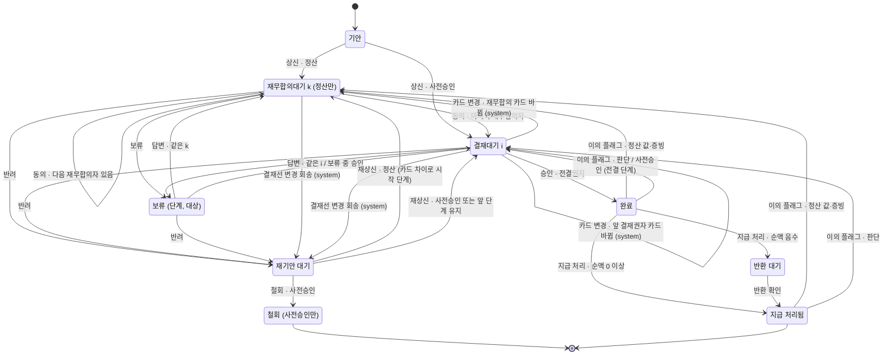

# 상태 어휘 독립 제안 — claude 레인 (#17)

- **티켓**: [#17 반려의 후속 상태 정의](https://github.com/DHChe/E2EAI_business_proj/issues/17) — 상태 어휘 전체의 주인
- **레인**: claude (세 레인 독립 제안 중 하나. 다른 레인의 산출물은 열지 않았다)
- **기준 커밋**: develop `47c89dc`
- **성격**: 제안이다. 규정 파일·ADR·용어집은 고치지 않았고, 고쳐야 할 곳은 §9(규정)·§10(ADR 후보)·§14(모순)에 적었다. 이 문서의 코드 블록은 **모두 설명용 스케치이고 구현이 아니다.**

## 0. 읽는 법

인용 약어 (줄 번호는 모두 `47c89dc` 기준):

| 약어 | 파일 |
| --- | --- |
| `CONTEXT:n` | `CONTEXT.md` |
| `ARCH:n` | `docs/ARCHITECTURE.md` |
| `PRD:n` | `docs/PRD.md` |
| `ADR-NNNN:n` | `docs/adr/NNNN-*.md` (0001–0022, 파일 이름은 `docs/adr/`에 하나씩뿐) |
| `APV:n` | `docs/company/approval-matrix.md` |
| `PRC:n` | `docs/company/travel-procedure.md` |
| `TRV:n` | `docs/company/travel-policy.md` |
| `RPL:n` | `docs/design/receipt-pipeline.md` |
| `AAC:n` | `docs/research/agent-architecture-comparison.md` |
| `TSC:n` | `docs/research/tech-stack-comparison.md` |
| `RPS:n` | `docs/research/receipt-parsing.md` |
| `KAG:n` | `docs/research/korean-approval-grammar.md` |
| `CSS:n` | `docs/research/competitor-screens.md` |

표지: `[설계 가정]` = 이 레인이 세운 가정(근거 문헌 없음), `[미확인]` = 1차 자료로 확인하지 않음, `[유도]` = 인용한 줄들에서 끌어낸 추론, **ADR 개정 제안** = ADR 0001–0022의 결정을 바꾸자는 제안(근거를 붙였다).

## 1. 요약

1. **축은 둘로 가른다.** 문서 축(결재 상태, 기안 문서 하나에 하나)과 증빙 축(값 상태, 증빙·필드·짝마다)이다. **되돌아가는 전이는 문서 축에만 있다.** 증빙 축은 앞으로만 간다 — 값을 고치면 새 필드 버전이 생기고 검산·대사가 다시 계산될 뿐이다. 두 축은 상태를 공유하지 않고 **가드**와 **카드 변경 사건** 하나로만 이어진다.
2. **반려는 구간과 무관하게 기안자의 `재기안 대기`로 간다.** 재기안은 같은 문서의 새 기안 차수이고, 결재선은 새 기안 시점에 다시 계산된다(`APV-11-1`). 앞선 승인은 **그 승인자가 읽은 판정 기록이 바뀌지 않았을 때만** 유지된다(카드 차이 규칙). **사전승인만 철회로 끝낼 수 있고**, 정산은 끝내 완료돼야 한다(법인카드 돈이 이미 나갔다). 재무합의 반려도 기안자에게 간다.
3. **항목별 부분 승인은 결재 행위로 채택하지 않는다.** 재량 조항이 허락하는 항목의 금액 판정(인정·불인정·안분)은 건 단위 승인 안의 **재량 판단 기록**으로 남고, 불인정분은 규정대로 본인 부담이 된다(`TRV-12-4`). 부분 반려(항목을 되돌려 보냄)와는 다른 물건이다.
4. **시간은 상태를 바꾸지 않는다.** 답 없는 보류와 기한 경과에는 자동 반려·자동 승인·에스컬레이션을 두지 않는다. 대신 기안자 답변 기한(규정 신설 초안)을 두고, 그 기한이 지나면 승인자의 시계를 다시 살린다 — 표시와 계산만 바뀌고 전이는 없다.
5. **재심은 새 상태가 아니라 결재 단계의 맥락**이다. 복귀 단계는 질문 영역으로 가른다(값·증빙 → 재무합의자, 판단 → 전결권자; 사전승인은 늘 전결권자) — ADR-0002:29의 **ADR 개정 제안**이다.
6. **사람 확인 지점**: 없애는 것 3(결재선 변경 때의 강제 반려 클릭, 바뀌지 않은 카드의 재승인, 재심 "유지"의 결재선 전체 재승인), 더하는 것 3(보류 답변이 앞 단계 카드를 바꿀 때의 재검토, 사전승인 재심의 전결권자 판단, 순액 반환 건의 반환 확인). 타임아웃에는 하나도 더하지 않는다. 더하는 셋은 §8에서 각각 없을 때의 실패로 정당화한다.

상태 표는 §15, 전이 표는 §16, 상태도는 §17, `UNDEFINED_BY_17` 교차 확인은 §18, 화면에 드러나는 것은 §19에 있다.

---

## 2. 질문 0 — 축: 한 기계인가, 두 축인가

### 추천

**두 축으로 가르고, 되돌아가는 전이는 문서 축에만 둔다.**

| 축 | 단위 | 상태의 성격 | 되돌아감 |
| --- | --- | --- | --- |
| **문서 축** | 기안 문서 하나(사전승인 또는 정산) | 결재 상태 — 누구의 차례인가 | 있다 (반려, 결재선 변경 회송, 승인 실효 후 재개, 재심) |
| **증빙 축** | 증빙 하나 · 필드 하나 · 대사 짝 하나 | 값 상태 — 이 값을 믿을 수 있는가 | **없다.** 수정은 새 필드 버전을 만들고 검산·대사가 다시 계산된다 |

두 축의 연결은 둘뿐이다.

1. **가드(증빙 축 → 문서 축 명령)**: 상신은 모든 필드가 확정일 때만 받는다(`PRC-11-2`, `PRC:192`). 현재 단계의 승인·동의는 그 사람의 열린 의무(재량 관문, 그 사람에게 배정된 짝 확인, 상신 뒤 생긴 짝 보류)가 없을 때만 받는다(`ADR-0012:46`, `AAC:57`). 반려·보류는 가드 없이 늘 받는다(`ARCH:314`).
2. **카드 변경 사건(증빙 축 → 문서 축 사건)**: 상신 뒤 어느 필드 버전이 바뀌면, 시스템이 결재선과 각 단계의 판정 기록을 다시 계산한다. 이미 승인한 단계의 판정 기록이 바뀌었으면 그 승인이 실효되고 문서가 그 단계로 돌아간다(질문 4·5의 **카드 차이 규칙**). 결재선 자체가 달라졌으면 문서가 기안자에게 회송된다(`APV-11-2`, `APV:256`).

증빙 축의 상태 이름은 새로 만들지 않는다. 이미 있는 이름을 쓴다: `추출 불확실` → `확정` / `재촬영 요청` / `확정 불가`(`CONTEXT:317`), 대사 결과 `대사 완료`·`대사 불일치`·`짝 없음`(`RPL:835-839`)과 영속 내부 상태 `후보 복수`·`짝 보류`(`ADR-0013:38`). 추출이 도는 중인지는 업무 상태가 아니라 실행 상태(`job`)다(`ADR-0011:43`).

#19가 제안한 `processing → extracted → pending_review ⇄ corrected → reconciled | rejected`(`RPS:245-251`)는 이렇게 옮긴다.

| #19 이름 | 이 안의 자리 |
| --- | --- |
| `processing`, `extracted` | 실행 상태(`job`) — 업무 상태가 아니다(`ADR-0011:43`) |
| `pending_review` | `추출 불확실`(열린 상태) |
| `corrected` | `확정`(출처 `사람 수기 확정`, `ADR-0012:41`) |
| `pending_review ⇄ corrected`의 되돌아가는 화살표 | **없앤다.** 다시 고치면 새 필드 버전이 생길 뿐이고 상태는 최신 버전의 함수다 |
| `reconciled` | 대사 결과 셋 중 하나 |
| `rejected` | `재촬영 요청` 또는 `확정 불가`. **`rejected`라는 이름은 증빙 축에 쓰지 않는다** — 문서 축의 `반려`와 부딪힌다(`CONTEXT:82` 반례 참고) |

### 논거

- **단위가 다르다.** 반려의 단위는 건 전체다(`CONTEXT:79`). 출처는 필드마다다(`CONTEXT:335-338`, `ADR-0012:41`). 한 기계에 합치면 "필드 하나가 `추출 불확실`인 문서는 무슨 결재 상태인가"를 모든 조합에 대해 정해야 한다.
- **증빙 축은 이미 앞으로만 가게 설계돼 있다.** 수기 확정은 "확정값으로 검산·대사를 다시 돌린다"(`CONTEXT:315`). 필드 출처는 `(entity, field, revision)` 필드 버전 행이다(`ADR-0012:41`). 이전 값으로 "되돌아가는" 전이는 필요 없다. 새 버전이 쌓이고, 검산과 대사는 결정적 코드가 다시 계산한다.
- **"되돌아가는 전이 두 벌"은 이렇게 피한다.** 증빙 축이 스스로 문서를 되돌리지 않는다. 증빙 축은 "카드가 바뀌었다"는 사실만 내보내고, 그 사실로 어디까지 되돌아갈지는 문서 축의 규칙 하나(카드 차이 규칙)가 정한다. 되돌아가는 규칙은 한 곳에만 있다.
- **세 층 구분과 맞다.** 업무 상태·실행 상태·표시 상태를 가른 `ADR-0011:43`의 업무 상태가 다시 둘로 나뉠 뿐이다. 사람 승인 대기는 여전히 문서 상태다(`ADR-0011:31-32`).

### 기각한 대안

| 대안 | 기각 이유 |
| --- | --- |
| 한 기계로 합친다 (예: `대사 대기`·`수기 확정 대기`를 문서 상태로) | 단위 불일치(건 vs 필드). 필드 하나마다 문서 상태가 흔들린다. `짝 보류`는 대사 결과 타입에 없고 승인 카드 도달 전 대기다(#8 결과 7, `RPL:835-839`) — 문서 상태로 올릴 이유가 없다 |
| 두 축 모두에 되돌아가는 전이를 둔다 (#19의 `⇄`를 살림) | "되돌아가는 전이 두 벌". 값이 바뀔 때 증빙 축의 되돌아감과 문서 축의 되돌아감이 서로 다른 규칙으로 움직여 순서가 어긋난다 |
| 계층 상태도(문서 상태 안에 증빙 하위 상태) | 표현력은 같고 복잡도만 크다. 리듀서가 역할별 액션 집합을 **데이터**로 두는 방향(`ADR-0011:98`)과 맞지 않는다 `[유도]` |

### 틀리는 조건

- 증빙 축에서 **사람의 되돌리기 행위**가 필요해지면(예: 재무합의자가 기안자의 수기 확정을 "무효"로 되돌려야 하는 규정이 생기면) 증빙 축에도 되돌아가는 전이가 생기고 이 안은 틀린다.
- 결재 행위가 필드 단위로 내려가면(항목별 부분 승인을 채택하면) 단위 불일치 논거가 사라진다 — 질문 4-2와 함께 무너진다.

---

## 3. 질문 1 — 구간별 반려

### 3.1 공통 추천: 반려 → `재기안 대기`

반려는 구간과 무관하게 문서를 기안자의 **`재기안 대기`**로 보낸다. 기안자가 할 수 있는 일은 둘이다.

- **재상신**: 같은 문서의 **새 기안 차수**(round n+1)로 다시 올린다. 결재선은 그 새 기안 시점에 다시 계산된다(`APV-11-1`, `APV:254` "결재선은 기안 시점에 계산되어 확정되며"). 조직 자료도 그 시점 것을 쓴다(`APV-8-3`, `APV:178`) `[유도]`.
- **철회**: **사전승인만** 할 수 있다. 문서는 `철회`로 닫히고 출장은 취소된 것으로 본다.

반려에는 **사유가 필수**다. 사유는 고칠 항목을 가리킬 수 있지만 반려의 단위는 여전히 건 전체다(`CONTEXT:79`). 경쟁 제품에서도 사유를 강제하고 전파하는 쪽(Moveworks)과 사유 없이 끝나는 쪽(Agent Inbox)이 갈린다(`CSS:99-115`). 이 저장소는 "기안자가 고쳐서 다시 기안해야 한다"(`CONTEXT:79`)고 했으므로, 무엇을 고칠지 모르는 반려는 그 정의를 이행할 수 없다 `[유도]`.

**재상신 때 앞선 승인은 어떻게 되나 — 카드 차이 규칙(질문 4에서 정식화)**:

- 재상신 뒤 결재선이 반려 전과 **같고**, 어느 단계에 같은 사람이 서며 그 사람에게 보일 판정 기록이 **바뀌지 않았으면**, 그 단계의 앞선 승인(동의)은 유지된다.
- 반려한 단계와 그 뒤 단계는 **늘 다시 결정한다**(반려는 승인이 아니므로 유지할 것이 없다).
- 판정 기록이 바뀐 가장 앞 단계부터 다시 진행한다. 결재는 순차이므로(`APV-9-1`, `APV:205`) 그 뒤의 승인도 모두 실효된다.
- 실효된 승인은 지우지 않는다. 감사 로그는 추가만 한다(`CONTEXT:358`) — "실효" 표지가 붙는 새 이벤트가 쌓인다.

이 유지 규칙을 반려→재상신에까지 넓힐지는 **사용자에게 묻는다**(§11 질문 A). 좁은 대안은 "반려 뒤에는 처음부터 다시"다.

**재기안은 같은 문서의 새 차수다(새 문서가 아니다).** 이유: 출장 하나에 사전승인 문서와 정산 문서가 한 벌씩 이어지고(`CONTEXT:121`, `:128`), 정산의 판은 사전승인 기안일에 묶이며(`PRC-2-2`, `PRC:33`), 정산의 전결 하한은 "그 사전승인 문서의 전결권자"를 본다(`APV-7.2-1`, `APV:150`). 새 문서를 만들면 이 참조들이 모두 "어느 문서"를 다시 물어야 한다. 기각한 대안은 `supersedes` 링크로 이은 새 문서다.

### 3.2 사전승인 반려

| 물음 (#17 본문) | 답 |
| --- | --- |
| 결과 상태 | `재기안 대기`(기안자). 재상신 또는 철회 |
| 출장은 취소되는가 | 반려만으로는 취소가 아니다. **기안자가 철회할 때** 취소된다. 철회 뒤 위약금 등 지출이 있으면 `PRC-10-2`(`PRC:179`)대로 정산을 기안한다(기준일은 예정됐던 출발일) |
| 위약금은 누가 | 규정상 예약은 사전승인이 완료된 뒤에 착수한다(`PRC-4-2`, `PRC:91`). 그러므로 **결재선 진행 중의 반려로는 위약금이 원칙적으로 생기지 않는다.** 남는 경우는 셋이다 — ① 완료 전에 예약한 경우(규정 위반): 초안 조항 "본인 부담"(§9 R3) ② 완료 전에 출발한 경우: 이미 `APV-7-1` 제2호가 정산의 한도 적용 금액 단계를 한 단계 올리고(`APV:115-117`) `APV-7.2-1`(`APV:150`)이 하한을 건다 ③ **완료 뒤 재심에서 반려된 경우**: 완료를 믿고 한 예약이므로 초안 조항 "회사 부담"(§9 R4) |
| 수정 재기안인가 종결인가 | 기안자가 고른다(재상신 / 철회) |
| 재기안 때 결재선 재계산 | 한다(새 기안 시점, `APV-11-1`). 결재선이 달라지면 앞선 승인은 모두 실효된다 |
| 이미 받은 승인 | 카드 차이 규칙(§3.1). 사용자 결정 대기(§11 질문 A) |
| 규정 몫 | 완료 전 예약의 위약금(§9 R3), 재심 반려 뒤 위약금(§9 R4), 철회된 사전승인이 `APV-7.2-1`의 "사전승인 문서"인가(§9 R5), 재기안된 사전승인의 판 기준일(`PRC-2-2`, §9 R6) — **모두 #20으로 넘기는 초안이다** |

### 3.3 정산 반려

| 물음 | 답 |
| --- | --- |
| 결과 상태 | `재기안 대기`(기안자). **철회는 없다** |
| 왜 철회가 없나 | 정산은 지출이 있으면 기안해야 하는 문서다(`PRC-10-1`, `PRC:166-177`; 취소된 출장도 `PRC-10-2`, `PRC:179`). 법인카드 지출은 회사가 이미 결제했다. 정산을 닫아 버리면 카드 지출이 정산되지 않은 채 남는다 `[유도]` |
| 반려된 항목만인가 건 전체인가 | **건 전체**(`CONTEXT:79`). 사유가 항목을 가리킬 수 있다. 재상신 때 무엇이 바뀌었는지는 카드 차이가 계산한다 |
| 재상신 / 자비 확정 / 급여 공제 | #17 본문이 한 줄에 놓은 셋은 **다른 층의 물건**이다. ① 반려 = 고쳐 오라는 되돌림(문서 축) ② 본인 부담 = 승인된 정산 **안의 금액 결과**(`TRV-11`, `TRV:233-237`; 불인정 초과분은 본인 부담, `TRV-12-4`, `TRV:251`) ③ 급여 공제 = 완료 **뒤의 반환 방법** 하나(`CONTEXT:213` 반례). 반환 방법과 시기는 규정이 정하지 않는다(`TRV-11-2`, `TRV:235`) → 초안(§9 R8), #20 |
| 기안자가 재상신 때 항목을 스스로 본인 부담으로 돌리면 | 청구 금액이 바뀌므로 카드가 바뀐다. 법인카드로 결제된 항목이면 본인 부담액이 생기고 같은 정산에서 상계된다(`TRV-11-2`, `PRC-16-2`, `PRC:307`) |
| 급여 공제의 법적 제약 | 임금 전액 지급 원칙(근로기준법 제43조) 때문에 공제에는 법령·단체협약 근거나 근로자 동의가 필요하다는 것이 통설이다 — **[미확인]** 이 저장소에 1차 자료가 없다. #20이 조항을 만들 때 확인해야 한다 |

### 3.4 재무합의 반려

| 물음 | 답 |
| --- | --- |
| 기안자에게인가, 앞 결재자에게인가, 총무에게인가 | **기안자에게**(`재기안 대기`). 재무합의는 기안자와 첫 결재자 사이에 서므로(`APV-9-1`, `APV:205`) **앞 결재자가 없다.** 총무는 결재선에 없다 — 예약 확정 연결은 상태 전이이지 결재가 아니다(`PRC-8-3`, `PRC:152`) |
| 앞 재무합의자가 있으면(담당자 → 재무팀장, `APV-9-2`, `APV:207-218`) | 그래도 기안자에게. 앞 결재자에게 돌려보내는 방식(다우오피스·카카오워크의 운영자 설정, `KAG:210`, `:356`)은 고칠 수 없는 사람에게 문서를 보낸다 — 앞 재무합의자는 증빙을 고칠 권한이 없다 `[유도]` |
| 재상신 뒤 | 재무합의가 다시 첫 단계다(`APV-9-1`). 카드 차이 규칙이 그대로 적용된다 |
| 예약 쪽 자료가 문제면 | 여행사 예약 줄의 짝·값 문제는 기안자에게 묻고, 총무에게 묻는 보류 대상은 **정의하지 않는다**(보류 대상은 기안자 또는 에이전트, `CONTEXT:86`). #18 후속으로 남긴다(§12) |

### 3.5 비대칭 — 누가 반려할 수 있나

| 사람 | 반려 | 근거 |
| --- | --- | --- |
| 결재권자(현재 단계) | 한다. 재량 관문도 막지 않는다 | `CONTEXT:79`, `ADR-0012:46`, `ARCH:314` |
| 재무합의자(현재 단계) | 한다. **재무합의는 늘 반려를 허용한다** | `APV-9-3`·`APV-9-5`(`APV:220-235`), `KAG:276` |
| 협조자 | **이 결재선에 없다.** 협조는 법령상 반려 권한이 없다(`CONTEXT:68`) — 그래서 우리 결재선에는 반려할 수 없는 결재선 행위자가 한 명도 없다 | `CONTEXT:68`, `KAG:74` |
| 기안자 | 반려하지 않는다. 사전승인만 **철회**한다 | §3.2 |
| 내부감사 | 반려하지 않는다. **이의 플래그**로 재심을 연다 — 반려가 아니다 | `CONTEXT:366`, `ADR-0002:65-66` |
| 재무팀(지급 처리) | 반려하지 않는다. 지급 처리는 결재가 아니다(`CONTEXT:128`). 문제를 보면 내부감사에 알리는 것뿐이다 `[설계 가정]` | `ARCH:281` |
| 총무·인사 | 반려하지 않는다 | `PRC-8-3` |
| 에이전트 | **결재 행위자가 아니다** | `CONTEXT:331`, `ADR-0012:35-36` |

"협조자는 반려권이 없고 재무합의는 늘 반려를 허용한다"는 비대칭은, 이 저장소에서는 **협조 역할을 두지 않았기 때문에** 결재선 안에서 사라진다. 비대칭은 결재선 **밖**(내부감사·재무팀·총무)으로 옮겨 가고, 그들의 도구는 반려가 아니라 각자의 전이(플래그·지급 처리·예약 연결)다.

### 틀리는 조건

- 정산을 닫아야 하는 실제 사례가 나오면(예: 같은 지출을 두 번 기안한 중복 기안) "정산 철회 없음"이 틀린다 → §11 질문 E.
- 반려 사유가 항목을 가리킬 때 기안자가 **그 항목만** 고치고 나머지 결재선이 전부 다시 도는 비용이 #11 시나리오에서 지배적이면, 카드 차이 규칙을 반려에까지 넓히지 않는 대안(질문 A-b)이 틀리고, 넓히는 추천이 옳다. 반대로 카드가 판정 기록을 빠짐없이 싣지 못하면(S15 실패, `PRD:165`) 넓히는 추천이 틀린다.
- 재무합의 반려를 앞 재무합의자에게 보내야 할 업무 이유(예: 재무팀장이 담당자의 판단을 뒤집는 경우)가 규정에 들어오면 §3.4가 틀린다.

---

## 4. 질문 2 — 답 없는 보류와 흐르는 시간

### 두 시계

| 시계 | 조항 | 보류 중에 |
| --- | --- | --- |
| **승인자의 시계** | 도달일부터 영업일 수 이내에 승인(동의)·반려·보류 중 하나(`PRC-14-1`, `PRC:269`; 영업일 수는 그 아래 블록) | **보류가 시계를 채운다** — 보류도 허용된 행위다(#8 결과 2, <https://github.com/DHChe/E2EAI_business_proj/issues/8#issuecomment-5769586450>). 다시 그 승인자의 차례가 되면 그날이 새 도달일이다(`PRC-14-2`, `PRC:283`) |
| **문서의 기한** | 현재 걸린 사내 기한의 최솟값(`PRC-3-5`, `PRC:68`; #8 결과 2) | 사전승인은 출발 전 완료 기한(`PRC-6-1`, `PRC:113-127`)이 살아 있다. **정산은 결재 중에 살아 있는 문서 기한이 없다** — 기안 기한(`PRC-10-1`)은 이미 이행했고 지급 기한(`PRC-16-1`, `PRC:295`)은 완료부터다 `[유도]` |

그러므로 진짜 빈틈은 **정산이 보류된 채 기안자가 답하지 않으면 아무 시계도 돌지 않는다**는 것이다. `PRC-13-4`는 대사 완료가 아닌 모든 지출에 대해 재무합의자가 보류하고 질문하게 한다(`PRC:239`) — 이 빈틈은 드문 경우가 아니라 정산의 흔한 경로 위에 있다.

`PRC-14-3`은 "기한이 지난 뒤의 상태 전이는 이 규정이 정하지 않는다"고 하고 "결재 상태의 어휘는 이 규정의 소관이 아니다"라고 한다(`PRC:285`). 이 안은 그 자리를 상태 어휘로 채우되, 규정에는 상태 이름 없이 업무 규칙만 넘긴다(§9 R10).

### 추천

1. **시간이 흘러도 문서 상태는 바뀌지 않는다.** 자동 반려·자동 승인·자동 취소·다른 사람에게 넘기는 에스컬레이션을 두지 않는다.
2. **기안자 답변 기한을 규정에 새로 둔다**(보류 대상이 기안자일 때만, §9 R9 초안, 영업일 수는 사람 결정). 기한이 지나면:
   - 두 큐에 "답변 기한 경과"를 표시한다(기안자·승인자).
   - 그다음 영업일을 **그 승인자의 새 도달일**로 본다 — `PRC-14-2`와 같은 방식으로 승인자의 3영업일 시계가 다시 산다.
   - 이것은 전이가 아니라 **계산값**이다. 기한은 저장하지 않고 매번 계산하므로(`ADR-0013:35`, `ARCH:298`) 깨우는 `job`이 필요 없다("N일 뒤에 깨워라"를 두지 않은 `ADR-0011:18`과 맞다).
3. **보류 중인 승인자가 답을 기다리지 않고 바로 결정할 수 있게 한다**: `보류` → 승인·동의·반려(같은 승인자). 열린 질문은 "답변 없이 종결"로 닫히고, 늦게 온 답변은 기록만 되고 전이를 일으키지 않는다. 재량 관문은 여전히 승인·동의를 막는다(`ADR-0012:46`).
4. **보류 대상이 에이전트일 때**: 에이전트 답변은 기계의 작업이다. 작업이 실패하면 그것은 실행 상태(`job`)이지 업무 상태가 아니다(`ADR-0011:43`). 승인자는 실패 표시를 보고 다시 묻거나 바로 결정한다. 답변 작성의 책임자는 질문한 승인자다(`ADR-0019:33`).
5. **`PRC-14-3`을 바꾸는 초안**을 #20에 넘긴다: "기한이 지난 문서는 그 결재자의 차례에 머문다. 회사는 문서를 다른 사람에게 넘기거나 자동으로 반려·승인하지 않는다."(§9 R10)

### 논거

- **자동 반려는 결재 행위다.** 결재 4행위의 행위자는 현재 단계 담당자인 사람뿐이다(`ADR-0012:35-36`). 시스템이 반려하면 이 결정을 깬다.
- **자동 승인은 금지돼 있다.** 에이전트는 결재 행위자가 아니고(`CONTEXT:331`), 자동 반려·자동 승인은 없다(`ARCH:300`).
- **다른 사람에게 넘기면 결재선이 바뀐다.** 결재선은 기안 시점에 확정되고 진행 중에 바뀌지 않는다(`APV-11-1`). 부재 대리는 `대결`인데 MVP 범위 밖이고 넣으려면 ADR이 필요하다(`CONTEXT:100`). 담당자 부재 때 자동 대체도 없다(`ADR-0019:37`).
- **자동 취소는 문서를 닫는 행위다.** 정산은 닫으면 안 되고(§3.3), 사전승인 철회는 기안자의 선택이다(§3.2).
- **기한 경과에는 불이익이 없다**(`PRC-15-2`, `PRC:291`). 경과는 표시만 한다(`ARCH:300`). 기한 경과를 전이의 방아쇠로 쓰면 "불이익 없음"과 부딪힌다 `[유도]`.
- **사람 확인 지점이 늘지 않는다.** 답변 기한 경과는 새 확인을 만들지 않고, 이미 있는 승인자의 결정을 다시 그 사람의 큐 앞에 세울 뿐이다. #8 입력 댓글이 적은 제약 "사람에게 보내는 건수 자체가 보장의 분모다(ADR-0010, #19 ⑤)"(<https://github.com/DHChe/E2EAI_business_proj/issues/8#issuecomment-5761066202>, 2026-09-21)와 맞다.
- `ARCH:305`는 "기한이 저장되거나 기한 경과가 자동 전이를 일으키게 되면(#17의 타임아웃 에스컬레이션) 그 전이의 책임자 행을 다시 둔다"고 했다. 이 안은 기한을 저장하지도 않는다(답변 기한도 계산값이다). 이 안에서는 그런 전이가 없으므로 **책임자 행을 다시 둘 일이 없다.**

### 기각한 대안

| 대안 | 기각 이유 |
| --- | --- |
| N일 뒤 자동 반려 | `ADR-0012:35-36` 위반. 반려 사유를 사람이 적지 않은 반려가 생긴다 |
| N일 뒤 자동 승인 | `CONTEXT:331`, `ARCH:300`, `PRD:141`(제외 13) 위반 |
| 상위자에게 에스컬레이션(#19 제안, `RPS:251`) | 결재선 변경(`APV-11-1`) 또는 대결(`CONTEXT:100`). 자동 대체 없음(`ADR-0019:37`) |
| 자동 취소(#19 제안) | 정산에는 불가능, 사전승인에는 기안자의 권리를 빼앗는다 |
| 아무것도 하지 않는다(현 상태 유지) | 정산 보류에 살아 있는 시계가 하나도 없는 빈틈이 남는다 |

### 틀리는 조건

- 승인자가 장기 부재인 문서가 #11 시나리오나 실제 운영에서 반복되고, 그 문서가 막혀 있는 비용(예: 출발일을 넘기는 사전승인)이 대결 도입 비용보다 크면 "에스컬레이션 없음"이 틀린다 → §11 질문 C.
- 답변 기한 경과 뒤 승인자가 거의 늘 반려한다면, 그 반려는 사실상 "답 없음 → 반려" 자동 규칙의 사람 도장이다. 그 비율이 높게 관측되면(93% 경고, `RPS:241`) 이 안의 "사람이 결정한다"는 논거가 약해진다.

---

## 5. 질문 3 — 재심(이의 플래그)

### 추천

1. **재심은 새 최상위 상태가 아니다.** 결재 단계의 대기(`재무합의대기(k)` 또는 `결재대기(i)`)에 **재심 맥락**(내부감사의 질문, 질문 영역, 플래그 직전 상태, 원래 완료 시각)이 붙은 것이다. 플래그는 결재 행위가 아니고 네 번째 액션도 아니다(`CONTEXT:366`, `ADR-0002:65-66`).
2. **복귀 단계는 질문 영역으로 가른다** — **ADR 개정 제안**(ADR-0002:29 "이의 플래그는 대상 건을 `재무합의대기`로 되돌린다").

   | 문서 | 질문 영역 | 재심을 맡는 단계 | 근거 |
   | --- | --- | --- | --- |
   | 정산 | 값·증빙(`APV-10-1`의 사항: 증빙·대사·법정 판정) | `재무합의대기(1)` — ADR-0002 그대로 | `APV:239-250` |
   | 정산 | 판단(`APV-10-2`의 사항: 출장과 지출의 업무상 필요 등) | 그 문서의 **전결권자** 단계 `결재대기(전결)` | `APV-10-3` — 재무합의자는 이 판단을 하지 않는다(`PRC-13-5`, `PRC:241` "출장과 지출의 업무상 필요 자체는 판단하지 않는다") |
   | 사전승인 | (영역 무관) | 그 문서의 **전결권자** 단계 | 사전승인에는 재무합의가 없다(`APV-9-1`, `APV:205`; `ARCH:345`). 효력을 발생시킨 사람은 마지막 승인자다(`CONTEXT:72`) |

   영역은 내부감사가 고르지 않는다. 플래그는 질문이 가리키는 필드나 조항을 달고, **코드가 `APV-10` 표로 영역을 정한다** `[설계 가정]`. 감사자는 판정하지 않고 되물을 뿐이라는 원칙(`ADR-0002:30`)을 지키기 위해서다.
3. **진행 중인 문서의 플래그**: 값·증빙 영역이면 `재무합의대기(1)`(ADR-0002 그대로). 판단 영역이면 **상태를 바꾸지 않고** 질문을 전결권자의 카드에 붙인다 — 전결권자가 아직 판단하기 전이기 때문이다 `[설계 가정]`.
4. **재심의 닫힘은 둘이다.**
   - **유지**: 재심 단계의 사람이 승인(동의)하고, 그 뒤 카드 차이 계산에서 **아무 단계의 판정 기록도 바뀌지 않았으면** 문서는 플래그 직전 상태로 돌아간다. **원래 완료 시각과 기존 승인이 그대로 효력을 가진다**(새 이벤트 "재심 종결: 유지"가 쌓일 뿐이다).
   - **변경**: 재심 단계의 사람이 반려하면 `재기안 대기`로 간다(§3). 재상신 뒤 카드가 바뀐 단계부터의 승인은 실효되고(기록은 남고 "실효" 표지), 새로 완료되면 **새 완료 시각**이 생긴다.
5. **지급의 효력**:
   - 재심이 열린 동안 지급 처리는 받지 않는다(§9 R11 초안).
   - **이미 지급한 돈은 사실로 남는다.** 재심이 "변경"으로 닫혀 새 지급액이 정해지면 차액(새 지급액 − 기지급액)을 처리한다 — 양수면 추가 지급 처리, 음수면 반환 대기(순액 반환과 같은 경로, §5.1).
6. **수정값은 늘 대사를 다시 거친다.** 재심에서 값이 바뀌면 새 필드 버전이 생기고 검산·대사가 다시 계산된다 — 사람 비용이 없는 코드 경로다(`CONTEXT:315`의 수기 확정과 같은 규율). 재심을 여는 순간에도 **현재의 카드 청구 줄로 대사를 한 번 다시 계산**해 재심 단계의 카드에 싣는다 — 완료 뒤에 도착한 카드 줄이 있을 수 있기 때문이다(카드 이용 내역은 매일 자동으로, 청구 명세는 월 1회 가져온다, `ADR-0021:43`) `[유도]`.
7. **완료 뒤에 대사가 달라지면**(새 카드 줄, 정정 재발행·부분 취소 등, `ARCH:415`): 완료 문서의 상태는 바뀌지 않는다. 내부감사와 재무팀의 화면에 "완료 후 대사 변동"만 표시한다. 재심을 여는 것은 여전히 내부감사뿐이다(`ADR-0002:29`). 지급을 자동으로 막지도 않는다 `[설계 가정]`.

### 5.1 순액이 반환인 건의 지급 처리 (`PRD:86`, `PRD:160`)

지급 처리(재무팀, 결재선 없는 전이, `CONTEXT:128`, `ARCH:281`)는 순액의 부호로 가른다.

| 순액(`TRV-11-2`, `PRC-16-2`) | 지급 처리가 기록하는 것 | 도착 | 지급 기한(`PRC-16-1`)은 |
| --- | --- | --- | --- |
| > 0 | 지급(송금은 실행하지 않는다, `PRD:86`) | `지급 처리됨` | 이 사건으로 닫힌다 |
| = 0 | 상계 종결 | `지급 처리됨` | 이 사건으로 닫힌다 |
| < 0 | 반환 청구 | **`반환 대기`**(신설) | 이 사건으로 닫힌다. 반환 기한은 규정에 없다(`TRV-11-2` "반환의 방법과 시기는 이 규정이 정하지 않는다", `TRV:235`) → §9 R8 |

`반환 대기`는 재무팀이 **반환 확인**을 기록하면 닫힌다. S10("닫는 사건이 정의되지 않은 기한 0", `PRD:160`)을 지키려면, #20이 반환 기한을 만드는 순간 그 기한을 닫는 사건이 필요하다 — 그것이 반환 확인이다. 이 지점은 §8에서 "더하는 지점"으로 센다.

### 논거

- **사전승인 플래그의 대상이 정의돼 있지 않다**(`ARCH:347`, `AAC:162`). `재무합의대기`는 정산에만 있다(`APV-9-1`). 효력을 발생시킨 사람(`CONTEXT:72`, 전결권자는 결재선의 마지막, `APV-1-2`, `APV:25-27`)에게 되묻는 것이 "되묻는다"의 가장 짧은 경로다.
- **판단 영역의 질문을 재무합의자에게 보내면 아무도 답하지 않는다.** 재무합의자는 업무상 필요를 판단하지 않는다(`APV-10-3`, `PRC:241`). 카드 차이 규칙 아래에서 재무합의자가 "내 영역에서 바뀐 것 없음"으로 동의하면 뒤 단계의 카드도 그대로이므로 기존 승인이 유지되고, 질문은 권한 있는 사람을 거치지 않고 닫힌다 `[유도]`. 반대로 뒤 단계를 모두 다시 돌리면 질문 하나에 결재선 전체의 사람 지점을 쓴다.
- **완료 시각을 유지해야 하는 이유**: 지급 기한은 완료일부터 센다(`PRC-16-1`, `PRC:295`). "유지"로 닫힌 재심이 완료일을 새로 만들면, 재심이 기한을 늘리는 도구가 된다 `[유도]`.
- **이미 지급한 돈을 되돌리는 상태를 만들지 않는다.** 송금은 시스템 밖이다(`PRD:86`). 시스템이 할 수 있는 것은 차액을 계산해 다음 지급 처리에 싣는 것뿐이다.

### 기각한 대안

| 대안 | 기각 이유 |
| --- | --- |
| ADR-0002 그대로(늘 `재무합의대기`) + 카드 차이 | 판단 영역 질문이 권한 없는 사람에게서 닫힌다(위 논거) |
| ADR-0002 그대로 + 재심 뒤 결재선 전체 재승인 | 질문 하나에 N+1 사람 지점. "한 번 더 확인"을 기본값으로 삼는 것이다 |
| `재심` 최상위 상태 신설 | 재심 중에도 결국 "누구의 차례인가"는 결재 단계다. 상태를 늘리면 리듀서 표 행만 늘고 정보는 같다 |
| 사전승인 플래그를 첫 결재자에게 | 효력을 발생시킨 사람이 아니다. 전결권자보다 아래 단계가 전결권자의 판단을 다시 여는 모양이 된다 |
| 완료 뒤 대사 변동 때 자동으로 지급 차단 | 결재 행위도 플래그도 아닌 시스템 판단으로 돈의 흐름을 막는다. 권한 표(`ADR-0002:21-27`)에 그런 권한이 없다 |

### 틀리는 조건

- 한 질문이 두 영역에 걸치는 경우가 흔하면(예: 증빙이 없어서 업무 관련성을 판단할 수 없는 경우 — `PRC-13-5`가 바로 이 경계다) 코드가 영역을 하나로 정하는 규칙이 틀린다. 그때는 "두 단계 모두"로 보내야 하고 사람 지점이 는다.
- 내부감사가 재심에서 **전결권자의 판단 자체**를 문제 삼는 경우(전결권자가 이해관계자인 경우 등)에는 같은 사람에게 되묻는 것이 무의미하다. 1인 겸직 배제(`ADR-0002:47-49`)가 이 경우를 다루지 못하면 이 안은 틀린다.
- 완료 뒤 대사 변동이 실제로 지급 전에 자주 생기고 그 대부분이 과지급으로 이어지면, "지급을 자동으로 막지 않는다"가 틀린다.

---

## 6. 질문 4 — #19의 세 전이

### 6.1 값만 수정한 뒤 재개

**추천**: 재개는 **증빙 축의 재계산 + 문서 축의 카드 차이 규칙**이다. 새 상태는 없다.

- **상신 전**: 문서는 `기안`에 머문다. 수기 확정·짝 확인은 증빙 축의 일이고 문서 상태를 흔들지 않는다. 상신 가드가 "모든 필드 확정"을 본다(`PRC-11-2`).
- **상신 뒤**: 기안자가 값을 **바꿀 수 있는 창구는 셋뿐**이다 — 보류 답변(새 증빙·새 사실, `PRC-13-4`는 추가된 사실을 받는다, `PRC:239`), 배정된 짝 확인, 배정된 수기 확정. **기안 폼의 항목(`PRC-11-1`, `PRC:183`의 청구 금액·사유 등)을 고치려면 반려 → 재기안이다** — 결재선 입력이 바뀔 수 있으면 재기안으로만 한다는 `APV-11-2`(`APV:256`)를 좁게 읽지 않은 것이다 `[유도]`.
- **카드 차이 규칙(정식화)**:

```text
# 설명용 스케치 — 구현 아님
on field_version_changed(document):          # actor_kind = system
    new_line  = compute_line(document)        # 기안 시점 조직 자료, APV-8-3
    if new_line != document.fixed_line:       # APV-11-2
        lapse all approvals; → 재기안 대기 (사유: 결재선 변경 회송)
        return
    for stage in document.fixed_line (순서대로):
        if stage.approved and card(stage, now) != card(stage, at approval):
            lapse stage and every later approval
            → 그 stage의 대기 (재무합의대기 k 또는 결재대기 i)
            return
    # 바뀐 카드가 없으면 현재 단계 그대로
```

  - **카드 비교의 범위** = S15의 판정 기록(`PRD:165` — 결재선·전결권자, 한도 대조, 차이, 재량 조항, 주의 신호와 근거 조항)에서 **기한 표시를 뺀 것** `[설계 가정]`. 기한을 빼는 이유: 기한 경과에는 불이익이 없고(`PRC-15-2`) 경과는 표시만 한다(`ARCH:300`) — 판정의 입력이 아니다.
  - **비교의 기준**: 승인 이벤트가 "이 승인에서 읽은 카드 revision"을 이미 가리킨다(`ARCH:406`). 새 저장 구조가 필요 없다 `[유도]`.
  - **결재선 변경 회송**은 반려가 아니다. 행위자는 시스템이고, 책임자는 결재선 계산에 배정된 업무 운영 담당자다(`ADR-0019:29-30`, `ARCH:261`). 결재 4행위를 사람만 하게 한 `ADR-0012:35-36`과 부딪히지 않는다 — 결재 행위가 아니기 때문이다. 이렇게 하는 이유: 결재선이 달라진 문서에 승인자가 반려를 누르게 하면, 그 클릭에는 **정답이 하나뿐**이다(`APV-11-2`가 재기안을 명령한다). 정답이 하나인 클릭은 확인이 아니라 도장이다(93% 경고, `RPS:241`).

**보류 답변이 앞 단계의 카드를 바꿀 때**: `ADR-0003:26`은 "답변이 오면 같은 결재자의 `결재대기`로 돌아간다"고 했고, `CONTEXT:88`도 답변 도착 뒤 같은 대기 상태(같은 승인자)로 적었다. 이 안은 **답변이 값을 바꾸지 않을 때**로 그 문장을 좁힌다 — **ADR 개정 제안**(ADR-0003). 결재권자가 보류로 기안자에게 증빙을 더 받았는데 그 증빙이 대사 결과를 바꾸면, 재무합의자의 판정 기록(`PRC-13-4`·`PRC-13-5`의 판단, `decided_by` 재무합의자)이 바뀐 것이다. 결재권자는 그 판단을 대신하지 않는다(`APV-10-3`). 그러므로 문서는 `재무합의대기(1)`로 돌아간다.

### 6.2 항목별 부분 승인

**채택 여부 먼저: 결재 행위로는 채택하지 않는다.** 승인·동의·반려·보류는 건 단위로 남는다(`CONTEXT:79`). ADR-0003(provisional, `ADR-0003:3`)의 "승인자의 액션 3종"을 이 점에서 **확정**하자고 제안한다.

그 대신 **항목 금액 판정**을 둔다.

| 구분 | 항목별 부분 승인(채택 안 함) | 항목 금액 판정(이 안) | 부분 반려(채택 안 함, `CONTEXT:82`) |
| --- | --- | --- | --- |
| 무엇이 항목 단위인가 | 승인 상태 | **금액 결과**(지급 인정액·본인 부담액) | 문서의 되돌림 |
| 누가 | 각 승인자가 항목마다 | 재량 조항의 `decided_by`만(`TRV:400-402`의 네 조항) | 수신부서별(KT 비즈메카, `KAG:257`) |
| 결과 | 항목마다 승인됨·안 됨이 섞인 문서 | 건은 하나의 승인을 받고, 판정된 항목의 초과분·안분분은 **본인 부담**(`TRV-12-4`, `TRV:251`; 안분은 `TRV-13-4`, `TRV:283`) | 일부 항목만 기안자에게 돌아감 |
| 기안자가 고칠 것 | (모호) | **없다** — 본인 부담은 규정이 정한 결과다 | 있다 |
| 기록 | 항목별 결재 이벤트 | 재량 판단 기록(재량 관문이 열려 있는 동안 승인·동의를 막는 그 기록, `ADR-0012:46`) | — |

- **#8이 물은 재량 "인정하지 않음"·안분은 같은 문제인가**: **같은 문제가 아니다.** #8은 이것을 "사실상 항목별 부분 승인"이라 불렀다(#8 결과 "넘길 것", <https://github.com/DHChe/E2EAI_business_proj/issues/8#issuecomment-5769586450>). 그러나 규정은 불인정의 결과를 이미 정해 두었다 — 초과분은 본인 부담이 된다(`TRV-12-4`). 이것은 결재 행위의 쪼갬이 아니라 **재량 판단의 금액 효과**다. 재량 판단은 이미 판단 책임자에게 올라가는 경로가 있고(`ADR-0005`의 재량 블록, `ADR-0005:63-79`), 관문으로 승인·동의 앞에 선다(#8 결과 5).
- **재량 조항이 없는 항목을 승인자가 인정하지 않으려면**: 반려다. 사유에 항목을 적는다. 규정도 이 모양이다 — 재무합의자는 근거가 없으면 **반려한다**(`PRC-13-5`, `PRC:241`). 항목 하나의 근거 부족에 대한 규정의 답이 건 반려다.
- **재량 판단이 결재선 입력을 바꾸는 경우**(`TRV-7-1`은 한도 적용 금액을, `TRV-13-4`는 총액을 바꾼다): 카드 차이 규칙의 "결재선 변경 회송"이 기본값이지만, 이것은 **#21의 결정 영역**이다(§12). 이 안은 #21이 무엇을 고르든 카드 차이 규칙이 그 위에서 동작하도록만 한다.

**기각한 대안**: ① 항목별 부분 승인을 결재 행위로 채택 — 상태가 항목 단위로 쪼개진다는, 부분 반려를 기각한 바로 그 이유(`ADR-0003:41-42`, `CONTEXT:82`)가 그대로 적용되고, 카드의 판정 기록 항목 집합(S15, `PRD:165`)을 항목×승인자 행렬로 바꿔야 한다. ② 모든 항목에 승인자의 "불인정" 버튼 — 재량 조항 없이 금액을 깎는 권한을 만든다. 규정에 없는 재량이 생기고(재량 조항은 넷뿐, `TRV:402`), 재량을 거치는 판정이 다수가 되면 이 방식의 전제가 틀린다(`PRD:121`).

### 6.3 승인 대기 타임아웃 에스컬레이션

**채택하지 않는다.** 질문 2의 결론 그대로다 — 전이 없음, 표시와 시계 재계산만(§4). #19의 "타임아웃 시 에스컬레이션 또는 자동 취소"(`RPS:251`)는 규정 문장이 아니라 제안이다.

### 틀리는 조건

- (6.1) 승인자의 결정이 카드 밖의 정보(대화, 카드에 없는 첨부)에 기대는 일이 흔하면, "카드가 같으면 승인도 같다"는 전제가 무너진다. S15 누락이 관측되면(`PRD:165`) 카드 차이 규칙 전체가 틀린다.
- (6.1) 기안 폼 항목의 작은 오타 수정(예: 사유 문구)까지 반려 → 재기안을 요구하는 비용이 #11 시나리오에서 크게 나오면, "폼 항목은 재기안으로만"이 너무 좁다.
- (6.2) 재량 조항이 없는 항목의 불인정 반려가 반려의 다수를 차지하고, 그 재기안이 늘 "그 항목을 본인 부담으로 돌림"으로 끝나면, 규정에 항목 불인정 조항을 더하는 것(#20)이 이 안보다 싸다.

---

## 7. 질문 5 — 상신 뒤 새로 생긴 짝 보류

**추천**:

1. **막는 것**: 상신 뒤 새 짝 보류가 생기거나 재무합의자에게 값 모순 짝 확인이 배정되면, **현재 단계의 승인·동의만** 막힌다(A10/C3, `AAC:57`, `AAC:193`). 반려·보류는 막지 않는다(`ARCH:314`). 문서 상태는 바뀌지 않는다.
2. **푸는 사람**: 짝 확인은 값 모순이면 재무합의자, 그 밖이면 기안자(`CONTEXT:310`; 순서는 `RPL:2130-2157`).
3. **재개 시점**: 짝 확인이 끝나면 대사가 다시 계산되고 **카드 차이 규칙**이 돈다.
   - 이미 승인한 단계의 카드가 안 바뀌었으면 → 현재 단계에서 그대로 계속.
   - 바뀌었으면 → 바뀐 가장 앞 단계로 돌아가고 그 단계와 뒤의 승인은 실효.
   - 결재선이 바뀌었으면 → 결재선 변경 회송(`재기안 대기`).
4. **완료 뒤에 생긴 짝 보류**: 문서 상태는 그대로이고 "완료 후 대사 변동"으로 표시한다(§5 추천 7).

**논거**: 짝 보류는 승인 카드 도달 전의 대기이고(#8 결과 7), 대사 결과 타입에 없다(`RPL:835-839`). 상신 뒤에 생긴 것은 "도달 전"이 아니므로 현재 단계를 막는 것이 A10의 결정이다. 풀린 뒤 어디서 재개할지는 "무엇이 바뀌었는가"의 함수여야 하고, 그 함수가 카드 차이 규칙이다. 별도 규칙을 두면 질문 4-1과 재개 규칙이 두 벌이 된다.

**기각한 대안**: ① 늘 처음(첫 단계)부터 — 짝 하나가 바뀌지 않은 카드까지 모두 다시 승인하게 한다. ② 늘 현재 단계에서 — 앞 단계(특히 재무합의자)가 본 대사 결과가 바뀌었는데도 그 사람의 동의가 남는다(`APV-10-1`의 판단이 건너뛰어진다).

**이미 받은 승인**: 카드가 바뀐 단계와 그 뒤만 실효. 실효 기록은 지우지 않는다(`CONTEXT:358`).

**틀리는 조건**: 상신 뒤 짝 보류가 대부분 재무합의자의 카드를 바꾸는 것으로 관측되면(예: 카드 청구 줄이 결재 중에 늦게 들어오는 경우가 흔하면), 이 안은 사실상 "늘 처음부터"가 되어 기각한 대안 ①과 비용이 같아진다. 그러면 비용 논거는 사라지고 정확성 논거만 남는다.

---

## 8. 질문 6 — 사람 확인 지점의 수

기준선은 `ARCH:364-380`의 사람 지점 표와 지금 정의된 전이다. "지점"은 시스템이 **사람에게 무언가를 하라고 세우는 자리**다(책임자 배정은 확인 요청이 아니다, `ARCH:382`).

### 없애는 지점 (−)

| # | 지점 | 언제 | 무엇으로 대체 |
| --- | --- | --- | --- |
| −1 | 결재선이 바뀐 문서에 승인자가 누르는 반려 | 상신 뒤 값 변경이 결재선 입력을 바꿀 때 | 시스템의 결재선 변경 회송. 그 반려 클릭에는 정답이 하나뿐이다(`APV-11-2`) |
| −2 | 카드가 바뀌지 않은 단계의 재승인 | 보류 답변·짝 확인·재상신 뒤 | 카드 차이 규칙. 재상신에까지 넓히는 것은 §11 질문 A |
| −3 | 재심 "유지"로 닫힐 때의 결재선 전체 재승인 | 재심 | 재심 단계 한 사람 + 카드 차이 |

### 더하지 않는 것 (0)

| 자리 | 왜 0인가 |
| --- | --- |
| 타임아웃·기한 경과 | 전이 없음. 표시와 승인자 시계의 재계산뿐(§4) |
| 보류 중 바로 결정 | 이미 있는 승인자의 결정을 앞당길 뿐 |
| 재심 뒤 재검산·재대사 | 코드(`CONTEXT:315`) |
| 결재선 변경 회송 뒤 기안자의 재기안 | 반려 뒤에도 어차피 기안자가 재기안한다(`CONTEXT:79`). 대체일 뿐 추가가 아니다 |
| 사전승인 철회 | 기안자가 `재기안 대기`에서 어차피 하나를 골라야 한다. 선택지가 하나 는 것이지 지점이 는 것이 아니다 |

### 더하는 지점 (+), 각각 없을 때의 실패

| # | 지점 | 누가 | 이 지점이 없으면 생기는 구체적 실패 |
| --- | --- | --- | --- |
| +1 | 보류 답변(또는 짝 확인)이 **앞 단계의 카드를 바꿀 때** 그 단계의 재검토 | 주로 재무합의자 | 결재권자의 보류로 들어온 새 증빙이 대사 결과를 바꿔도 재무합의자의 동의가 남는다. 그 동의 이벤트는 재무합의자가 **읽지 않은 카드 revision**에 묶인다 — 감사 조회 "이 승인에서 읽은 카드 revision → 계산 → …"(`ARCH:406`)가 거짓을 말한다. `PRC-13-4`·`PRC-13-5`의 판단(`decided_by` 재무합의자)이 건너뛰어진다 |
| +2 | 사전승인 재심의 전결권자 판단 | 전결권자 | 사전승인에 걸린 플래그가 갈 곳이 없다(`ARCH:347`). 지금은 `UNDEFINED_BY_17`로 거절될 뿐이고, 내부감사는 판정할 수 없으므로(`ADR-0002:30`) 플래그를 연 질문이 **아무에게도 도달하지 않는다** |
| +3 | 순액 반환 건의 반환 확인 | 재무팀 | 반환 청구가 기록된 뒤 돈이 돌아왔는지 시스템이 모른다. #20이 반환 기한을 만들면 그 기한은 **닫는 사건이 없는 기한**이 되어 S10 하드 규칙(`PRD:160`)을 깬다. 순액이 음수인 건에만 생긴다 |

판단 영역 재심을 전결권자에게 보내는 것(§5)은 **추가가 아니라 교체**다 — 재심마다 한 사람이 보는 것은 ADR-0002와 같고, 그 사람이 바뀔 뿐이다.

### 틀리는 조건

- +1이 #11 시나리오에서 드물지 않고, 그 재검토의 대부분이 "바뀐 것 확인, 동의"로 끝나면 +1은 도장이 된다. 그때는 카드 비교 범위를 좁혀야 한다(예: 그 단계의 `decided_by` 필드만).
- +3을 두어도 반환이 시스템 밖(ERP, `docs/company/tools.md:14`)에서만 추적된다면 이 지점은 중복이다 → §11 질문 D.

---

## 9. 규정 변경 목록 (초안 — 규정 파일은 고치지 않았다)

규정 개정권자는 대표이사다(`ADR-0022`). 아래는 모두 **#20으로 넘기는 초안**이고, 새 조항 번호는 가번호다. 문언에 상태 이름을 쓰지 않았다 — 결재 상태의 어휘는 규정의 소관이 아니다(`PRC-14-3`, `PRC:285`).

| 조항(새 번호 또는 기존) | 초안 문언 | 왜 필요한가 | 넘길 곳 |
| --- | --- | --- | --- |
| R1 `PRC-14-4`(신설) | "반려하는 결재자와 재무합의자는 사유를 적는다. 사유에는 고칠 항목을 적을 수 있다." | 반려의 정의가 "기안자가 고쳐서 다시 기안"(`CONTEXT:79`)인데, 사유 없는 반려로는 고칠 것을 알 수 없다(§3.1) | #20 |
| R2 `APV-11-3`(신설) | "반려된 문서는 기안자가 고쳐 다시 기안한다. 다시 기안한 날을 기안 시점으로 보아 결재선을 다시 계산한다. 다시 계산한 결재선의 같은 단계에 같은 사람이 서고 그 사람에게 제시되는 판정 자료가 달라지지 않았으면, 그 단계의 앞선 승인(동의)은 유지된다." | `APV-11-1`(`APV:254`)은 "기안 시점"만 말하고 재기안의 기안 시점을 말하지 않는다. 셋째 문장은 §11 질문 A의 답에 따른다 | #20 (질문 A 뒤) |
| R3 `PRC-4-3`(신설) | "사전승인이 완료되기 전에 한 예약에서 생긴 위약금은 출장자가 부담한다." | `PRC-4-2`(`PRC:91`)를 어긴 예약의 비용 주인이 없다. 예외(업무상 불가피)를 두면 재량 조항이 다섯째가 된다(지금 넷, `TRV:402`). 재량 조항을 거치는 판정이 다수가 되면 이 방식의 전제가 틀린다(`PRD:121`) — 그래서 예외 없는 초안이다 | #20 |
| R4 `PRC-4-4`(신설) | "완료된 사전승인이 재심에서 반려되거나 철회된 경우, 그 완료를 믿고 한 예약의 위약금은 회사가 부담한다." | 규정대로 완료 뒤 예약한 사람에게 재심의 결과를 떠넘기지 않기 위해서다(§3.2 ③) | #20 |
| R5 `APV-7.2-2`(신설) | "반려된 뒤 철회된 사전승인 문서도 제1항의 사전승인 문서로 본다." | `APV-7.2-1`(`APV:150`)은 "사전승인 문서가 있으면"만 말한다. 철회 뒤 출발한 출장(규정 위반)의 정산 하한이 모호하다 | #20 |
| R6 `PRC-2-2` 보완 | "사전승인이 다시 기안되어 완료된 경우, 판을 정하는 기안일은 완료된 기안 차수의 기안일로 한다." | `PRC-2-2`(`PRC:33`)의 기준일이 재기안 때 어느 날인지 없다. 시행 중인 판이 하나뿐인 동안에는 실제 영향이 없다 `[유도]` | #20 |
| R7 `PRC-4-5`(신설) | "기안자는 반려된 사전승인을 다시 기안하지 않고 철회할 수 있다. 철회하면 그 출장은 취소된 것으로 보고, 위약금 등 지출이 있으면 제10조 제2항에 따라 정산한다." | 철회 경로와 `PRC-10-2`(`PRC:179`)의 연결 | #20 |
| R8 `TRV-11-2` 보완 | "반환할 금액은 정산이 완료된 날부터 [N]영업일 이내에 회사가 정한 방법으로 반환한다. 급여에서 공제하는 방법은 출장자의 동의가 있을 때만 쓴다." | `TRV-11-2`(`TRV:235`)가 방법과 시기를 정하지 않는다. 급여 공제의 법적 요건(임금 전액 지급 원칙)은 **[미확인]** — 이 저장소에 1차 자료가 없다 | #20 |
| R9 `PRC-14-5`(신설) | "결재자 또는 재무합의자가 보류하여 기안자에게 물으면, 기안자는 질문이 도달한 날부터 [N]영업일 이내에 답한다. 이 기한이 지나면 그다음 영업일을 그 결재자의 새 도달일로 본다." | 정산 보류 중에는 살아 있는 시계가 없다(§4). 새 도달일은 `PRC-14-2`(`PRC:283`)와 같은 방식 | #20 |
| R10 `PRC-14-3` 개정 | "기한이 지난 문서는 그 결재자의 차례에 머문다. 회사는 문서를 다른 결재자에게 넘기거나 결재자를 대신하여 승인·반려하지 않는다." | 지금 문언은 "정하지 않는다"(`PRC:285`). 이 안의 "시간은 상태를 바꾸지 않는다"를 업무 규칙으로 옮긴 것 | #20 |
| R11 `PRC-16-3`(신설) | "내부감사가 재심을 연 정산은 재심이 끝날 때까지 지급하지 않는다. 이미 지급한 뒤 재심으로 지급할 금액이 달라지면 그 차액을 더 지급하거나 반환받는다." | 재심 중 지급과 기지급의 효력(`CONTEXT:365` 미결 둘째) | #20 |
| R12 `APV-10-4`(신설) | "내부감사가 재심을 연 문서는, 질문이 제1항의 사항이면 재무합의자가, 그 밖의 사항이거나 사전승인 문서이면 전결권자가 다시 본다." | §5 추천 2. ADR-0002:29 개정 제안과 짝 | #20 (ADR 개정과 함께) |
| R13 `APV-11-4`(신설) | "진행 중 보류의 답변 등으로 앞 단계에 제시된 판정 자료가 달라지면, 그 단계부터 다시 결재한다." | §6.1. `APV-10-3`(업무 분담) 때문에 뒤 단계가 앞 단계의 판단을 대신하지 않는다 | #20 |
| R14 `PRC-16-1` 보완 | "지급할 차액이 없거나 반환할 금액이 남으면, 같은 기한 안에 상계 또는 반환 청구를 기록한다." | `PRC-16-1`(`PRC:295`)은 "지급한다"만 말한다. 순액이 0·음수인 건의 기한을 닫는 사건이 없다(`PRD:160`) | #20 |

---

## 10. ADR 후보 (0023부터 — `docs/adr/`에는 쓰지 않았다)

되돌리기 어려운 선택만 올렸다. 스키마·리듀서 표·감사 이벤트 모양이 이 결정들에 묶인다.

### ADR-0023 (후보) 두 축 — 되돌아가는 전이는 문서 축에만

- **결정**: 업무 상태를 문서 축(결재)과 증빙 축(값)으로 가른다. 증빙 축은 새 필드 버전과 결정적 재계산으로만 움직이고 되돌아가는 전이가 없다. 두 축은 가드와 "카드 변경" 사건으로만 이어진다.
- **기각**: 한 기계로 합침 / 두 축 모두에 되돌아감 / 계층 상태도(§2).
- **반증**: 증빙 축에 사람의 되돌리기 행위가 규정으로 생긴다. 또는 결재 행위가 필드 단위로 내려간다.

### ADR-0024 (후보) 승인은 그 승인자가 읽은 판정 기록에 묶인다

- **결정**: 승인·동의 이벤트는 읽은 카드 revision(`ARCH:406`)에 묶인다. 상신 뒤 값이 바뀌면 시스템이 카드를 다시 계산하고, 판정 기록(기한 표시 제외)이 바뀐 가장 앞 단계와 그 뒤의 승인을 실효시켜 그 단계로 되돌린다. 결재선이 바뀌면 기안자에게 회송한다(시스템 전이, 반려 아님). 실효 기록은 지우지 않는다. **`ADR-0003:26`의 "답변이 오면 같은 결재자의 `결재대기`로 돌아간다"를 답변이 앞 단계의 판정 기록을 바꾸지 않는 경우로 좁히는 ADR 개정 제안을 포함한다.**
- **기각**: 늘 처음부터 / 늘 현재 단계에서 / 결재선 변경 때 승인자의 반려 클릭(§6.1, §7).
- **반증**: S15 누락이 관측된다(카드가 판정 기록을 다 싣지 않는다). 또는 +1 재검토의 대부분이 변경 없는 동의로 끝난다(§8).

### ADR-0025 (후보) 반려는 같은 문서의 새 기안 차수 — `재기안 대기`, 철회는 사전승인만

- **결정**: 반려(구간 무관)와 결재선 변경 회송은 `재기안 대기`로 간다. 재기안은 같은 문서 ID의 새 기안 차수이고 결재선은 새 기안 시점에 다시 계산한다. 사전승인만 철회로 닫을 수 있다. 반려 사유는 필수다.
- **기각**: 새 문서 + `supersedes` 링크 / 앞 결재자에게 되돌림(`KAG:210`, `:356`의 운영자 설정) / 반려 = 종결(`KAG:301`의 이카운트 설정 한쪽) / 정산 철회 허용.
- **반증**: 정산을 닫아야 하는 실제 사례(중복 기안 등)가 반복된다. 또는 재기안 차수를 넘는 참조(판 기준일, 전결 하한)가 새 문서 모델에서 더 단순하다는 것이 구현에서 드러난다.

### ADR-0026 (후보) 시간은 문서 상태를 바꾸지 않는다

- **결정**: 기한 경과·답 없는 보류에 자동 반려·자동 승인·자동 취소·에스컬레이션을 두지 않는다. 경과는 계산값이고 표시만 한다. 기안자 답변 기한이 지나면 승인자의 새 도달일로 계산한다(규정 초안 R9). 보류 중인 승인자는 답 없이 바로 결정할 수 있다.
- **기각**: 자동 반려 / 자동 승인 / 상위자 에스컬레이션 / 자동 취소(§4).
- **반증**: 승인자 장기 부재로 막힌 문서의 비용이 대결 도입 비용보다 크다는 것이 관측된다(→ 대결 ADR). 이 결정이 뒤집히면 `ARCH:305`대로 책임자 행과 깨우는 `job`이 생긴다 — 그래서 되돌리기 어렵다.

### ADR-0027 (후보) 재심의 복귀 단계는 질문 영역으로 가른다 — **ADR-0002 개정 제안**

- **결정**: 이의 플래그는 질문이 가리키는 필드·조항을 달고, 코드가 `APV-10` 표로 영역을 정한다. 정산의 값·증빙 영역은 `재무합의대기(1)`, 판단 영역과 모든 사전승인은 전결권자 단계. 재심은 새 상태가 아니라 단계의 맥락이다. "유지"로 닫히면 원래 완료 시각과 기존 승인이 효력을 유지하고, "변경"(반려 → 재기안)으로 닫히면 카드 차이 규칙대로 실효되고 새 완료 시각이 생긴다. 재심 중 지급 처리는 받지 않는다.
- **기각**: ADR-0002 그대로 + 카드 차이 / ADR-0002 그대로 + 결재선 전체 재승인 / `재심` 최상위 상태(§5).
- **반증**: 두 영역에 걸친 질문이 흔하다. 또는 재심의 대상이 전결권자 본인의 판단인 경우가 흔하다(§5 틀리는 조건).

### ADR-0028 (후보) 항목별 부분 승인을 결재 행위로 두지 않는다 — ADR-0003 확정

- **결정**: 결재 4행위는 건 단위로 남는다. 항목 단위의 금액 결과는 재량 조항의 `decided_by`가 남기는 재량 판단 기록으로만 생기고, 불인정·안분분은 규정대로 본인 부담이 된다. 재량 조항이 없는 항목의 불인정은 반려다. ADR-0003의 provisional 표지(`ADR-0003:3`)를 떼자고 제안한다.
- **기각**: 항목별 부분 승인 채택 / 모든 항목에 불인정 버튼(§6.2).
- **반증**: 재량 조항 없는 항목 불인정 반려가 반려의 다수이고 그 재기안이 늘 같은 모양(본인 부담으로 돌림)으로 끝난다.

---

## 11. 사용자에게 물을 것

각 질문의 첫 선택지가 이 레인의 추천이다.

**A. 카드 차이 규칙을 반려 → 재상신에도 적용할까?**

| 선택지 | 약점 |
| --- | --- |
| (a) 적용한다 — 바뀌지 않은 카드의 앞선 승인은 재상신 뒤에도 유지 **(추천)** | S15(카드 완전성)에 전적으로 기댄다. 그룹웨어의 반려는 기안자에게 돌아가 고쳐 다시 올리는 모양인데(`KAG:210`), 그때 앞선 승인이 유지되는지는 확인하지 않았다 `[미확인]` — 관행과 다를 수 있다 |
| (b) 반려 뒤에는 처음부터, 카드 차이는 한 기안 차수 안(보류 답변·짝 확인)에서만 | 반려 한 번마다 앞 단계 전원이 같은 카드를 다시 승인한다 — 정답이 하나인 클릭이 는다 |
| (c) 상신 뒤 어떤 값 변경이든 처음부터 | 가장 단순하고 가장 비싸다. 짝 확인 하나로 결재선 전체가 다시 돈다 |

**B. 재심은 어느 단계로 돌아가나?**

| 선택지 | 약점 |
| --- | --- |
| (a) 질문 영역으로 가름(정산 값·증빙 → 재무합의자, 판단·사전승인 → 전결권자) — ADR-0002 개정 **(추천)** | 두 영역에 걸친 질문의 처리가 규칙 하나 더 필요하다 |
| (b) ADR-0002 그대로(`재무합의대기`) + 재심 뒤 결재선 전체 재승인. 사전승인은 전결권자 | 질문 하나에 결재선 전체의 사람 지점 |
| (c) ADR-0002 그대로 + 카드 차이. 사전승인은 전결권자 | 판단 영역 질문이 권한 없는 사람에게서 닫힌다 |

**C. 승인자가 부재하면 문서가 멈추는 것을 MVP에서 받아들일까?**

| 선택지 | 약점 |
| --- | --- |
| (a) 받아들인다 — 경과 표시만, 대결은 MVP 밖(`CONTEXT:100`) **(추천)** | 출발일이 걸린 사전승인이 승인자 한 명의 부재로 멈출 수 있다 |
| (b) 대결을 ADR로 연다(부재 등록 → 지정 대리인이 그 단계를 맡음) | 결재선 고정(`APV-11-1`)과 자동 대체 금지(`ADR-0019:37`)를 함께 손봐야 한다 |
| (c) 기한 경과 뒤 인사 절차 운영 담당이 수동으로 재배정 | 운영 배정이 결재선을 바꾸지 않는다는 결정(`ADR-0019:46`)과 부딪힌다 |

**D. 순액이 반환인 건은 어디서 닫나?**

| 선택지 | 약점 |
| --- | --- |
| (a) 지급 처리가 반환 청구를 기록하고 `반환 대기` → 재무팀의 반환 확인으로 닫음 **(추천)** | 재무팀 지점이 음수 건마다 하나 는다. ERP와 이중 기록이 될 수 있다(`docs/company/tools.md:14`) |
| (b) 지급 처리(반환 청구 기록)로 문서를 닫고 회수는 시스템 밖 | 반환 기한이 생기면(R8) 닫는 사건이 없는 기한이 된다(`PRD:160`) |
| (c) #20이 반환 기한을 정할 때까지 미결로 둠 | S10에서 순액 반환 건을 계속 따로 표시해야 한다 |

**E. 정산 철회를 막을까?**

| 선택지 | 약점 |
| --- | --- |
| (a) 막는다 — 정산은 끝내 완료돼야 한다 **(추천)** | 중복 기안 같은 사고를 닫을 길이 없다(모든 금액을 0으로 고쳐 재상신하는 우회만 남는다) |
| (b) 재무합의자의 동의가 있을 때만 철회 허용 | 결재 행위도 아니고 철회도 아닌 새 행위가 생긴다 |

**F. 기안자 답변 기한(R9)의 영업일 수는?**

| 선택지 | 약점 |
| --- | --- |
| (a) 승인자 시계와 같은 3영업일(`PRC:278`과 대칭) **(추천)** | 출장 중인 기안자에게 짧을 수 있다 |
| (b) 5영업일 | 정산 보류가 더 오래 멈춘다 |
| (c) 두지 않음(표시만) | 정산 보류 중 살아 있는 시계가 없다는 빈틈이 남는다(§4) |

---

## 12. 경계 — 넘기는 것 (정하지 않는다)

| 티켓 | 넘기는 것 | 이 안이 가정한 기본값 |
| --- | --- | --- |
| #21 | 재량 판단(`TRV-7-1`, `TRV-13-4`)이 결재선 입력을 바꿀 때 재기안·결재선 연장·처음부터 최악 결재선 중 무엇인가, 전결 단계가 내려갈 때 윗사람이 계속 보는가 | `APV-11-2`의 문언대로 결재선 변경 회송. 카드 차이 규칙은 #21이 무엇을 고르든 그 위에서 돈다 |
| #20 | §9의 R1–R14 초안 전부, 급여 공제의 법적 요건([미확인]), 반환 기한, 답변 기한의 영업일 수, `APV-9-4`(`ARCH:346`), 법적 하자의 처리자(#8 넘길 것) | 초안 문언만 적었다 |
| #22 | 새 용어: `재기안 대기`, `재기안 차수`, `철회`, `결재선 변경 회송`, `실효`, `재심 맥락`, `반환 대기`, `반환 확인`, `답변 기한 경과`, `완료 후 대사 변동`, `항목 금액 판정`. `진행중`·`결재선 진행`·`결재대기`의 정리(§14) | 이름은 제안이다 |
| #25 | 출장자 화면: `재기안 대기`(반려 사유, 다시 받을 승인), 보류 답변의 답변 기한, 반환할 금액 알림, 철회 확인 | §19의 "보여야 하는 것"만 정했다 |
| #11 | 시나리오: 카드 차이 실효, 결재선 변경 회송, 재심 유지·변경, 사전승인 재심, 순액 반환, 답변 기한 경과. 지표: 문서당 실효된 승인 수, 재승인 수(+1 지점), 반려 중 "재량 조항 없는 항목 불인정" 비율(§6.2 반증용) | — |
| #12 | 반려 버튼의 활성화(#8 결과 9의 비활성 "#17 대기"를 푸는 것, `TSC:154-155`), 반려 사유 입력, 실효된 승인의 변경 대조 표시(#8의 `diff=all`) | — |
| #18 후속 | 총무를 보류 대상으로 둘지(여행사 예약 줄의 짝 문제), 대사 결과 타입 정리(`ADR-0013:38`) | 보류 대상은 기안자·에이전트 그대로 |

---

## 13. 네 추천이 틀리는 조건 (모음)

| 추천 | 틀리는 조건 | 절 |
| --- | --- | --- |
| 두 축, 되돌아감은 문서 축만 | 증빙 축에 사람의 되돌리기 행위가 규정으로 생긴다 / 결재가 필드 단위로 내려간다 | §2 |
| 반려 → `재기안 대기`, 같은 문서 새 차수 | 새 문서 모델이 판 기준일·전결 하한 참조를 더 단순하게 푼다 | §3.1 |
| 정산 철회 없음 | 중복 기안 같은 사고가 반복된다 | §3.3 |
| 재무합의 반려 → 기안자 | 재무팀장이 담당자의 판단을 뒤집는 업무 이유가 규정에 들어온다 | §3.4 |
| 시간은 상태를 바꾸지 않는다 | 승인자 장기 부재의 비용이 대결 도입 비용보다 크다 / 답변 기한 경과 뒤 반려가 거의 전부다 | §4 |
| 재심은 영역으로 가름 | 두 영역에 걸친 질문이 흔하다 / 재심 대상이 전결권자 본인의 판단이다 | §5 |
| 완료 후 대사 변동은 표시만 | 지급 전 변동이 잦고 과지급으로 이어진다 | §5 |
| 카드 차이 규칙 | S15 누락 / 카드 밖 정보에 기댄 승인이 흔하다 / +1 재검토가 도장이 된다 | §6.1, §8 |
| 폼 항목 수정은 재기안으로만 | 작은 수정의 재기안 비용이 크다 | §6.1 |
| 항목별 부분 승인 불채택 | 재량 조항 없는 항목 불인정 반려가 다수다 | §6.2 |
| 짝 보류 해소 뒤 카드 차이로 재개 | 짝 보류 대부분이 재무합의자 카드를 바꿔 사실상 늘 처음부터가 된다 | §7 |
| 반환 확인 지점(+3) | 반환이 ERP에서만 추적되어 중복이다 | §8 |

---

## 14. 기존 문서와의 모순

| # | 자리 | 내용 | 이 안의 처리 |
| --- | --- | --- | --- |
| 1 | `CONTEXT:74`, `:81` vs `CONTEXT:121`, `:128` vs `ARCH:322` | 같은 상태를 `진행중`(`CONTEXT:74`, `:81`), `결재선 진행`(`CONTEXT:121`, `:128`, `ARCH:322`의 `결재선 진행 i`), `결재대기`(`CONTEXT:74`, `:88`)로 부른다 | 저장 상태는 `결재대기(i)` 하나. `진행중`은 상신 뒤 완료 전의 **표시용 묶음 이름**으로만 쓴다(§15). #22 |
| 2 | `ADR-0003:26`, `CONTEXT:88` | `ADR-0003:26`: "답변이 오면 같은 결재자의 `결재대기`로 돌아간다". `CONTEXT:88`도 답변 도착 뒤 같은 대기 상태(같은 승인자)로 적었다 | 답변이 앞 단계의 판정 기록을 바꾸면 그 단계로 돌아간다 — **ADR 개정 제안**(ADR-0024 후보, §6.1) |
| 3 | `ADR-0002:29`, `CONTEXT:365`, `ARCH:341-342`, `ARCH:379` | 이의 플래그는 늘 `재무합의대기`로 | 질문 영역으로 가름 — **ADR 개정 제안**(ADR-0027 후보, §5) |
| 4 | `ARCH:338-339` | 반려의 출발이 `FIN`·`LINE`뿐이고 `HOLD`에서 나가는 전이는 답변 도착뿐 | `보류`에서 같은 승인자의 승인·동의·반려를 더한다(§4). 모순이라기보다 빈칸이다 |
| 5 | `RPS:245-251` | #19 제안 기계의 `pending_review ⇄ corrected`, "타임아웃 시 에스컬레이션 또는 자동 취소" | 되돌아가는 화살표와 에스컬레이션·자동 취소를 채택하지 않는다(§2, §4). 연구 문서의 제안이지 결정은 아니다 |
| 6 | `ADR-0003:3` | 부분 승인까지 포함해 #17이 시험한다는 provisional 표지 | 이 안은 3종(재무합의자는 동의)을 확정하자고 제안한다(ADR-0028 후보) |

그 밖의 문서(PRD·ADR 0001–0022의 결정 본문·규정)와는 모순을 찾지 못했다. 결재선 변경 회송은 `APV-11-2`를 따르고, 시스템 전이이므로 `ADR-0012:35-36`(결재 4행위는 사람)과 부딪히지 않는다.

---

## 15. 상태 표

`(k)`는 재무합의 순번, `(i)`는 결재권자 순번이다. `진행중`은 **저장 상태가 아니다** — 상신 뒤 완료 전의 `재무합의대기`·`결재대기`·`보류`를 묶어 부르는 표시용 이름이다(§14 모순 1).

| 상태 | 축 | 정의 | 들어오는 전이 | 나가는 전이 | 이 상태에서 기다리는 사람 |
| --- | --- | --- | --- | --- | --- |
| `기안` | 문서 | 기안자가 작성 중인 문서(첫 차수) | 생성 | 상신 | 기안자 |
| `재무합의대기(k)` | 문서 | 정산만. k번째 재무합의자의 차례(`APV-9-1`, `APV-9-2`). 재심 맥락이 붙을 수 있다 | 상신·재상신, 앞 재무합의자의 동의, 보류 답변 복귀, 카드 차이 재개, 이의 플래그(값·증빙 영역) | 동의, 반려, 보류, 카드 차이 재개(자기보다 앞), 결재선 변경 회송 | 재무합의자 k |
| `결재대기(i)` | 문서 | i번째 결재권자의 차례. 재심 맥락이 붙을 수 있다 | 상신·재상신(사전승인), 마지막 재무합의자의 동의, 앞 결재권자의 승인, 보류 답변 복귀, 카드 차이 재개, 이의 플래그(판단 영역·사전승인) | 승인, 반려, 보류, 카드 차이 재개, 결재선 변경 회송 | 결재권자 i |
| `보류(단계, 대상)` | 문서 | 그 단계의 승인자가 대상(기안자·에이전트)에게 물은 상태(`CONTEXT:86`) | 그 단계 승인자의 보류 | 답변 도착(→ 같은 단계, 또는 카드 차이 재개), 같은 승인자의 승인·동의·반려(신설), 결재선 변경 회송 | 대상(기안자·에이전트). 답변 기한이 지나면 승인자도 |
| `재기안 대기` (신설) | 문서 | 반려되었거나 결재선 변경으로 회송된 문서. 기안자가 고치는 중 | 반려(어느 단계든), 결재선 변경 회송 | 재상신, 철회(사전승인만) | 기안자 |
| `철회` (신설) | 문서 | 사전승인만. 기안자가 재기안하지 않고 닫은 문서. 출장 취소로 본다 | 철회 | 없음(닫힘) | 없음 |
| `완료` | 문서 | 전결권자가 승인한 문서(`CONTEXT:72-74`). 사전승인은 예약 착수 가능(`PRC-4-2`), 정산은 지급 처리를 기다림 | 전결권자 승인, 재심 "유지" 복원 | 지급 처리(정산), 이의 플래그 | 정산: 재무팀. 사전승인: 없음(예약은 총무의 전이) |
| `지급 처리됨` | 문서 | 정산만. 순액 ≥ 0의 지급 처리, 또는 반환 확인이 끝난 문서 | 지급 처리, 반환 확인, 재심 "유지" 복원 | 이의 플래그 | 없음 |
| `반환 대기` (신설) | 문서 | 정산만. 순액 < 0으로 반환 청구가 기록된 문서(§5.1) | 지급 처리(순액 < 0), 재심 "변경" 뒤 차액 < 0 | 반환 확인, 이의 플래그 | 출장자(반환), 재무팀(확인) |
| `추출 불확실` | 증빙 | 필드 값을 기계가 확정하지 못함(`CONTEXT:303`) | 추출 결과 | 수기 확정 입력(→ `확정`), `재촬영 요청`, `확정 불가` | 기안자(`RPL:273-282`) |
| `확정` | 증빙 | 필드 버전이 확정값을 가짐(출처 셋, `ADR-0012:41`) | 추출(불확실 아님), 수기 확정, 시스템 연동 | 없음 — 새 버전이 생길 뿐 | 없음 |
| `재촬영 요청` | 증빙 | 사람도 지면에서 읽지 못해 다시 찍어 달라고 한 상태(`CONTEXT:317`) | 수기 확정 시도 | 새 증빙 업로드(새 증빙 항목) | 기안자 |
| `확정 불가` | 증빙 | 닫힌 상태. `판정 불가`의 입력(`CONTEXT:317`) | 수기 확정 시도 | 없음 | 없음(재무합의자가 `PRC-13-4`·`PRC-13-5`로 다룸) |
| `대사 완료` / `대사 불일치` / `짝 없음` | 증빙(짝) | 대사 결과(`RPL:835-839`) | 대사 계산 | 재계산(새 필드 버전·새 카드 줄) | 없음(대사 불일치는 재무합의자 카드에) |
| `후보 복수` / `짝 보류` | 증빙(짝) | 대사의 영속 내부 상태(`ADR-0013:38`). 승인 카드 도달 전 대기(#8 결과 7) | 대사 계산 | 짝 확인 뒤 재계산 | 기안자, 값 모순이면 재무합의자(`CONTEXT:310`) |

재심은 상태가 아니다: `재무합의대기(k)`·`결재대기(i)`에 붙는 **재심 맥락**(질문, 영역, 플래그 직전 상태, 원래 완료 시각)이다(§5).

---

## 16. 전이 표

**모든 명령은 기대 revision을 싣는다.** 어긋나면 `STALE_REVISION`으로 거절한다(C8, `AAC:198`). 가드 열에는 그 밖의 조건만 적었다. 결재 4행위(승인·동의·반려·보류)의 `actor_kind`는 늘 `person`이다 — 에이전트는 결재 행위자가 아니다(`CONTEXT:331`, `ADR-0012:35-36`). 책임자 배정이 없으면 `RESPONSIBLE_UNASSIGNED`(`ADR-0019:38`).

| 출발 | 행위자(actor_kind) | 사건·명령 | 가드 | 도착 | 감사 이벤트 | 근거(파일:줄) |
| --- | --- | --- | --- | --- | --- | --- |
| — | 기안자(person) | 기안 작성 | — | `기안` | `document.drafted` | `CONTEXT:37` |
| `기안` | 기안자(person) | 상신 | 모든 필드 `확정`(정산), 결재선 계산 성공 | 정산 `재무합의대기(1)` / 사전승인 `결재대기(1)` | `document.submitted`, `line.computed` | `PRC:192`, `APV:205`, `APV:254` |
| `재무합의대기(k)` | 재무합의자 k(person) | 동의 | 현재 단계 담당자, 자기 결재 아님, 열린 의무 없음(재량 관문·배정된 짝 확인·상신 뒤 짝 보류) | `재무합의대기(k+1)` / 마지막이면 `결재대기(1)` | `approval.consented`(읽은 카드 revision 포함) | `CONTEXT:66`, `APV:220-231`, `ADR-0012:46`, `AAC:57` |
| `결재대기(i)` | 결재권자 i(person) | 승인 | 동의와 같음 | `결재대기(i+1)` / 전결권자면 `완료` | `approval.approved`(읽은 카드 revision 포함) | `CONTEXT:74`, `APV:25-27` |
| `재무합의대기(k)`·`결재대기(i)` | 그 단계 승인자(person) | 보류(질문, 대상=기안자·에이전트) | 현재 단계 담당자(관문은 막지 않음) | `보류(단계, 대상)` | `approval.held` | `CONTEXT:86-88`, `ADR-0012:46` |
| `보류(단계, 기안자)` | 기안자(person) | 답변(글, 새 증빙·새 사실 포함 가능) | 열린 질문 있음 | 같은 단계(새 도달일). 답변이 값을 바꾸면 카드 차이 행으로 | `hold.answered` | `CONTEXT:88`, `PRC:283`, `PRC:239` |
| `보류(단계, 에이전트)` | 에이전트(agent) | 답변 | 열린 질문 있음. 결재 행위 아님 | 같은 단계(새 도달일) | `hold.answered`(책임자 = 질문한 승인자) | `ADR-0019:33` |
| `보류(단계, *)` | 그 단계 승인자(person) | 승인·동의 **(신설)** | 동의·승인 가드와 같음. 열린 질문은 "답변 없이 종결" | 동의·승인 행과 같은 도착 | `hold.closed_unanswered`, `approval.*` | §4 `[설계 가정]` |
| `재무합의대기(k)`·`결재대기(i)`·`보류(단계, *)` | 그 단계 승인자(person) | 반려(사유 필수) | 현재 단계 담당자(관문은 막지 않음) | `재기안 대기` | `approval.rejected`(사유, 가리킨 항목) | `CONTEXT:79`, `APV:220-235`, `ADR-0012:46`, `ARCH:314` |
| `재기안 대기` | 기안자(person) | 재상신 | 상신 가드와 같음. 결재선을 새 기안 시점에 다시 계산 | 카드 차이로 정한 가장 앞 단계(질문 A의 답에 따라 첫 단계일 수도) | `document.resubmitted`(차수 n+1), `line.computed`, `approval.lapsed`* | `APV:254`, `APV:178` |
| `재기안 대기` | 기안자(person) | 철회 **(신설)** | 사전승인 문서 | `철회` | `document.withdrawn` | §3.2, 규정 초안 R7 |
| `재무합의대기`·`결재대기`·`보류` | 시스템(system) | 카드 변경(필드 버전 변경 뒤 재계산) | 결재선 불변, 이미 승인한 단계의 판정 기록이 바뀜 | 바뀐 가장 앞 단계의 대기 | `card.recomputed`, `approval.lapsed`* (책임자 = 결재선·정책 계산 담당) | `ADR-0019:29-30`, `ARCH:406`, `ADR-0012:41` |
| `재무합의대기`·`결재대기`·`보류` | 시스템(system) | 결재선 변경 회송 | 다시 계산한 결재선 ≠ 확정 결재선 | `재기안 대기` | `document.returned_line_changed`, `approval.lapsed`* (책임자 = 결재선 계산 담당) | `APV:256`, `ARCH:261`, `ADR-0019:29-30` |
| `완료` | 재무팀(person) | 지급 처리(순액 기록) | 정산, 재심 열림 아님 | 순액 ≥ 0 `지급 처리됨` / 순액 < 0 `반환 대기` | `payment.processed`(순액, 부호) | `CONTEXT:128`, `ARCH:281`, `PRC:295`, `TRV:235` |
| `반환 대기` | 재무팀(person) | 반환 확인 **(신설)** | 재심 열림 아님 | `지급 처리됨` | `repayment.confirmed` | §5.1, 규정 초안 R8 |
| `완료`·`지급 처리됨`·`반환 대기` | 내부감사(person) | 이의 플래그(질문, 가리킨 필드·조항) | 내부감사 권한, 1인 겸직 배제 | 정산 값·증빙 → `재무합의대기(1)`[재심] / 정산 판단·사전승인 → `결재대기(전결)`[재심] | `audit.flagged`(영역은 코드가 `APV-10`으로 정함) | `ADR-0002:29`(**개정 제안**), `CONTEXT:365`, `ADR-0002:47-49` |
| `재무합의대기`·`결재대기`(진행 중) | 내부감사(person) | 이의 플래그 | 같음 | 값·증빙 → `재무합의대기(1)`[재심] / 판단 → 상태 불변, 전결권자 카드에 질문 부착 | `audit.flagged` | `CONTEXT:365`, §5 `[설계 가정]` |
| 재심 맥락이 붙은 대기 | 그 단계 승인자(person) | 동의·승인 | 동의·승인 가드와 같음 | 카드 차이 결과 바뀐 단계 없음 → **플래그 직전 상태 복원**(원래 완료 시각) / 있음 → 그 단계 | `audit.reopen_closed`(유지), `approval.*` | §5 `[설계 가정]` |
| 재심 맥락이 붙은 대기 | 그 단계 승인자(person) | 반려 | 반려 가드와 같음 | `재기안 대기`(재상신 뒤 새 완료면 새 완료 시각, 기지급이 있으면 차액을 지급 처리) | `approval.rejected`, `audit.reopen_closed`(변경) | §5, 규정 초안 R11 |

`*` 실효되는 승인 하나마다 `approval.lapsed` 이벤트 하나. 실효된 원래 승인 이벤트는 지우지 않는다(`CONTEXT:358`).

**전이가 아닌 것**(표에 넣지 않았다): 상신 뒤 새 짝 보류(현재 단계의 승인·동의 가드일 뿐, `AAC:57`), 기한 경과·답변 기한 경과(계산값·표시, `ADR-0013:35`, `ARCH:300`), 완료 후 대사 변동(표시).

---

## 17. 상태도



재심 맥락이 붙은 `FIN`·`LINE`에서 "유지"로 닫히면 플래그 직전 상태(`DONE`·`PAID`·`REPAY`)로 돌아간다 — 그림을 단순하게 두려고 이 화살표는 생략했다.

---

## 18. `UNDEFINED_BY_17` 교차 확인

`grep -rn "UNDEFINED_BY_17\|#17" docs CONTEXT.md`(`47c89dc`)의 **모든** 결과다(50곳). "지금의 거절"이 "없음"인 줄은 #17을 맥락으로 언급만 한 곳이다.

| 자리(파일:줄) | 지금의 거절 | 네 안에서의 도착 | 여전히 거절이면 그 이유 |
| --- | --- | --- | --- |
| `PRD:86` | 순액 반환 건의 지급 처리 미정 | 지급 처리가 부호로 가름: 순액 < 0 → `반환 대기` → 반환 확인 → `지급 처리됨`(§5.1) | — |
| `PRD:143` | 부분 승인·타임아웃·기한 초과 뒤·반환 방법·순액 반환이 #17 미결 | 부분 승인 불채택(§6.2), 타임아웃 전이 없음(§4), 기한 초과 뒤 그 차례에 머묾, 반환 방법은 #20 초안 R8, 순액 반환 §5.1 | 반환 방법·급여 공제는 규정 몫(#20) |
| `PRD:160` | S10에서 순액 반환 건의 지급 기한을 닫는 사건 미정 | 지급 처리(반환 청구 기록)가 `PRC-16-1`을 닫는다. 반환 기한은 반환 확인이 닫는다 | 반환 기한 자체는 #20이 만들 때까지 없다 |
| `PRD:161` | #17이 정하지 않은 후속 상태를 성공으로 처리하지 않음 | §16의 행이 리듀서에 더해진다 | 이 안에서도 표에 없는 전이는 이름 붙은 거부로 막는다(`ADR-0011:96`) |
| `PRD:177` | 여섯 미결 목록 | 각각 §3–§6, §5.1 | 반환 방법(#20) |
| `ARCH:241` | `UNDEFINED_BY_17` 거부 정의(반려 이후·답 없는 보류·재심 복귀·타임아웃) | 넷 모두 도착이 생긴다(`재기안 대기`, 그 차례에 머묾 + 보류 중 결정, 재심 유지·변경, 전이 없음) | 이름은 표 밖 전이의 거부로만 남는다(아래 "남는 거절") |
| `ARCH:305` | 타임아웃 자동 전이가 생기면 책임자 행 복원 | 자동 전이가 없다 → 복원할 행 없음 | — |
| `ARCH:316` | 반려 이후 | `재기안 대기` | — |
| `ARCH:324` | 상태도의 `REJ` | `재기안 대기`(§17) | — |
| `ARCH:347` | 사전승인 플래그의 대상 상태 | 전결권자 단계 `결재대기(전결)`[재심] | — |
| `ARCH:361` | "[재상신: #17 자리]" | 재상신 명령 + 카드 차이(§3.1) | — |
| `ARCH:379` | 이의 플래그의 복귀 | 유지 → 직전 상태 복원, 변경 → 반려 → 재기안(§5) | — |
| `ARCH:478` | 사전승인 플래그 대상 미결 | `ARCH:347`과 같음 | — |
| `ARCH:479` | 네 전이 미결 | `ARCH:241`과 같음 | — |
| `RPS:253` | #18의 "단방향이라 겹치지 않는다" 정정 | 증빙 축은 여전히 단방향이다(§2) — 정정의 취지(두 티켓의 조율)는 카드 변경 사건이 받는다 | — |
| `RPS:255` | "사람 수정 후 재개"와 반려 후속이 같은 순환 위 | 같은 순환의 되돌아감은 문서 축 한 곳(카드 차이 규칙)에만 있다 | — |
| `TSC:100` | C6: 미정 전이는 이름 붙은 거부 | 정해진 전이는 표 행으로, 남는 것만 거부 | 아래 "남는 거절" |
| `TSC:154` | #8 결과 9 반려 자리 비활성 "#17 대기" | 반려 뒤 상태가 생겼으므로 비활성의 이유가 사라진다 | 화면 활성화는 #12 |
| `TSC:155` | 화면에서 반려를 언제 열지 #8·#12·#17 확인 | 서버는 늘 받는다(`ADR-0012:46`). 상태 쪽 막힘은 없다 | 화면 결정은 #12 |
| `AAC:36` | 반려 이후 #17 | `재기안 대기` | — |
| `AAC:56` | A9: 반려 이후 `UNDEFINED_BY_17` | `재기안 대기` | — |
| `AAC:57` | A10: 상신 뒤 짝 보류의 재개 상태 | 카드 차이 규칙(§7) | — |
| `AAC:213` | #17: 사전승인 플래그 대상 | 전결권자 단계 | — |
| `AAC:239` | 사전승인 이의 플래그(claude) 확인 → #17 | 전결권자 단계 | — |
| `RPL:2665` | 수기 확정 후 재개, 값 수정 후 전이, 재심의 재대사 조건 | 증빙 축 재계산 + 카드 차이(§6.1), 재심은 늘 재대사(§5 추천 6) | — |
| `ADR-0010:66` | 멈춘 건이 기한을 넘길 때의 전이 | 전이 없음, 경과 표시(§4) | — |
| `ADR-0012:83` | #17이 넣는 교차 규칙이 DB 제약으로 안 되면 가드를 애플리케이션 한 층으로 | 카드 차이는 **가드가 아니라 전이 계산**(시스템 사건)이다. "보류 중 승인" 가드는 기존 가드와 같은 모양이다 `[유도]` | 반증 4가 발동하는지는 구현에서 확인(#11) |
| `ADR-0012:95` | #8 결과 9 "#17 대기" | `TSC:154`와 같음 | 화면은 #12 |
| `ADR-0012:97` | 결정 9와 #8 결과 9의 층 구분 | 층 구분 그대로. 이제 반려 뒤 상태가 있다 | — |
| `ADR-0014:76` | #17이 비차단 재무합의를 요구하면 절차 | 이 안은 비차단 재무합의를 요구하지 않는다 — 반증 2 발동 안 함 | — |
| `ADR-0014:79` | `CONTEXT:402`(반려·보류 이후, #17)를 남은 목록으로 가리킴 | 이 안이 채택되면 `CONTEXT:402`가 닫힌다 | 용어집 수정은 #22 |
| `ADR-0011:5` | 없음(맥락 티켓 표기) | — | — |
| `ADR-0011:35` | 결정 6: 미정 전이는 이름 붙은 거부(정정된 범위) | 범위의 넷 모두 도착이 생긴다 | 결정 6의 장치 자체는 남는다(남는 거절) |
| `ADR-0011:36` | 리듀서가 추측하지 않고 `UNDEFINED_BY_17` | 같음 | 같음 |
| `ADR-0011:37` | S11 문장을 코드로 | 같음 | 같음 |
| `ADR-0011:96` | #17이 정하면 리듀서 표 행을 더함 | §16의 19행 | — |
| `ADR-0011:98` | ADR-0003 provisional, 액션 집합을 데이터로 | 액션 집합은 3종 그대로(ADR-0028 후보) + 기안자 철회·재상신, 재무팀 반환 확인 | — |
| `ADR-0002:5` | 없음(맥락 티켓 표기) | — | — |
| `ADR-0002:63` | 재심 후 복귀, 완료 건의 승인·지급 효력(, 재대사 조건) | §5 추천 4–6 | — |
| `ADR-0003:3` | provisional — #17이 시험 | 3종 확정 제안(ADR-0028 후보) | — |
| `ADR-0003:5` | 없음(맥락 티켓 표기) | — | — |
| `ADR-0003:42` | 부분 반려 불채택 이유(#17과 얽힘) | 같은 이유로 항목별 부분 승인도 결재 행위로는 불채택 | — |
| `ADR-0003:46` | #17이 시험할 미정 목록 | §3–§6 | — |
| `ADR-0003:60` | 항목별 부분 승인은 버리지 않았다, #17이 판정 | 결재 행위로는 불채택, 항목 금액 판정으로 대체(§6.2) | — |
| `CONTEXT:81` | 반려 뒤 상태 미정 | `재기안 대기` | — |
| `CONTEXT:82` | 부분 승인 채택 여부 #17 | 불채택(§6.2) | — |
| `CONTEXT:88` | 답 없는 보류 미정 | 그 차례에 머묾, 답변 기한 경과 뒤 새 도달일, 보류 중 바로 결정(§4) | — |
| `CONTEXT:212` | 본인 부담액 반환의 방법과 시기 | 방법·시기는 #20 초안 R8. 상태는 `반환 대기` | 규정 몫 |
| `CONTEXT:365` | 재심 복귀·효력·재대사 조건 | §5 | — |
| `CONTEXT:402` | 반려·보류 이후 이름, 재심 복귀, #19 세 전이 | §3–§6 | — |

**남는 거절** — 이 안이 채택된 뒤에도 거부로 남기는 것. 이름은 `UNDEFINED_BY_17` 대신 **이유를 말하는 이름**으로 바꾸자고 제안한다 `[설계 가정]`:

| 명령 | 거부 | 이유 |
| --- | --- | --- |
| 정산의 철회 | `WITHDRAW_NOT_ALLOWED` | §3.3 (사용자 질문 E) |
| 다른 사람이 대신 결정(대결), 자동 에스컬레이션 | `NOT_IN_MVP` | `CONTEXT:100`, §4 |
| 총무·재무팀·내부감사·기안자의 반려 | 기존 권한 거부 | §3.5 |
| 재심이 열린 정산의 지급 처리 | `REOPEN_IN_PROGRESS` | §5, 규정 초안 R11 |
| 상신 뒤 기안 폼 항목 수정 | `REDRAFT_REQUIRED` | §6.1, `APV-11-2` |
| 총무를 대상으로 한 보류 | 기존 대상 거부 | #18 후속(§12) |

---

## 19. 화면에 드러나는 것

시각 설계는 정하지 않는다. **무엇이 보여야 하는지**만 적는다. 문구는 예시다.

| 상태·사건 | 누구의 큐에 | 보여야 하는 것 |
| --- | --- | --- |
| `재무합의대기(k)` / `결재대기(i)` | 그 단계 승인자 | 카드(S15 전부, `PRD:165`), 승인자 시계(`PRC-14-1`)와 문서 기한(#8 결과 2). 재심 맥락이면 **"재심 — 내부감사 질문: …"**, 기존 승인 기록, 원래 완료 시각 |
| 같은 상태, 카드 차이로 되돌아온 경우 | 그 단계 승인자 | **"다시 결정 필요 — 앞선 동의(승인) 뒤 바뀐 것"**과 바뀐 항목의 전후 대조(#8의 `diff=all` 방식) |
| 같은 상태, 상신 뒤 짝 보류로 막힌 경우 | 그 단계 승인자 | **"짝 확인 대기 중 — 승인·동의 불가, 반려·보류 가능"**, 짝 확인을 맡은 사람 |
| `보류(단계, 기안자)` | 기안자 | 질문, 물은 사람, **답변 기한**(규정 초안 R9) |
| 같은 상태 | 승인자 | **"보류 중 — {대상}에게 질문, {n}영업일째"**. 답변 기한이 지나면 **"답변 기한 경과 — 지금 결정할 수 있음"**과 새 도달일 기준의 승인자 시계 |
| `보류(단계, 에이전트)` | 승인자 | 답변, 또는 작업 실패 표시(실행 상태, `ADR-0011:43`) |
| `재기안 대기`(반려) | 기안자 | **"반려됨 — {단계·이름}: {사유}"**, 가리킨 항목, 살아 있는 문서 기한. 사전승인이면 철회 선택지와 "철회하면 출장 취소로 본다" |
| `재기안 대기`(회송) | 기안자 | **"결재선이 바뀌어 다시 기안해야 함 — {이전 전결권자} → {새 전결권자}, 원인 {바뀐 입력}"** |
| 재상신 직후 | 앞선 승인자 | 유지되는 승인이면 큐에 뜨지 않는다. 다시 결정해야 하면 "다가오는 건"(#8 결과 1)에 |
| `완료`(정산) | 재무팀 | 지급 기한(`PRC-16-1`), 순액과 **부호**. 재심 중이면 **"재심 중 — 지급 처리 불가"** |
| `반환 대기` | 출장자 / 재무팀 | 출장자: **"반환할 금액 {금액}"**(방법·기한은 #20 뒤). 재무팀: 반환 대기 목록 |
| 완료 후 대사 변동 | 내부감사, 재무팀 | **"완료 후 대사 변동 — {짝·금액}"**. 상태는 바뀌지 않았다는 것 |
| `철회` | 기안자(이력) | 철회일. 위약금 등 지출이 있으면 정산 기안 필요(`PRC-10-2`) |
| 실효된 승인 | 감사 조회(내부감사) | 원래 승인, 실효 사유(카드 변경·결재선 변경·재심), 그때 읽은 카드 revision(`ARCH:406`) |

이 표의 어느 칸에도 **판정 권고를 싣지 않는다**(`PRD:141` 제외 13, `CONTEXT:370-373`).
