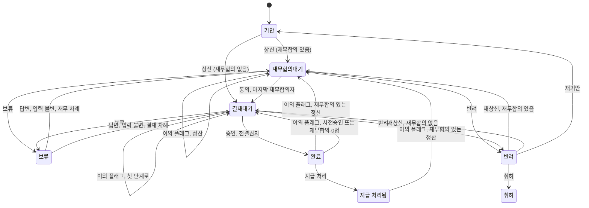

# 상태 어휘 독립 제안 — grok 레인 (#17)

- **날짜**: 2026-09-22
- **지위**: 독립 제안. 제품 코드가 아니고, 아래 코드 블록은 설명용 스케치다.
- **티켓**: [#17 반려의 후속 상태 정의](https://github.com/DHChe/E2EAI_business_proj/issues/17) (본문·댓글 확인 2026-09-22)
- **고치지 않은 것**: 이 파일 외의 저장소 문서는 읽기만 했다. ADR 0001–0022는 전제다. 그 문장과 갈리는 곳은 본문에서 **ADR 개정 제안**으로 표시하고, 규정 원문은 초안만 적어 #20으로 넘긴다.

이 레인의 추천을 한 줄로 말하면 다음과 같다. 결재 문서와 증빙·대사는 축을 나눈다. 사전승인·정산·재무합의의 반려는 모두 비종결 상태 `반려`로 기안자에게 가고, 재상신은 같은 결재선의 첫 단계부터이며, 기안자의 `취하`만 그 문서를 끝낸다. 항목별 부분 승인은 채택하지 않는다.

## 0. 축 — 결재 상태와 추출·대사 상태를 나눈다

**추천.** 결재 문서의 상태와 증빙·대사의 상태는 다른 축이다. 문서 쪽 되돌림은 한 벌만 둔다. 증빙 쪽의 "값만 고치고 재개"는 문서 상태를 옮기는 전이가 아니라, 필드 revision을 새로 쓰고 검산·대사를 코드로 다시 돌리는 일이다.

**논증.** 지금 문서도 이미 층을 나눠 적는다. 업무 상태·실행 상태(`job`)·표시 상태가 다르고, 사람 결재 대기는 문서 상태다(`docs/ARCHITECTURE.md:309`, `docs/adr/0011-messages-api-direct-waits-are-document-state.md:31-32`, `:43`). 대사의 닫힌 결과 타입은 `대사 완료` · `대사 불일치` · `짝 없음(증빙)` · `짝 없음(카드)`이고, 그 타입에 `짝 보류`가 없다(`docs/design/receipt-pipeline.md:835-839`). `짝 보류`와 `후보 복수`는 그 앞의 중간 상태다(`docs/design/receipt-pipeline.md:68`, `CONTEXT.md:310`). 상신 뒤에 생긴 짝 보류는 문서 상태를 바꾸지 않고 현재 단계의 승인·동의만 막는다(A10·C3, `docs/research/agent-architecture-comparison.md:57`, `:193`, `docs/ARCHITECTURE.md:315`). 반려는 문서 한 건이 단위다(`CONTEXT.md:79`). 이 둘을 한 상태 이름에 넣으면, 영수증 한 장의 중간 상태와 출장 문서 한 건의 결재가 같은 칸을 나눠 쓴다.

되돌아가는 전이가 두 벌이 되지 않게 하는 규칙은 하나다. **문서를 이전 단계로 되돌리는 이름은 문서 축에만 있다.** 그 이름은 `재상신`, `재기안`, `판정입력 변경으로 첫 단계 복귀`, `이의 플래그` 네 명령이고, 도착은 항상 그 문서의 첫 판단 단계다(재무합의자가 있는 정산은 `재무합의대기` 1단계, 그 밖은 `결재대기` 1단계). 증빙 축에는 단계 복귀라는 상태 이름을 두지 않는다. 사람이 값을 고치면 필드가 새 revision이 되고, 시스템은 재추출 없이 검산·대사를 다시 돌린다(`CONTEXT.md:315`, `docs/design/receipt-pipeline.md:69`). 그 결과가 문서의 판정 입력을 바꾸면, 문서 축의 복귀 명령 하나가 탄다. 바꾸지 않으면 문서 상태는 그대로고 막혀 있던 승인·동의만 풀린다.

#19 본문이 든 한 줄 기계 `processing → extracted → pending_review ⇄ corrected → reconciled | rejected`(`docs/research/receipt-parsing.md:250`)는 이 제안이 채택하는 문서 상태가 아니다. 그 글은 추출 파이프라인이 되돌아가는 일을 요구한다는 진단으로는 맞다(`:245-255`). 진단의 다음 수인 "반려와 값 수정이 같은 순환의 두 상태 이름"은 채택하지 않는다.

**기각한 대안.**

- 한 상태 기계에 추출 단계와 결재 단계를 이어 붙인다. 반려와 재추출이 같은 화살표를 쓴다. 기각 이유: 대사 결과는 증빙·카드 줄의 결과이고(`CONTEXT.md:310`), 반려는 문서 한 건의 행위다(`CONTEXT.md:79`). 같은 이름이면 짝 보류가 문서 상태를 바꾸지 않는다는 A10과 모순된다.
- 추출 어휘를 이 티켓에서 문서 상태로 다시 정의한다. 기각 이유: `추출 완료`, `검산 성공`·`검산 실패`·`검산 불가`, `추출 불확실`, 대사의 결과와 중간 상태는 이미 용어집과 파이프라인에 있다(`CONTEXT.md:296`, `:303`, `:310`, `docs/design/receipt-pipeline.md:60-72`). 이름을 문서 축에 복사하면 되돌림이 두 벌이 된다.
- 증빙 축을 비우고 모든 수정은 문서를 `반려`로 보낸다. 기각 이유: 수기 확정은 결재가 아니다(`CONTEXT.md:319`). 상신 전 값 수정에 반려를 쓰면 결재권자가 하지 않은 반려가 생긴다.

**틀리면 이렇게 보인다.** 한 건이 멈춘 이유가 문서 상태도, 증빙·대사 상태도, 승인·동의를 막는 가드도 아닌 셋째 이름으로만 설명된다. 또는 값 수정과 반려가 서로 다른 되돌림 상태 이름을 각자 갖게 되어, 같은 종류의 단계 복귀가 두 벌의 이름으로 구현된다.

## 1. 구간별 반려 — 셋 다 기안자의 `반려`, 재상신은 첫 단계, 취하만 종결

**추천.** 사전승인 반려, 정산 반려, 재무합의 반려의 도착 상태는 모두 같은 문서 상태 `반려`다. 종결이 아니다. 기안자가 `재상신`하거나 `재기안`하거나 `취하`한다. `취하`의 도착만 종결 상태 `취하`다. 세 반려 모두 기안자에게 가고, 직전 결재자나 총무에게 가지 않는다. 이미 기록된 승인·동의는 그 이벤트의 revision에만 남고, 다음 revision을 승인하지 않는다. 재상신은 결재선 구성원을 다시 계산하지 않고 첫 단계부터 다시 받는다. 결재선이 달라지는 수정만 `재기안`이다.

세 구간의 차이는 도착 상태가 아니라, 재상신 때 첫 단계가 어디인가이다.

| 반려를 한 자리 | 도착 | 재상신의 첫 단계 | 이 반려가 하지 않는 일 |
| --- | --- | --- | --- |
| 사전승인 결재권자 | `반려` | `결재대기` 1단계. 사전승인에는 재무합의가 없다(`APV-9-1`, `docs/company/approval-matrix.md:205`) | 출장 취소, 예약 취소, 위약금 확정 |
| 정산 결재권자 | `반려` | 재무합의자가 한 명이라도 있으면 `재무합의대기` 1단계. `APV-9-4`로 재무합의자가 0명이면 `결재대기` 1단계(`docs/company/approval-matrix.md:233`) | 자비 부담 확정, 급여 공제, 항목만 반려 |
| 재무합의자 | `반려` | 위와 같다. 재무합의 2단계가 반려해도 1단계로 돌아간다 | 직전 결재자에게 전달, 총무에게 전달 |

**논증.**

용어집은 반려를 "기안자가 고쳐서 다시 기안해야 한다"고 정의하고, 건 전체가 단위이며, 기안자에게 전달된 다음을 #17이 정한다고 적는다(`CONTEXT.md:79-81`). 다우오피스 원문은 반려 문서를 최초 기안자에게 전달하고, 이전 결재자에게 보내는 길을 운영자 설정으로 연다(`docs/research/korean-approval-grammar.md:210`). 그 운영자 설정은 채택하지 않는다. 정책의 원본은 규정 3종 안의 구조화 블록이다(`docs/PRD.md:91`). 화면 설정의 토글로 도착지를 바꾸지 않는다. 이전 결재자는 정산 문서의 내용을 고치는 사람이 아니다. 정산은 확정된 값 위에서 기안자가 기안한다(`PRC-11-2`, `docs/company/travel-procedure.md:192`).

재무합의는 기안자와 첫 결재자 사이에 있다(`APV-9-1`, `docs/company/approval-matrix.md:205`). 재무합의자가 반려할 때 직전 결재자는 아직 없다. 총무가 예약 증빙을 만들었더라도 반려의 도착은 총무가 아니다. 총무의 예약 연결과 근태 반영은 결재가 아니다(`PRC-8-3`, `docs/company/travel-procedure.md:152`). 증빙이 모자라면 기안자가 문서에 다시 붙인다. 총무에게 물을 일이 있으면 그것은 반려가 아니라, 이미 정의된 `보류`다(`CONTEXT.md:86`).

협조자와 재무합의의 비대칭은 이렇게 들어간다. 협조자가 반대해도 문서는 죽지 않고, 법령에는 협조 결렬을 이유로 문서를 반려·중단시키는 조항이 없다(`docs/research/korean-approval-grammar.md:74`). 이 저장소는 협조를 결재 역할로 쓰지 않는다(`CONTEXT.md:68`, `:102`). 따라서 협조자 반려 명령은 없다. 재무합의는 반려를 설정으로 끌 수 없다(`APV-9-3`의 `reject_always_allowed: true`, `docs/company/approval-matrix.md:228`). 하이웍스 원문도 합의자는 반려를 허용하지 않을 수 있고, 재무합의는 항상 반려를 허용한다고 적는다(`docs/research/korean-approval-grammar.md:276`). 상태 기계에서는 재량 관문(`gate=on`)과 짝 보류 가드가 승인·동의만 막고, 반려·보류는 그 가드 중에도 받는다(`docs/adr/0012-transition-audit-provenance-in-one-transaction.md:46`, A9 `docs/research/agent-architecture-comparison.md:56`). 재무합의자의 반려를 막는 가드는 두지 않는다.

이미 받은 승인의 효력. 문서의 효력은 마지막 결재자의 승인이 발생시킨다(`CONTEXT.md:72`). 완료 전에 난 반려는 아직 그 효력이 없는 문서를 기안자에게 되돌린다. 그 사이에 기록된 동의·승인은 감사에 그 revision으로 남는다. 재상신이 만든 새 revision을 승인하지는 않는다. 감사 이벤트는 revision을 갖는다(`docs/adr/0012-transition-audit-provenance-in-one-transaction.md:31`). 옛 동의를 새 본문에 이어 붙이면, 재무합의자가 본 증빙과 다시 올라온 증빙이 달라도 동의가 살아 남는다. 재상신은 그래서 항상 첫 단계부터다. 이것은 새 종류의 확인 자리를 더하는 일이 아니라, 같은 결재선을 새 revision에 대해 다시 걷는 일이다. 자리의 수는 물음 6에서 센다.

결재선을 다시 계산하는 조건은 `APV-11`이 이미 정한 것과 같다. 결재선은 기안 시점에 계산되어 확정되고 진행 중에 바뀌지 않는다(`APV-11-1`, `docs/company/approval-matrix.md:254`). 제5조·제7조·제7조의2의 입력이 달라져 결재선이 달라지는 수정은 재기안으로만 한다(`APV-11-2`, `:256`). 재상신은 그 입력이 선을 바꾸지 않을 때의 명령이다. 선을 바꾸는 수정은 `재기안`이고, 직책자는 그 재기안의 기안 시점 조직 정보로 정한다(`APV-8-3`, `:178`). 진행 중에 재량 판단이 이 입력을 바꾸는 경우는 여기서 정하지 않는다. #21이다.

사전승인 반려와 예약·위약금. 예약은 사전승인이 완료된 뒤에 착수한다(`PRC-4-2`, `docs/company/travel-procedure.md:91`). 완료 전의 반려는 예약 착수 전이다. 이 제안은 그 반려에 위약금 상태를 붙이지 않는다. 출장이 취소되었더라도 위약금 등 지출이 있으면 정산을 기안한다(`PRC-10-2`, `:179`). 위약금이 실제로 생겼다면 그것은 반려된 사전승인 문서의 다음 상태가 아니라, 별도 정산 문서의 청구다. 완료 전에 잡힌 예약의 위약금을 누가 부담하는지는 규정이 말하지 않는다. 조항 초안은 아래 규정 목록에 있고, 채택은 #20이다.

정산 반려와 자비·급여 공제. 한도를 넘은 부분은 출장자 본인이 부담하고(`TRV-11-1`, `docs/company/travel-policy.md:233`), 한도 초과 청구가 인정되지 않으면 그 초과분은 그 본인 부담이 된다(`TRV-12-4`, `:251`). 그것은 승인된 정산의 금액 계산이다. 반려의 결과가 아니다. 본인 부담액을 회사가 먼저 결제했으면 같은 정산에서 차액으로 정산하고, 반환의 방법과 시기는 이 규정이 정하지 않는다(`TRV-11-2`, `:235`). 급여 공제는 그 방법의 후보이고, 이 제안은 반려 상태에도 지급 상태에도 그 이름을 넣지 않는다. 순액이 반환인 건의 지급 처리가 무엇인지는 #17의 몫이다(`docs/PRD.md:86`). 여기서 정하는 것은 상태다. 재무팀의 `지급 처리` 한 명령이 지급 기한(`PRC-16-1`, `docs/company/travel-procedure.md:295`)을 닫고, 차액의 부호에 따라 사건의 `정산 방향`이 `지급` 또는 `반환`이다. 돈은 보내지 않는다(MVP 제외 사항 4, `docs/PRD.md:132`). 급여 공제와 계좌 입금은 실행하지 않는다. 방법의 문언은 #20으로 넘긴다.

반려에는 비어 있지 않은 사유가 필요하다 `[설계 가정]`. 규정은 사유를 의무로 적지 않았다. 이 가정은 Moveworks가 사유 없이 거절을 끝내지 않고, Agent Inbox는 `args: null`로 끝내는 화면 차이에서 온다(`docs/research/competitor-screens.md:104`, `:112`). 사유는 새 승인 지점이 아니라 기존 반려 명령의 입력이다.

**기각한 대안.**

- 세 반려가 서로 다른 종결 상태다. 사전승인은 출장 취소, 정산은 자비 확정, 재무합의는 직전 단계 복귀. 기각 이유: 사전승인 완료 전에는 예약이 착수되지 않고(`PRC-4-2`), 자비는 `TRV-12-4`의 금액 결과이며, 재무합의 앞에는 직전 결재자가 없다(`APV-9-1`).
- 반려는 종결이고 다시 올리려면 새 문서다. 기각 이유: 용어집은 고쳐서 다시 기안한다고 적는다(`CONTEXT.md:79`). 문서를 끊으면 같은 출장 사건의 감사가 갈라진다(`CONTEXT.md:112-115`).
- 반려한 사람 앞에서만 다시 받고, 그 앞 단계의 동의는 유지한다. 기각 이유: 반려의 통상 이유는 그 사람이 본 본문이 그대로는 안 된다는 것이다. 앞 단계의 동의를 유지하면 바뀐 증빙에 옛 동의가 남는다.
- 정산 반려를 항목 단위로 한다. 기각 이유: 부분 반려는 이미 채택하지 않았다(`CONTEXT.md:82`, `docs/adr/0003-approver-actions-three.md:41-42`). 항목별 부분 승인은 물음 4에서 따로 거절한다. 같은 거절이 아니다.
- 다우오피스처럼 이전 결재자 전달을 설정으로 연다. 기각 이유: 도착지가 운영자 설정이면 판정 근거가 조항이 아니다.

**틀리면 이렇게 보인다.** 재상신된 본문의 판정 입력(총액, 한도 적용 금액, 상향 사유, 사전승인과 정산의 차이)이 반려 직전 revision과 같은데, 첫 단계부터 다시 받은 승인의 체류가 첫 상신보다 짧고 본문 변경이 없다. 그때 첫 단계 재시작은 확인이 아니라 같은 클릭의 반복이다. 이 비교에 쓰는 93%는 Claude Code 승인 프롬프트 관찰이지 이 파이프라인의 승인률이 아니다(`docs/adr/0010-human-routing-bounded-by-structure-measured-by-ratio.md:56-57`, `docs/design/receipt-pipeline.md:2301`). 또 다른 반증: 완료 전 사전승인 반려인데도 회사 예약의 위약금이 그 문서 안에서 반복해 처리되어야 하면, 위약금을 상태 밖으로 둔 것이 틀리다.

## 2. 보류 무응답과 시간 — 경과해도 상태는 그대로다

**추천.** 답 없는 `보류`와, 기한이 지난 `결재대기`·`재무합의대기`는 상태를 바꾸지 않는다. 자동 승인, 자동 반려, 자동 취소, 상위 직책자로의 에스컬레이션은 두지 않는다. 기한 경과는 계산해서 문서에 표시한다. 상태 전이가 아니다.

두 시계를 섞지 않는다.

- 결재자 시계 `PRC-14-1`은 "자기 차례에 도달한 날부터 3영업일 이내에 승인(동의)·반려·보류 중 하나를 한다"이다(`docs/company/travel-procedure.md:269-279`). `보류`를 선택한 순간 그 도달에 대한 처리 의무는 닫힌다. 보류는 처리를 안 한 것이 아니라, 세 행위 중 하나를 한 것이다.
- 보류된 문서가 다시 그 결재자의 차례가 되면 그날을 새 도달일로 본다(`PRC-14-2`, `:283`). 답변을 기다리는 동안에는 새 `PRC-14-1`이 흐르지 않는다. 답변이 도착해 같은 대기 상태로 돌아온 뒤(`docs/adr/0003-approver-actions-three.md:25-26`, `CONTEXT.md:88`)부터 다시 센다.
- 문서 기한(사전승인 기안·사전승인 완료·정산 기안·지급)은 보류 중에도 계속 계산된다. 한 문서의 기한은 걸린 기한 중 가장 이른 것이다(`PRC-3-5`, `docs/company/travel-procedure.md:68`). 사내 기한은 저장하지 않고 계산한다(`PRC-3-1`, `:48`).

`PRC-14-3`은 "기한이 지난 뒤의 상태 전이는 이 규정이 정하지 않는다"고 적고, 결재 상태의 어휘는 이 규정의 소관이 아니라고 한다(`:285`). 이 제안이 그 빈칸에 넣는 어휘는 **빈 전이다.** 경과 사실은 문서에 표시하고(`PRC-15-1`, `:289`), 불이익은 정하지 않는다(`PRC-15-2`, `:291`). 아키텍처도 기한 경과는 표시만 하고 자동 반려·자동 승인도 없다고 적는다(`docs/ARCHITECTURE.md:300`). 기한 경과가 자동 전이를 일으키면 그 전이의 책임자 행을 다시 두라고 했는데(`:305`), 이 제안은 그 전이를 만들지 않으므로 책임자 행을 추가하지 않는다.

에스컬레이션이라는 말을 #19가 요구한 자리에 쓰지 않는 것이 아니다. 쓰는 뜻이 버튼이나 상태 이동이 아니다. 큐를 그리는 쪽은 경과 사실을 그 문서를 가진 사람에게 보이게 한다(물음 6의 화면). 보이게 하는 일은 조회 시 계산이다. 기한을 저장하지 않는 결정(`PRC-3-1`)과 맞는다. 자동 전이 명령이 들어오면 성공으로 기록하지 않고 `DEADLINE_IS_DISPLAY_ONLY`로 거절한다. 이것은 `UNDEFINED_BY_17`이 아니다. #17이 정한 거절이다.

답변 대기 전용 숫자 기한은 만들지 않는다 `[설계 가정]`. 규정에 그 기한이 없고, 기한에 재량을 넣지 않는 것이 이 규정의 저작 태도이다(`docs/company/travel-procedure.md:365`). 숫자를 여기서 고르면 규정이 정하지 않은 시계를 제품이 만든다. 문언이 필요하면 #20이다. 초안은 규정 목록에 둔다.

S10은 기한마다 닫는 사건이 정의되어 있을 것을 요구하고, 지급 기한의 닫는 사건은 지급 처리다(`docs/PRD.md:160`). 이 제안의 읽기 `[설계 가정]`: "정의되지 않은 기한 0"은 닫는 사건의 종류가 없는 기한을 세는 것이지, 아직 행위가 일어나지 않은 기한 인스턴스를 시각 경과로 억지 종료하라는 뜻이 아니다. `PRC-14-1`의 닫는 사건은 승인·동의·반려·보류 중 하나다. 그 행위가 아직 없으면 기한은 열린 채 표시된다. 순액 반환 건의 지급 기한은 `지급 처리`(방향 `반환`)가 닫는다.

**기각한 대안.**

- 무응답이 N영업일을 넘으면 자동 반려 또는 자동 취소. `docs/research/receipt-parsing.md:251`은 타임아웃 시 에스컬레이션 또는 자동 취소를 실무 패턴으로 적고 `[2차]`라고만 표시한다. 그 문장만으로 이 회사의 전이를 만들지 않는다. `PRC-15-2`는 불이익을 정하지 않는다.
- 무응답이면 상위 결재자에게 넘긴다. 기각 이유: 결재선은 진행 중에 바뀌지 않는다(`APV-11-1`). 상위자를 끼우면 선이 바뀌고, 확인하는 사람이 한 명 늘어난다.
- 보류 동안에도 `PRC-14-1`이 계속 흐르고, 그 경과가 보류를 끝낸다. 기각 이유: `PRC-14-1`의 세 행위 안에 보류가 들어 있고, 다음 시계는 `PRC-14-2`가 답변 뒤의 새 도달일에 시작한다.
- 경과 시 감사 이벤트를 매번 남긴다. 기각 이유: 기한은 저장하지 않는 계산값이라 경과 자체에는 전이도 감사 이벤트도 없다(`docs/ARCHITECTURE.md:298-300`). 표시는 계산으로 충분하다.

**틀리면 이렇게 보인다.** 답 없는 `보류`가 문서 기한을 넘긴 뒤, 기안자도 결재자도 답변·반려·취하 중 하나를 하지 않아 사전승인 완료 또는 지급이 놓치는 일이 시나리오에서 반복된다. 그때 표시만으로는 부족하다. 부족한 다음 수단이 자동 취소인지는 이 반증만으로 정해지지 않는다. 상위자 배정이 필요하다는 관측이 따로 있어야 한다. S10을 "#11이 모든 기한 인스턴스는 마감 시각에 닫는 행이 있어야 한다"로 읽으면, 표시-only는 그 시험을 통과하지 못한다.

## 3. 재심 — 첫 단계로 다시 걷고, 완료 건의 효력은 정지한다

**추천.** 이의 플래그는 감사자의 명령으로 남긴다. 승인 3종에 넣지 않는다(`docs/adr/0002-admin-read-only-audit-axis.md:65-66`). 플래그는 값을 고치지 않는다(`:25`). 문서는 그 문서에 실제로 있는 첫 판단 단계로 가고, 거기서부터 보통의 동의·승인 또는 반려로 걷는다. 재심이 끝난 뒤 저장해 둔 옛 단계로 점프하지 않는다.

도착은 문서 종류로 가른다.

| 문서 | 플래그의 도착 |
| --- | --- |
| 재무합의자가 1명 이상인 정산 | `재무합의대기` 1단계. ADR-0002의 문장 그대로다(`docs/adr/0002-admin-read-only-audit-axis.md:29`) |
| 재무합의자가 0명인 정산(`APV-9-4`) | `결재대기` 1단계 |
| 사전승인 | `결재대기` 1단계 |

둘째·셋째 행은 **ADR 개정 제안**이다. ADR-0002:29와 `CONTEXT.md:365`는 대상 건을 `재무합의대기`로 되돌린다고 적는다. 사전승인에는 그 상태가 없고(`APV-9-1`), #10은 그 명령을 `UNDEFINED_BY_17`로 거절해 두었다(`docs/research/agent-architecture-comparison.md:162`, `:239`, `docs/ARCHITECTURE.md:347`). `APV-9-4`로 단계가 사라지는 정산도 같은 구멍이다. 없는 상태를 만들지 않는다. 재무합의를 사전승인에 새로 붙이지도 않는다. 붙이면 `APV-9-1`이 금지한 사람을 결재선 밖에 세우게 된다.

플래그를 받을 수 있는 문서 상태는 `재무합의대기`, `결재대기`, `보류`, `완료`, `지급 처리됨`이다. `CONTEXT.md:365`가 적은 출발은 `완료`와 `진행중`이다. 이 제안에서 `진행중`·`결재선 진행`은 상태 이름이 아니라 `결재대기`의 단계 표시다(상태 표 앞의 설명). `보류`와 `지급 처리됨`을 출발에 넣는 것은 `CONTEXT.md:365`보다 넓다. 근거는 그 두 상태에도 재심을 열 문서가 있고, 열지 못하면 그 명령이 다시 미정이 되기 때문이다 `[설계 가정]`. `기안`·`반려`·`취하`에서는 플래그로 단계를 옮기지 않는다. `반려`는 이미 기안자에게 가 있다.

복귀. 재심의 끝은 새 `완료`이거나, 재심 중 `반려`다. 새 `완료`는 전결권자의 새 승인이다(`CONTEXT.md:51`). 옛 단계 번호로 돌아가지 않는다. ADR-0002가 재무합의의 처음으로 보내는 것과 같다. 처음으로 보내는 이상, 중간 단계만 다시 보는 북마크는 두지 않는다.

완료 건의 효력.

- 플래그는 효력을 취소하지 않는다. 취소는 결재 행위인데 admin은 결재선에 서지 않는다(`docs/adr/0002-admin-read-only-audit-axis.md:26`, `CONTEXT.md:366`).
- `완료` 또는 `지급 처리됨`에서 플래그가 열리면 표시 `효력 정지`를 붙인다. 상태 이름이 아니다. 정지가 막히는 명령은 `지급 처리`다. 거부 이름은 `EFFECT_SUSPENDED`.
- 이미 기록된 `지급 처리됨`은 지우지 않는다. 감사는 추가만 된다(`CONTEXT.md:358`). MVP는 송금을 하지 않는다(`docs/PRD.md:132`). 지급을 되돌리는 상태를 만들지 않는다.
- 재심이 새 `완료`로 끝나면 정지를 걷고, 그 승인이 새 효력이다. 옛 승인 이벤트는 revision과 함께 감사에 남는다.
- `지급 처리됨`이었던 건이 다시 `완료`가 되어도 두 번째 `지급 처리`를 자동으로 열지 않는다. 차액이 생기면 표시 `재정산 필요`만 남긴다. 회수 방법은 #20의 초안이다.
- 재심 중 반려되면 정지는 유지된다. 효력은 되살아나지 않는다. 기안자가 그 `반려`에서 `취하`하면 종결 이벤트에 효력 상실을 함께 적는다. 상실의 결재 행위는 admin의 플래그가 아니라, 재심 중 승인자의 반려와 기안자의 취하다.

수정값과 대사. 플래그 자체는 값을 바꾸지 않으므로 대사를 다시 돌리지 않는다. 그 뒤 기안자가 대사 입력을 고치면 증빙 축이 검산·대사를 다시 돌리고, 판정 입력이 바뀌면 물음 5의 같은 가드가 문서 축을 첫 단계로 되돌린다. 값을 아무도 안 고친 재심은 사람에게 짝 확인을 다시 묻지 않는다. 수기 확정 세션을 하나 더 열지도 않는다.

H1은 증빙 하나당 수기 확정 세션을 최대 1회로 둔다(`docs/design/receipt-pipeline.md:2308`). 이 제안은 그 1회를 `추출 불확실`을 닫는 세션으로 읽는다 `[설계 가정]`. `반려` 또는 재심 뒤의 `값 수정`은 그 세션의 재개가 아니라, 이미 확정된 필드의 새 revision이다. 이 읽기가 틀리면 H1과 충돌한다. 모순 절에 적는다.

**기각한 대안.**

- 사전승인도 `재무합의대기`를 만든다. 기각 이유: `APV-9-1`은 재무합의를 정산 문서에만 붙인다. 없는 역할을 재심 때문에 만들지 않는다.
- 플래그가 완료 건의 승인과 지급을 즉시 취소한다. 기각 이유: admin이 결재 행위의 행위자가 된다. ADR-0002가 금한다.
- 플래그 뒤에도 지급 처리를 그대로 허용한다. 기각 이유: 재심 중인 금액이 지급 기한을 닫을 수 있다. 정지는 새 사람을 부르지 않고 기존 지급 명령만 막는다.
- 재심이 끝날 때 플래그 당시의 단계로 돌아간다. 기각 이유: ADR-0002의 도착은 재무합의의 처음이다. 북마크를 두면 그 결정과 다른 두 번째 복귀가 생긴다.
- 플래그만으로 대사를 항상 다시 돌리고 사람에게 다시 확인받는다. 기각 이유: 값이 안 바뀌었는데 확인을 더하면 물음 6의 기본값인 "한 번 더"가 된다. 실패도 없다. 같은 짝을 다시 묻기 때문이다.

**틀리면 이렇게 보인다.** 사전승인 재심이 `결재대기` 1단계로 갔는데, 그 결재권자가 재무 증빙 검토 없이는 판단할 수 없는 사례가 반복된다. 그때 도착이 틀리다. 고칠 자리의 후보는 상태 이름보다 `APV-9-1`이다. 그 판단은 #20의 규정 개정이다. 또 다른 반증: `지급 처리됨` 재심 뒤 새 `완료`가 두 번째 `지급 처리`를 열어, 한 문서에 지급 기록이 둘 생긴다. 이 제안의 "두 번째는 자동으로 열지 않는다"가 그 기록을 막지 못하면 틀리다.

## 4. #19의 세 전이 — 재개는 증빙 축, 부분 승인은 거절, 타임아웃은 표시

셋은 액션 버튼이 아니다. #17 이슈의 범위 확장 댓글(확인 2026-09-22)과 ADR-0003이 그렇게 적는다(`docs/adr/0003-approver-actions-three.md:52-60`). 적용 단위, 재개 경로, 시간 조건으로 답한다.

### 4.1 값만 수정한 뒤의 재개

**추천.** 적용 단위는 필드다. 경로는 증빙 축이다. 사람은 값을 직접 넣고, 모델은 다시 부르지 않는다(`docs/design/receipt-pipeline.md:69`, `CONTEXT.md:315`). 검산과 대사는 코드가 다시 돈다. 문서 상태의 이름은 바뀌지 않는다.

허용되는 문서 상태는 `기안`, `반려`, 그리고 질문의 대상이 기안자인 `보류`다. `결재대기`·`재무합의대기`에서 기안자가 조용히 고치지 못한다. 승인자가 보고 있는 revision과 어긋나 명령이 `STALE_REVISION`이 되기 때문이다(`docs/ARCHITECTURE.md:240`). 고치려면 승인자가 `보류`하거나 `반려`한 뒤다. `보류` 답변이 판정 입력을 바꾸면 물음 5의 복귀가 함께 탄다. 답변만 있고 입력이 그대로면, 이미 정의된 대로 같은 승인자의 같은 대기로 돌아간다(`CONTEXT.md:88`).

**기각한 대안.** 문서 상태 `corrected`를 둔다. 기각 이유: 물음 0. 재추출이 필요 없다는 #19의 말은 모델 호출을 하나 더 하지 말라는 뜻이지, 문서 상태를 하나 더 만들라는 뜻이 아니다.

**틀리면 이렇게 보인다.** 값을 고쳤는데 검산·대사가 옛 값으로 정책 대조에 들어간다. 또는 `결재대기` 중에 기안자 수정이 성공해, 승인자의 카드 revision과 감사 revision이 다르다.

### 4.2 항목별 부분 승인 — 채택하지 않는다

**추천.** 채택하지 않는다. 명령 `항목별 부분 승인`은 `PARTIAL_APPROVAL_NOT_ADOPTED`로 거절한다. 문서의 승인·반려·보류는 건 하나다.

재량 "인정하지 않음"은 이와 다른 문제다. `TRV-12-4`는 한도 초과 청구가 인정되지 않으면 초과분이 본인 부담이 된다고 하고(`docs/company/travel-policy.md:251`), `TRV-13-4`는 일정 조건에서 왕복교통비도 안분한다고 한다(`:283`). 둘 다 문서가 한 번 승인된 뒤의 금액이다. 항목마다 결재 상태가 갈라지지 않는다. #8이 "사실상 항목별 부분 승인"이라고 넘겨 프로토타입에서 그 선택을 막아 둔 것은 입력이다([#8 결과 댓글](https://github.com/DHChe/E2EAI_business_proj/issues/8#issuecomment-5769586450), 확인 2026-09-22). 이 레인은 그 등치를 거부한다.

| | 부분 반려 (이미 거절) | 항목별 부분 승인 (이번에도 거절) | 재량 "인정하지 않음" (상태로 만들지 않음) |
| --- | --- | --- | --- |
| 단위 | 수신부서의 결재문서(`CONTEXT.md:82`) | 한 정산 안의 항목마다 승인 또는 보류 | 한 문서의 금액 |
| 상태 | 문서가 쪼개짐 | 문서가 쪼개짐 | 문서는 `완료` 하나. 지급액과 본인 부담액이 갈라짐 |
| 누가 | 수신부서 | 결재권자가 항목마다 | 조항의 `decided_by`. 판단 기록 뒤 문서 단위로 승인 |

#19의 "일부는 통과, 일부는 보류"(`docs/research/receipt-parsing.md:247`)는 항목 상태로 번역하지 않는다. 한 항목이 보류면 문서 전체가 기존의 `보류`다. 질문은 그 항목을 가리킨다. 통과한 항목만 먼저 지급하는 상태는 없다.

인정하지 않음의 기록이 총액이나 한도 적용 금액을 바꿔 결재선 구성이 달라지는 경우는 #21이다. 이 제안은 그 순간에 선을 다시 계산하지 않는다(`APV-11-1`). 구성이 그대로고 승인자가 본 금액만 바뀌면 물음 5의 첫 단계 복귀가 적용된다. 재기안·선 연장·최악값으로 미리 잡기 중 #21의 선택지는 고르지 않는다.

**기각한 대안.**

- 항목 상태 `승인됨`·`보류됨`을 둔다. 기각 이유: ADR-0003이 부분 반려를 거절한 이유가 상태가 항목 단위로 쪼개지기 때문이고(`:41-42`), 그 문장은 부분 승인을 자동으로 거절하지 말라고 경고한다(`:60`). 경고는 받았다. 쪼개짐의 비용은 부분 승인도 같다. 승인자 큐는 문서의 기한으로 서는 평평한 목록이다([#8 결과 댓글](https://github.com/DHChe/E2EAI_business_proj/issues/8#issuecomment-5769586450)의 정한 것 1, 확인 2026-09-22). 한 문서가 항목마다 다른 결재 상태면 그 목록의 한 칸이 두 기한을 가진다.
- 인정하지 않음을 부분 승인과 같은 명령으로 막는다. 기각 이유: 그러면 `TRV-12-4`와 `TRV-13-4`를 기록할 상태가 없다. 판단 책임자는 이미 재량 조항을 기록한다(`docs/adr/0012-transition-audit-provenance-in-one-transaction.md:46`). 기록의 결과가 본인 부담 금액이다.
- 부분 승인만 채택하고 부분 반려는 계속 거절한다. 기각 이유: 이름만 다르고 항목마다 상태가 생기는 것은 같다. #19가 둘을 다른 물건이라고 한 것은 수신부서 반려와 금액 판정을 구분하라는 경고로 읽고, 항목 상태 기계를 만들라는 요구로는 읽지 않는다.

**틀리면 이렇게 보인다.** 한 정산에서 다툼이 없는 항목의 지급이, 다른 항목 하나를 문서 전체 `보류`로 붙잡는 바람에 지급 기한(정산 완료일부터 5영업일, `PRC-16-1`)을 넘기는 일이 반복된다. 그때 항목 단위 상태는 다시 열 이유가 생긴다. 그 관측 전에는 열지 않는다.

### 4.3 타임아웃 뒤의 에스컬레이션

**추천.** 시간 조건은 물음 2와 같은 결정이다. 이미 규정에 있는 기한이 지나면 표시만 한다. 새 상태, 새 결재자, 자동 취소는 없다. 승인 3종 옆에 네 번째 버튼을 두지 않는다.

**기각한 대안.** 승인 대기 타임아웃을 상태 `에스컬레이션됨`으로 둔다. 기각 이유: 도착한 사람이 없고(`APV-11-1`), 닫는 사건은 여전히 사람의 승인·동의·반려·보류다.

**틀리면 이렇게 보인다.** 물음 2의 반증과 같다. 표시 후에도 현재 단계의 사람이 행위하지 않아 문서 기한이 놓치는 일이 반복된다.

## 5. 상신 뒤 새 짝 보류 — 문서는 그 단계에 있고, 입력이 바뀌면 첫 단계로

**추천.** A10·C3을 유지한다. 상신 뒤에 생긴 `짝 보류`(그리고 재무합의자에게 배정된 값 모순 짝 확인)는 문서 상태를 바꾸지 않고, 현재 단계의 승인·동의만 막는다. 반려와 보류는 그 동안에도 받는다(`docs/ARCHITECTURE.md:313-316`).

풀린 뒤의 재개 지점은 두 갈래다.

1. 짝이 `대사 완료`·`대사 불일치`·`짝 없음` 중 하나로 닫히고(`docs/design/receipt-pipeline.md:835-839`), 총액·한도 적용 금액·상향 사유·사전승인과 정산의 차이 목록이 승인자가 본 revision과 같으면, 문서 상태와 단계 번호는 그대로다. 이미 기록된 승인·동의는 그 revision에 대해 유효하다. 현재 단계의 승인·동의 가드만 풀린다.
2. 그 입력 중 하나라도 바뀌고, `APV-8`로 계산한 결재선 구성원이 고정된 선과 같으면, 명령 `판정입력 변경으로 첫 단계 복귀`가 문서를 첫 단계로 보낸다. 행위자는 짝을 닫거나 값을 고친 사람이다. 에이전트가 아니다(`CONTEXT.md:331`). 이전 승인·동의는 옛 revision의 감사로 남고 새 revision을 승인하지 않는다.
3. 바뀐 입력 때문에 `APV-11-2`의 결재선이 달라지면, 단계 번호를 옮기지 않는다. 가드 `재기안 필요`가 승인·동의를 `LINE_CHANGE_REQUIRES_REDRAFT`로 거절한다. 기안자가 `재기안`하기 전까지 문서 상태의 이름은 유지된다. 반려는 계속 가능하다. 재량 판단이 같은 종류의 입력 변화를 만들 때 선을 재기안할지, 늘릴지, 최악값으로 미리 잡을지는 #21이다. 이 갈래 3은 짝 해소와 기안자의 값 수정에만 `APV-11-2`를 적용한 것이다.

이미 준 승인을 무조건 유지하지 않는 이유: 승인 이벤트는 revision에 묶인다(`docs/adr/0012-transition-audit-provenance-in-one-transaction.md:31`). 총액이 바뀐 뒤에도 앞 단계의 동의를 현재 본문의 동의로 세면, 그 사람은 다른 금액을 본 것이다. 무조건 첫 단계로 돌리지 않는 이유: 짝이 같은 금액으로 닫히면 앞 사람이 다시 볼 실패가 없다. 승인 프롬프트를 하나 더 여는 기본값이 된다(`docs/design/receipt-pipeline.md:2301`).

**기각한 대안.**

- 짝이 풀리면 항상 문서를 `반려`로 보낸다. 기각 이유: 짝 해소는 결재권자의 반려가 아니다. 반려 상태를 쓰면 행위자가 없어진다.
- 짝이 풀려도 총액이 바뀌어도 이전 승인을 유지하고 현재 단계만 연다. 기각 이유: 앞 승인자의 감사 revision과 완료 revision이 다른 금액을 가리킨다.
- 짝이 풀릴 때마다 결재선을 다시 계산한다. 기각 이유: `APV-11-1`. 구성이 바뀌는 경우의 처리 방식 전체를 #21이 고르기 전에, 짝 해소가 선을 바꿔 버리게 두지 않는다.

**틀리면 이렇게 보인다.** 짝 해소가 총액을 바꿨는데 이전 승인이 유지된 채 전결권자만 새 금액을 보고 `완료`가 된다. 반대로, 총액·한도 적용 금액·상향 사유·차이 목록이 그대로인데도 매번 첫 단계로 돌아가 같은 사람들이 같은 본문을 다시 승인한다.

## 6. 사람 확인 지점 — 종류는 늘리지 않고, 취하 행위만 하나 더한다

기준선은 `docs/ARCHITECTURE.md:367-380`의 사람 자리이다. 이 제안은 그 표를 대체하지 않는다. 증감만 센다.

승인·동의 프롬프트의 종류는 **+0**이다. 결재선에 없는 사람을 호출하지 않는다. 항목마다 프롬프트를 만들지 않는다. 재심 전용 위원회를 만들지 않는다. 값을 안 바꾼 재심에서 짝 확인을 다시 묻지 않는다. 기한 경과로 사람을 하나 더 부르지 않는다.

새로 생기는 사람 행위는 **+1**, 기안자의 `취하`다. 승인 프롬프트가 아니다. `반려`에 있는 기안자가 문서를 끝내는 명령이다.

같은 종류의 승인·동의가 **조건부로 반복**되는 경우는 셋이다. 자리의 종류가 늘어난 것은 아니다.

| 반복이 생기는 때 | 누가 다시 보는가 | 이 반복이 없을 때의 실패 |
| --- | --- | --- |
| `재상신` | 고정된 선의 첫 단계부터 전결권자까지 | 재무합의자가 증빙 집합 E1에 동의했다. 기안자가 영수증을 바꾼 E2로 다시 올렸다. E1의 동의가 E2를 승인한다. S11은 그 동의가 어느 revision인지 되짚지 못한다(`docs/PRD.md:161`) |
| 판정 입력이 바뀐 짝 해소·값 수정·보류 답변 | 위와 같다. 선 구성이 달라질 때는 반복 대신 `재기안` 가드 | 앞 사람이 승인한 총액과 완료된 총액이 다르다 |
| `이의 플래그` 뒤의 재심사 | 그 문서의 첫 단계부터 | 완료 건이 플래그만 달고 옛 `완료`로 남으면, admin이 절차를 다시 연다는 ADR-0002(`:29`, `:60`)가 상태 위에 없다 |

`취하`가 없을 때의 실패: `반려` 문서가 기한 경과 표시만 가진 채 기안자 큐에 남고, 그 출장 문서가 끝났는지 감사가 답하지 못한다. 자동 취소로 대신하면 `PRC-15-2`의 불이익 금지를 제품이 어긴다.

`지급 처리`의 방향 `반환`은 새 자리가 아니다. 같은 재무팀 명령이다(`docs/ARCHITECTURE.md:378`, `docs/PRD.md:86`). 이 분기가 없을 때의 실패: 순액이 반환인 건의 지급 기한에 닫는 사건이 없다(`docs/PRD.md:160`, `TRV-11-2`).

사전승인 이의 플래그의 도착을 `결재대기` 1단계로 두는 것은 새 역할이 아니다. 없는 `재무합의대기`를 만들지 않기 위한 도착 변경이다.

넣지 않아서 줄어드는 프롬프트는 항목별 부분 승인의 항목 수만큼이다. 물음 4에서 거절한 결과다.

**틀리면 이렇게 보인다.** 재상신·재심에서 반복된 승인·동의가, 본문을 열지 않은 채 첫 상신과 같거나 더 높은 비율로 통과한다. 그때 그 반복은 확인이 아니다. 비율을 재는 설계는 #11이다(`docs/PRD.md:147`). 이 제안은 임계값을 정하지 않는다.

## 상태 표

용어집의 `진행중`과 `결재선 진행`은 이 표의 상태 이름이 아니다. `진행중`은 마지막이 아닌 결재권자가 승인한 뒤의 말로 쓰이고(`CONTEXT.md:74`), `결재선 진행`은 사전승인·정산 생애의 말로 쓰인다(`CONTEXT.md:121`, `:128`). 이 제안의 문서 상태는 그 구간에서 `결재대기` 하나이고, 누구의 차례인지는 단계 번호다 `[설계 가정: 이름 대응]`. 대응이 틀리면, 아무도 차례가 아닌데 `진행중`으로 보여야 하는 화면이 생긴다.

단계 번호, `재심중`, `효력 정지`, `재정산 필요`, `재기안 필요`, `정산 방향`, `기한 경과`는 상태가 아니다. `기한 경과`는 저장하지 않는 계산이다(`PRC-3-1`).

증빙 축은 이미 있는 이름만 적는다. 이 제안이 새로 만드는 문서 상태 이름은 `취하`뿐이다. `반려`는 용어집에 이미 있고(`CONTEXT.md:81`), 이 제안이 그 다음 출구를 정한다.

| 상태 | 축 | 정의 | 들어오는 전이 | 나가는 전이 | 이 상태에서 기다리는 사람 |
| --- | --- | --- | --- | --- | --- |
| `기안` | 문서 | 상신 전. 초안은 판정 입력이 아니다(`docs/ARCHITECTURE.md:368`) | 없음. 또는 `재기안` | `상신`. 값 수정은 상태를 안 바꾼다 | 기안자 |
| `재무합의대기` | 문서 | 정산의 재무합의자 k의 차례. 동의 전에는 결재선이 진행되지 않는다(`APV-9-1`) | `상신`, 앞 단계 `동의`, `보류` 답변, `재상신`, 첫 단계 복귀, 이의 플래그 | `동의`, `반려`, `보류` | 그 단계의 재무합의자 |
| `결재대기` | 문서 | 결재권자 i의 차례 | 마지막 재무 `동의`, 앞 결재권자 `승인`, 사전승인 `상신`, `보류` 답변, `재상신`, 첫 단계 복귀, 이의 플래그 | `승인`, `반려`, `보류` | 그 단계의 결재권자 |
| `보류` | 문서 | 승인자가 기안자 또는 에이전트에게 묻는 상태. 그 승인자의 큐에 남고 진행은 멈춘다(`CONTEXT.md:86-88`) | `보류` | 답변 뒤 같은 단계의 대기. 답변이 판정 입력을 바꾸면 첫 단계 복귀. 이의 플래그 | 보류한 승인자. 답변 대상이 기안자이면 기안자도 본다. 대상이 에이전트이면 답변 `job`이 돈다. 에이전트는 결재 행위자가 아니다(`CONTEXT.md:331`) |
| `반려` | 문서 | 결재권자 또는 재무합의자가 건 전체를 기안자에게 되돌린 상태. 종결이 아니다 | `반려` | `재상신`, `재기안`, `취하`. 값 수정은 상태를 안 바꾼다 | 기안자 |
| `완료` | 문서 | 전결권자 승인이 효력을 발생시킨 상태(`CONTEXT.md:72`). 지급이 아니다(`CONTEXT.md:129`) | 전결권자 `승인`. 재심이면 새 효력 | `지급 처리`(정산, `효력 정지`가 아닐 때), 예약 확정 연결·근태 반영(사전승인, 결재가 아님 `PRC-8-3`), 이의 플래그 | 지급 처리 전 정산은 재무팀. 사전승인의 예약·근태는 총무·인사. 결재 큐의 승인자는 아니다 |
| `지급 처리됨` | 문서 | 재무팀의 `지급 처리`가 지급 기한을 닫은 상태. `정산 방향`은 `지급` 또는 `반환`. 송금은 없다 | `지급 처리` | 이의 플래그. 방향 `반환`이어도 같은 상태 | 없음 |
| `취하` | 문서 | 기안자가 `반려`에서 문서를 끝낸 상태. 이 제안이 추가하는 이름 | `취하` | 없음 | 없음 |
| `추출 불확실`이 열린 필드 | 증빙 | 지면의 값을 확정하지 못한 상태. 정책 대조 전에 닫힌다(`CONTEXT.md:303`) | 추출·규칙·대사 신호 | 수기 확정 또는 재촬영·`확정 불가` | 기안자(수기 확정). 화면의 형태는 #25 |
| `검산 성공` / `검산 실패` / `검산 불가` | 증빙 | 숫자가 맞는지의 구조적 결과(`CONTEXT.md:296`) | 검산 | 문서 전이 없음. `검산 실패`는 사람 수정 또는 재촬영의 입력 | `검산 실패`이고 판정 입력이면 기안자 |
| `후보 복수` | 증빙 | 카드 줄 후보가 둘 이상(`CONTEXT.md:310`) | 대사 | 사람이 고르면 닫힌 대사 결과 | 기안자 |
| `짝 보류` | 증빙 | 후보는 하나이나 자동 확정이 막힘. 닫힌 결과 타입에는 없다(`docs/design/receipt-pipeline.md:835-839`) | 대사 | 짝 해소 → `대사 완료` / `대사 불일치` / `짝 없음` | 값 모순이면 재무합의자, 그 밖은 기안자(`CONTEXT.md:310`). 상신 뒤에는 현재 승인자의 승인·동의도 막힌다 |
| `대사 완료` / `대사 불일치` / `짝 없음` | 증빙 | 닫힌 대사 결과 | 자동 확정 또는 사람의 짝 해소 | 문서 전이 없음. 결과가 판정 입력을 바꾸면 문서 축 복귀 가드 | 없음 |
| 명세 미도착 | 증빙 | 카드 명세가 아직 없는 대기. `짝 없음`이 아니다(`docs/design/receipt-pipeline.md:68`) | 이용 내역·청구 명세 전 | 명세가 오면 대사 | 청구 명세를 가져오는 재무팀(`docs/ARCHITECTURE.md:377`). 문서 상태를 바꾸지 않는다 |

## 전이 표

모든 명령은 기대 revision을 들고 온다. 어긋나면 `STALE_REVISION`이다(`docs/ARCHITECTURE.md:225`, `:240`, C8 `docs/research/agent-architecture-comparison.md:198`). 아래 표의 가드는 그에 더해지는 조건이다. 결재 4행위의 행위자는 현재 단계의 사람이고, 에이전트는 거절된다(`docs/adr/0012-transition-audit-provenance-in-one-transaction.md:35`, `CONTEXT.md:331`). 자기 결재는 거절된다(`APV-8-2`, `docs/company/approval-matrix.md:176`). 감사의 `responsible_person_id`는 사람이다(ADR-0012 결정 2).

`actor_kind`는 `person` · `agent` · `system`이다(`docs/adr/0012-transition-audit-provenance-in-one-transaction.md:29`).

| 출발 | 행위자(actor_kind) | 사건·명령 | 가드 | 도착 | 감사 이벤트 | 근거(파일:줄) |
| --- | --- | --- | --- | --- | --- | --- |
| `기안` | person, 기안자 | `상신` | 판정 입력의 `추출 불확실`이 닫혀 있다. 정산은 확정값 위(`PRC-11-2`) | 재무합의자가 있으면 `재무합의대기` 1단계, 없으면 `결재대기` 1단계 | `document.submitted` | `docs/company/approval-matrix.md:205`, `docs/company/travel-procedure.md:192`, `CONTEXT.md:303` |
| `재무합의대기` k | person, 그 재무합의자 | `동의` | `gate=on`이면 재량 기록이 있다. 짝 보류·값 모순 가드가 없다. `재기안 필요`·`효력 정지`가 아니다 | 다음 재무합의자가 있으면 k+1, 없으면 `결재대기` 1단계 | `document.finance_agreed` | `docs/company/approval-matrix.md:235`, `docs/adr/0012-transition-audit-provenance-in-one-transaction.md:46` |
| `결재대기` i, 전결권자 아님 | person, 그 결재권자 | `승인` | 동의와 같은 가드 | `결재대기` i+1 | `document.approved_step` | `CONTEXT.md:74` |
| `결재대기` i, 전결권자 | person, 전결권자 | `승인` | 동의와 같은 가드 | `완료`. `재심중`이면 `효력 정지`를 걷는다. 이전 상태가 `지급 처리됨`이었으면 두 번째 지급을 열지 않고, 차액이 있을 때만 `재정산 필요` | `document.completed` | `CONTEXT.md:51`, `CONTEXT.md:72` |
| `재무합의대기` 또는 `결재대기` | person, 현재 단계 승인자 | `반려` | 관문·짝 보류로 막지 않는다. 사유가 비어 있지 않다 `[설계 가정]` | `반려`. 기존 동의·승인은 그 revision에만 남는다. `완료`에서 온 재심이면 `효력 정지` 유지 | `document.rejected` | `CONTEXT.md:81`, `docs/company/approval-matrix.md:228`, `docs/research/agent-architecture-comparison.md:56` |
| `재무합의대기` 또는 `결재대기` | person, 현재 단계 승인자 | `보류` | 질문이 비어 있지 않다 `[설계 가정]`. 대상은 기안자 또는 답변기 | `보류`. 이번 `PRC-14-1` 도달은 이 행위로 닫힌다 | `document.held` | `CONTEXT.md:86-88`, `docs/company/travel-procedure.md:269` |
| `보류` | person 기안자, 또는 system(답변 `job` 수락. 책임자는 질문한 승인자) | `보류 답변` | 판정 입력이 안 바뀌었다. 답변기가 재량 조항을 값으로 정하지 않는다 | 같은 단계의 `재무합의대기` 또는 `결재대기`. `PRC-14-2`의 새 도달일 | `document.hold_answered` | `docs/adr/0003-approver-actions-three.md:25-26`, `docs/company/travel-procedure.md:283`, `docs/PRD.md:155` |
| `반려` | person, 기안자 | `재상신` | `APV-8`의 선 구성이 고정된 선과 같다. 정산이면 확정값 | 첫 단계 | `document.resubmitted` | `docs/company/approval-matrix.md:254`, `docs/company/travel-procedure.md:192` |
| `반려` 또는 `기안` | person, 기안자 | `재기안` | 제5조·제7조·제7조의2 입력이 달라 선이 달라진다 | `기안`. 조직 정보는 재기안 시점(`APV-8-3`) | `document.redrafted` | `docs/company/approval-matrix.md:256`, `:178` |
| `반려` | person, 기안자 | `취하` | 없음. `효력 정지`가 있으면 효력 상실을 같은 트랜잭션에 적는다 | `취하` | `document.withdrawn` | 이 제안 `[설계 가정]`. 감사는 한 트랜잭션(`docs/adr/0012-transition-audit-provenance-in-one-transaction.md:23`) |
| `재무합의대기`, `결재대기`, `보류`, `완료`, `지급 처리됨` | person, 내부감사 | `이의 플래그` | 값 수정이 아니다. 자기가 기안·수기 확정·결재에 관여한 건이 아니다 | 재무합의자가 있는 정산은 `재무합의대기` 1단계, 그 외는 `결재대기` 1단계. `재심중`. `완료`·`지급 처리됨`이면 `효력 정지` | `document.reopened` | `docs/adr/0002-admin-read-only-audit-axis.md:25-29`, `:48`. 사전승인과 `APV-9-4`의 도착은 ADR 개정 제안 |
| `완료` | person, 재무팀 | `지급 처리` | `효력 정지`가 아니다. 재심 재완료 후의 두 번째 지급이 아니다 | `지급 처리됨`. 차액이 0보다 작으면 `정산 방향=반환`, 아니면 `지급` | `document.payment_recorded` | `docs/PRD.md:86`, `:132`, `docs/company/travel-procedure.md:295`, `docs/company/travel-policy.md:235` |
| `결재대기` 또는 `재무합의대기` 또는 `보류`(답변과 함께) | person, 값을 바꾼 기안자 또는 짝을 닫은 사람 | `판정입력 변경으로 첫 단계 복귀` | 총액·한도 적용 금액·상향 사유·차이 목록이 바뀌었다. 선 구성은 같다 | 첫 단계. 이전 동의·승인은 옛 revision에 남는다 | `document.inputs_changed_rewound` | `docs/adr/0012-transition-audit-provenance-in-one-transaction.md:31`, `docs/company/approval-matrix.md:254` |
| 위와 같은 출발 | person, 값을 바꾼 사람 | 값 수정 또는 `짝 해소` | 바뀐 입력으로 선 구성이 달라진다 | 상태 이름 유지. 가드 `재기안 필요`. 승인·동의는 `LINE_CHANGE_REQUIRES_REDRAFT` | `document.redraft_required` | `docs/company/approval-matrix.md:256`. 재량 경로의 선택지는 #21 |
| 대기·보류·반려 어느 쪽이든 | system | 기한 경과로 상태를 바꾸는 명령 | 항상 거절 | 같은 상태. 표시는 계산 | 거부 `DEADLINE_IS_DISPLAY_ONLY`. 성공 감사 없음 | `docs/company/travel-procedure.md:285`, `:289-291`, `docs/ARCHITECTURE.md:300` |
| 정산 문서 | person | `항목별 부분 승인` | 항상 거절 | 같은 상태 | 거부 `PARTIAL_APPROVAL_NOT_ADOPTED` | `CONTEXT.md:82`, `docs/adr/0003-approver-actions-three.md:60` |
| `추출 불확실` 또는 확정된 필드 | person, 기안자 | `값 수정` | 문서가 `기안`·`반려`·(대상이 기안자인)`보류`이다. 재추출 호출이 없다 | 증빙 축에서 검산·대사 재실행. 문서 상태 이름은 유지. 판정 입력이 바뀌면 복귀 행 | `field.corrected` | `CONTEXT.md:315`, `docs/design/receipt-pipeline.md:69` |
| `짝 보류` 또는 `후보 복수` | person, 막힌 이유의 담당자 | `짝 해소` | 값 모순은 재무합의자, 그 밖은 기안자 | 닫힌 대사 결과. 문서 상태 이름은 유지. 입력이 그대로면 승인·동의 가드만 해제 | `reconciliation.resolved` | `CONTEXT.md:310`, `docs/design/receipt-pipeline.md:835-839`, `docs/research/agent-architecture-comparison.md:57`, `:193` |

예약 확정 연결(총무)과 근태 반영(인사)은 결재 전이가 아니다(`PRC-8-3`). 이 표에 결재 행으로 넣지 않는다. 사전승인 `완료` 뒤에 문서 결재 상태를 바꾸지 않고 인계 기록만 남긴다(`docs/company/travel-procedure.md:148-152`).

## 상태 그림

설명용이다. 구현이 아니다. 단계 번호와 가드는 그림 밖의 데이터다.



증빙 축은 문서 상태와 나란히 있고, 문서 그림의 화살표가 아니다.

```text
설명용 — 구현 아님
추출 불확실 ──값 수정(사람)──▶ 검산·대사 재실행 ──▶ 대사 완료 | 대사 불일치 | 짝 없음
짝 보류 | 후보 복수 ──짝 해소(사람)──▶ 같은 닫힌 결과
명세 미도착 ──명세 도착(시스템)──▶ 대사

판정 입력(총액, 한도 적용 금액, 상향 사유, 차이 목록)이 바뀌면
문서 축의 「첫 단계 복귀」 또는 「재기안 필요」 하나만 탄다.
```

## `UNDEFINED_BY_17` 대조

2026-09-22에 워크트리 루트에서 `grep -rn "UNDEFINED_BY_17\|#17" docs CONTEXT.md`로 모은 50줄이다. 다른 레인의 제안 파일은 검색 대상에 없었고, 결과에도 없었다.

이 제안이 채택되면 리듀서는 미정이라는 이유로 `UNDEFINED_BY_17`을 성공 대신 돌려주지 않는다. 각 자리의 도착 또는 이름 붙은 거부가 있다. 구현 전에 저장소의 리듀서 문장을 이 문서가 고치지는 않는다.

| 자리(파일:줄) | 지금의 거절 | 네 안에서의 도착 | 여전히 거절이면 그 이유 |
| --- | --- | --- | --- |
| `CONTEXT.md:81` | 거절 명령이 아님. `반려` 다음이 미정 | `반려`에서 `재상신`·`재기안`·`취하` | 아니오 |
| `CONTEXT.md:82` | 거절 명령이 아님. 부분 승인은 #17이 판정 | 부분 승인 명령은 거절. 재량 인정하지 않음은 금액 | `PARTIAL_APPROVAL_NOT_ADOPTED` |
| `CONTEXT.md:88` | 거절 명령이 아님. 무응답 보류가 미정 | 상태 유지, 기한은 표시 | 자동 전이만 `DEADLINE_IS_DISPLAY_ONLY` |
| `CONTEXT.md:212` | 거절 명령이 아님. 반환 방법·시기가 미정 | 상태로는 `지급 처리`의 방향 `반환`. 방법의 문언은 #20 | 급여 공제·계좌 입금 명령은 없다(MVP는 송금하지 않음, `docs/PRD.md:132`) |
| `CONTEXT.md:365` | 거절 명령이 아님. 재심 복귀·효력·대사가 미정 | 첫 단계부터 재심사, `효력 정지`, 값이 바뀔 때만 대사 | 아니오. 사전승인 도착은 ADR 개정 제안 |
| `CONTEXT.md:402` | 거절 명령이 아님. 용어집 미결 목록 | 물음 0–4가 그 목록을 닫는다. 용어집 문장은 고치지 않음 | 아니오 |
| `docs/adr/0002-admin-read-only-audit-axis.md:5` | 거절 명령이 아님. 맥락 티켓 표시 | 물음 3 | 아니오 |
| `docs/adr/0002-admin-read-only-audit-axis.md:63` | 거절 명령이 아님. 넘긴 질문 목록 | 물음 3 | 아니오 |
| `docs/adr/0003-approver-actions-three.md:3` | 거절 명령이 아님. provisional 선언 | 3종은 유지. 부분 승인은 거절. 보류 무응답은 상태 유지 | 부분 승인만 거절 |
| `docs/adr/0003-approver-actions-three.md:5` | 거절 명령이 아님. 맥락 티켓 | 위와 같음 | 아니오 |
| `docs/adr/0003-approver-actions-three.md:42` | 거절 명령이 아님. 부분 반려가 #17과 얽힌다는 이유 | 부분 반려의 거절을 유지 | 부분 반려는 계속 거절(기존 결정) |
| `docs/adr/0003-approver-actions-three.md:46` | 거절 명령이 아님. 시험 선언 | 물음 1–3이 그 시험의 답 | 아니오 |
| `docs/adr/0003-approver-actions-three.md:60` | 거절 명령이 아님. 부분 승인은 #17이 판정 | 채택하지 않음 | `PARTIAL_APPROVAL_NOT_ADOPTED` |
| `docs/adr/0014-apv-9-3-exposed-declaratively.md:76` | 거절 명령이 아님. 비차단 재무합의를 #17이 요구하면 ADR 반증 | 이 제안은 비차단 재무합의를 요구하지 않는다. `APV-9-3` 판 1을 유지 | 해당 없음 |
| `docs/adr/0014-apv-9-3-exposed-declaratively.md:79` | 거절 명령이 아님. 용어집 :402를 #17로 가리킴 | `CONTEXT.md:402` 행과 같음 | 아니오 |
| `docs/adr/0011-messages-api-direct-waits-are-document-state.md:5` | 거절 명령이 아님. 맥락 티켓 | 물음 1–3 | 아니오 |
| `docs/adr/0011-messages-api-direct-waits-are-document-state.md:35` | `UNDEFINED_BY_17`의 범위 정의. 보류 답변 복귀는 제외 | 네 자리 모두 도착 또는 이름 붙은 거절이 있다 | 자동 타임아웃 전이만 거절 |
| `docs/adr/0011-messages-api-direct-waits-are-document-state.md:36` | 리듀서가 `UNDEFINED_BY_17`을 돌려줌 | 구현 시 그 버킷을 이 표의 전이·거절로 바꿈. 문서가 리듀서를 고치진 않음 | 정의된 거절은 성공이 아님(S11) |
| `docs/adr/0011-messages-api-direct-waits-are-document-state.md:37` | S11의 미정 성공 금지 | 미정을 성공으로 처리하지 않음 | 정의된 거절은 성공이 아님 |
| `docs/adr/0011-messages-api-direct-waits-are-document-state.md:96` | 거절 명령이 아님. 정하면 표 행을 더하라 | 이 문서의 전이 표가 그 행 | 아니오 |
| `docs/adr/0011-messages-api-direct-waits-are-document-state.md:98` | 거절 명령이 아님. 액션 집합을 데이터로 | 3종 유지, 역할별 가드는 데이터. 부분 승인은 데이터에 넣지 않음 | 아니오 |
| `docs/adr/0010-human-routing-bounded-by-structure-measured-by-ratio.md:66` | 거절 명령이 아님. 기한을 넘긴 멈춤의 전이는 #17 | 멈춘 건도 자동 전이 없음. 표시만 | `DEADLINE_IS_DISPLAY_ONLY` |
| `docs/adr/0012-transition-audit-provenance-in-one-transaction.md:83` | 거절 명령이 아님. #17의 교차 규칙이 DB에 안 들어가면 반증 4 | 복귀 가드는 명령 처리기 가드. DB 제약으로 못 옮기면 반증 4가 열린다. 지금 열렸다고 주장하지 않음 | 아니오 |
| `docs/adr/0012-transition-audit-provenance-in-one-transaction.md:95` | 거절 명령이 아님. 화면의 "#17 대기" | 반려 명령을 서버는 받고, 도착은 `반려` | 아니오 |
| `docs/adr/0012-transition-audit-provenance-in-one-transaction.md:97` | 거절 명령이 아님. 화면 미정을 #17로 읽은 `[유도]` | 화면 문구는 아래 화면 절. 레이아웃은 #12 | 아니오 |
| `docs/ARCHITECTURE.md:241` | `UNDEFINED_BY_17` 이름 정의 | 버킷을 전이와 `DEADLINE_IS_DISPLAY_ONLY`로 대체 | 자동 전이만 거절 |
| `docs/ARCHITECTURE.md:305` | 거절 명령이 아님. 자동 전이가 생기면 책임자 행 | 자동 전이를 만들지 않음. 행을 추가하지 않음 | 아니오 |
| `docs/ARCHITECTURE.md:316` | 반려 이후는 `UNDEFINED_BY_17` | `반려`의 출구 세 명령 | 아니오 |
| `docs/ARCHITECTURE.md:324` | 그림의 반려가 미정 | 그림의 `반려`에 출구가 있다 | 아니오 |
| `docs/ARCHITECTURE.md:347` | 사전승인 이의 플래그를 #17로 넘김 | `결재대기` 1단계. ADR 개정 제안 | 아니오 |
| `docs/ARCHITECTURE.md:361` | 재상신 자리가 비어 있음 | `재상신`·`재기안`·`취하` | 아니오 |
| `docs/ARCHITECTURE.md:379` | 플래그 도착은 `재무합의대기`, 복귀는 `UNDEFINED_BY_17` | 정산(재무 있음)은 그대로. 복귀는 첫 단계부터 `완료` 또는 `반려` | 사전승인에 `재무합의대기`를 만드는 명령은 거절(ADR 개정 제안) |
| `docs/ARCHITECTURE.md:478` | 거절 명령이 아님. 미닫힘 목록 | 물음 3 | 아니오 |
| `docs/ARCHITECTURE.md:479` | 거절 명령이 아님. 미닫힘 목록 | 물음 1–3 | 아니오 |
| `docs/PRD.md:86` | 거절 명령이 아님. 순액 반환의 지급 처리가 #17 | `지급 처리`, 방향 `반환` | 송금·급여 공제 명령은 없다 |
| `docs/PRD.md:143` | 거절 명령이 아님. 미결 목록 | 물음 1, 2, 4와 반환 방향 | 부분 승인과 자동 타임아웃은 거절 |
| `docs/PRD.md:160` | 거절 명령이 아님. 순액 반환의 닫는 사건이 #17 전엔 별도 표시 | 닫는 사건은 `지급 처리` | 아니오 |
| `docs/PRD.md:161` | 미정 후속을 성공으로 처리하지 않음 | 정의된 전이만 성공. 정의된 거절은 성공이 아님 | `DEADLINE_IS_DISPLAY_ONLY`, `PARTIAL_APPROVAL_NOT_ADOPTED` |
| `docs/PRD.md:177` | 거절 명령이 아님. 정하지 않는 것 표 | 이 문서가 그 칸의 제안 | 아니오 |
| `docs/research/tech-stack-comparison.md:100` | 문장이 반려·보류 이후를 한 덩어리로 `UNDEFINED_BY_17`에 넣음. ADR-0011:35 정정 전 표현 | 보류 답변 복귀는 이미 정의된 전이라 거절하지 않음. 나머지 미정은 이 제안이 닫음 | 자동 타임아웃만 거절. 이 문장은 고치지 않음 |
| `docs/research/tech-stack-comparison.md:154` | 거절 명령이 아님. 프로토타입 "#17 대기" | 반려 버튼의 도착은 `반려` | 아니오 |
| `docs/research/tech-stack-comparison.md:155` | 거절 명령이 아님. 화면에서 반려를 언제 열지 #17이 확인 | 서버는 반려를 받는다(ADR-0012 결정 9). 가드로 반려를 숨기지 않는다. 버튼의 그림은 #12 | 아니오 |
| `docs/research/receipt-parsing.md:253` | 거절 명령이 아님. #17과의 관계 정정 | 물음 0이 그 관계의 답 | 아니오 |
| `docs/research/receipt-parsing.md:255` | 거절 명령이 아님. 같은 순환이라는 결론 | 같은 순환의 두 상태 이름은 채택하지 않음. 축을 나눔 | 아니오 |
| `docs/design/receipt-pipeline.md:2665` | 거절 명령이 아님. 재개·값 수정·재심 대사를 #17로 넘김 | 물음 3, 4.1, 5 | 아니오 |
| `docs/research/agent-architecture-comparison.md:36` | 거절 명령이 아님. 반려 이후 #17 | 물음 1 | 아니오 |
| `docs/research/agent-architecture-comparison.md:56` | 반려 이후 `UNDEFINED_BY_17`이 합의 A9에 적힘 | `반려`의 출구를 정의. 반려·보류를 가드로 막지 않는 A9는 유지 | 아니오 |
| `docs/research/agent-architecture-comparison.md:57` | 짝 보류의 재개 상태가 #17 | 물음 5. 문서 상태는 그대로, 입력 변경 시 첫 단계 | 아니오 |
| `docs/research/agent-architecture-comparison.md:213` | 거절 명령이 아님. 후속 목록 | 물음 3 | 아니오 |
| `docs/research/agent-architecture-comparison.md:239` | 거절 명령이 아님. 교차 검증이 #17로 귀결 | `결재대기` 1단계 | 아니오 |

## 화면에 드러나는 것

그림, 색, 레이아웃은 #12와 #25의 몫이다. `docs/ui-guide.md:22-23`은 컴포넌트 스펙을 아직 두지 않는다. 여기에는 누가, 어느 큐에서, 어떤 문장을 봐야 하는지만 적는다. 승인 카드와 보류 답변에 승인 권고·반려 권고를 싣지 않는다(`CONTEXT.md:373`, `docs/PRD.md:141`).

| 상태 또는 표시 | 누구의 큐 | 보여야 하는 문구 | 실으면 안 되는 것 |
| --- | --- | --- | --- |
| `기안` | 기안자 | "아직 상신하지 않은 문서" | 결재 버튼 |
| `재무합의대기` | 그 단계의 재무합의자 | "재무합의 차례. 동의 · 반려 · 보류"와 단계 번호 | 결재권자의 승인 버튼. 동의 권고 |
| `결재대기` | 그 단계의 결재권자 | "결재 차례. 승인 · 반려 · 보류"와 단계 번호. 전결권자면 "이 승인이 문서의 효력을 발생시킨다"(`CONTEXT.md:72`) | 승인 권고 |
| `보류` | 보류한 승인자. 대상이 기안자이면 기안자 큐에도 | "보류. 질문은 이것이다." 질문 본문, 질문한 사람 이름, 대상(기안자 또는 답변기). 승인자 쪽에는 "답변이 오기 전에는 승인·동의가 없다" | 자동으로 끝날 시각. 이 제안은 답변 기한을 만들지 않는다 |
| `반려` | 기안자 | "반려되었다." 반려한 사람의 이름과 역할(결재권자 또는 재무합의자), 사유, "재상신 · 재기안 · 취하" | 항목만 반려되었다는 문구. 급여 공제·자비 확정이라는 문구 |
| `완료` | 정산은 재무의 지급 처리 목록. 사전승인은 총무·인사의 인계 목록 | 정산: "결재가 끝났고 지급 처리는 아직이다." 사전승인: "결재가 끝났다. 예약 착수 대상이다."(`PRC-4-2`) | 지급이 끝났다는 문구 |
| `지급 처리됨` | 없음. 조회에서만 | 방향 `지급`이면 "지급 처리를 기록했다. 송금은 하지 않았다." 방향 `반환`이면 "반환 의무를 기록했다. 돈은 움직이지 않았다. 회수 방법은 규정 밖이다." | 급여 공제를 실행했다는 문구 |
| `취하` | 없음. 조회에서만 | "기안자가 취하했다." 재심에서 왔으면 "이전 효력은 상실로 기록되었다." | 승인자가 취소했다는 문구 |
| `효력 정지` | 재심의 현재 단계 큐 | "내부감사가 재심을 열었다. 이전 효력은 정지되어 있고, 지급 처리는 할 수 없다." | admin이 금액을 고쳤다는 문구. admin은 값을 못 고친다(`docs/adr/0002-admin-read-only-audit-axis.md:25`) |
| `재정산 필요` | 재무의 지급 처리 목록 | "재심 뒤 차액이 있다. 두 번째 지급 처리는 자동으로 열리지 않았다." | 자동 환수 버튼 |
| `재기안 필요` | 기안자. 현재 승인자에게는 승인·동의가 막힌 이유 | "금액을 반영하면 결재선이 달라진다. 재기안하기 전에는 승인·동의를 할 수 없다. 반려는 할 수 있다." | 선이 이미 바뀌었다는 문구. #21이 정하기 전에는 진행 중 재계산을 하지 않는다 |
| `짝 보류`가 상신 후 | 짝의 담당자 큐. 현재 승인자의 카드 | 담당자: 막힌 조건. 승인자: "짝 보류가 있는 동안 승인·동의를 할 수 없다. 반려·보류는 할 수 있다." | 문서 상태가 바뀌었다는 문구 |
| `기한 경과` | 그 문서를 가진 사람의 큐 | "기한이 지났다." 어느 기한인지 조항 식별자(`PRC-15-1`) | 불이익, 자동 취소, 상위자 이관(`PRC-15-2`) |
| 수기 확정·짝 확인·보류 답변의 화면 형태 | 기안자 또는 재무합의자 | 문구의 내용만 위 행. 형태는 #25 | 에이전트가 읽은 값을 미리 채움(`CONTEXT.md:315`) |

## 규정 변경 필요 목록

규정 파일은 고치지 않았다. 초안은 이 제안의 문장이고, 채택은 #20이다. `PRC-14-3`이 결재 상태의 어휘는 출장관리규정의 소관이 아니라고 하므로(`docs/company/travel-procedure.md:285`), 상태 이름을 규정 조항에 넣지 않는다.

| 조항(새 번호 또는 기존) | 초안 문언 | 왜 필요한가 | 넘길 곳 |
| --- | --- | --- | --- |
| 신설 `PRC-14-4` | 제14조의 기한이 지나도 문서는 승인·반려·취소로 바뀌지 않는다. 경과 사실은 제15조에 따라 표시한다. 보류 중 답변을 기다리는 데에는 이 규정의 별도 기한을 두지 않는다. | `PRC-14-3`이 경과 뒤 전이를 비워 두었다. 이 제안은 빈 전이를 골랐고, 그 선택을 규정 문언으로 남기지 않으면 제품과 조항이 어긋난다 | #20 |
| 신설 `TRV-11-4` | 제2항의 반환에 대해 이 규정은 급여 공제와 계좌 입금 중 어느 것도 정하지 않는다. 같은 정산의 차액을 기록하는 일과, 그 기록을 누가 하는지만 정산의 지급 처리로 둔다. | `TRV-11-2`는 방법과 시기를 정하지 않는다고 이미 말한다(`docs/company/travel-policy.md:235`). 급여 공제를 반려의 결과로 읽지 못하게 그 침묵을 유지한다고 적는다 | #20 |
| 신설 `PRC-4-3` | 사전승인 문서가 완료 전에 반려된 것은 예약의 취소가 아니다. 완료 전에 생긴 예약의 위약금을 회사가 부담하는지 여부는 이 규정이 정하지 않는다. 위약금 지출이 있으면 제10조 제2항의 정산으로 기안한다. | `PRC-4-2`는 완료 후 착수만 말하고, 완료 전 위약금의 부담자는 없다. 상태 기계에 위약금 상태를 넣지 않는 이유 | #20 |
| 기존 `TRV-11-2` | 본문은 유지. "방법과 시기는 이 규정이 정하지 않는다"를 `TRV-11-4`가 풀어 설명한다 | 상태 제안이 이 침묵을 급여 공제로 메우지 않았음을 조항에 남긴다 | #20 |
| 신설하지 않음 — 상태 이름 `반려`·`취하` | 없음 | `PRC-14-3` 후문이 상태 어휘를 이 규정의 소관 밖으로 둔다 | 용어집 반영은 구현 때 `CONTEXT.md`. #22의 현재 빈칸이 아니다 |

## ADR 후보

가번호다. `docs/adr/`에 쓰지 않았다. 되돌리기 어려운 것만 골랐다. 상태 이름 하나를 화면 문구로만 쓰는 결정은 여기 넣지 않는다.

### ADR-0023 — 결재 문서와 증빙·대사는 다른 축이다

- **결정**: 문서 상태와 증빙·대사 상태를 한 열거형으로 합치지 않는다. 문서를 이전 단계로 보내는 명령은 문서 축에만 두고, 증빙 축의 값 수정은 그 명령의 입력이 될 뿐 별도 되돌림 상태가 아니다.
- **기각한 대안**: `docs/research/receipt-parsing.md:250`의 한 줄 기계. 모든 수정을 `반려`로 보내는 안.
- **반증**: 물음 0의 반증. 셋째 이름이 필요해지거나 되돌림 이름이 두 벌이 된다.
- **개정 제안 여부**: 아님. ARCHITECTURE §7의 세 층(`:309`)과 A10을 상태 어휘로 밀어서 적은 것이다.

### ADR-0024 — 반려는 비종결이고, 승인·동의는 그 revision에만 효력이 있다. 항목별 부분 승인은 두지 않는다

- **결정**: `반려`의 출구는 `재상신`·`재기안`·`취하`다. 재상신은 고정된 선의 첫 단계부터다. 선이 달라지는 수정만 `재기안`이다(`APV-11-2`). 부분 승인 상태는 두지 않고, `TRV-12-4`·`TRV-13-4`의 인정하지 않음은 문서 하나의 금액이다.
- **기각한 대안**: 종결 반려, 반려자 앞에서만 재개, 항목 상태, 이전 결재자 전달 설정.
- **반증**: 물음 1과 물음 4.2의 반증.
- **개정 제안 여부**: ADR-0003은 provisional이고 이 결정이 그 시험을 닫는다(`docs/adr/0003-approver-actions-three.md:3`). 3종 액션 자체는 뒤집지 않는다. 부분 반려 거절은 유지한다.

### ADR-0025 — 기한 경과는 문서 전이가 아니다

- **결정**: `PRC-14-3`의 빈칸은 빈 전이로 채운다. 자동 승인·자동 반려·자동 취소·상위자 에스컬레이션은 없다. 경과를 전이로 만드는 명령은 `DEADLINE_IS_DISPLAY_ONLY`다. 답변 대기 전용 기한 숫자는 제품이 만들지 않는다.
- **기각한 대안**: 자동 취소, 상위자 이관, 보류 중에도 `PRC-14-1`이 보류를 끝낸다.
- **반증**: 물음 2의 반증.
- **개정 제안 여부**: 아님. `docs/ARCHITECTURE.md:300`과 `PRC-15-2`를 타임아웃 자리에 적용한 것이다. 자동 전이를 나중에 넣으면 `:305`의 책임자 행을 그때 연다.

### ADR-0026 — 재심은 첫 단계부터 다시 걷고, 완료의 효력은 정지한다

- **결정**: 플래그의 끝은 새 `완료` 또는 `반려`다. `완료`·`지급 처리됨`에서 열리면 `효력 정지`로 `지급 처리`를 막되, 지급 기록은 지우지 않는다. 값이 안 바뀌면 대사를 다시 묻지 않는다. 사전승인과 재무합의자가 0명인 정산의 도착은 `결재대기` 1단계다.
- **기각한 대안**: 즉시 효력 취소, 지급을 그대로 허용, 플래그 당시 단계로 복귀, 사전승인용 `재무합의대기` 신설.
- **반증**: 물음 3의 반증.
- **개정 제안 여부**: **ADR-0002 개정 제안.** `:29`의 "대상 건을 `재무합의대기`로 되돌린다"는 재무합의자가 있는 정산에만 그대로 둔다. 그 상태가 없는 문서는 `결재대기` 1단계로 보낸다고 예외를 적는다. `CONTEXT.md:365`도 같은 예외가 필요하다. 이 제안은 그 파일을 고치지 않는다.

## 사용자에게 물을 것

근거로 닫지 못한 자리만 둔다. 각 항목의 첫 선택지가 이 레인의 추천이다. 추천으로 이미 문서를 썼고, 여기서 고르면 그 자리가 바뀐다.

### U1. `취하`한 사전승인과 출장 사건의 관계

- **문서만 끝고 출장 사건은 남는다. 위약금이 있으면 별도 정산.** 추천. 약점: 큐와 조회에 "문서가 없는 출장"이 남고, 그걸 취소로 읽을 수 있다.
- **취하가 곧 출장 취소다.** 약점: `PRC-10-2`의 위약금 정산과 한 문서 안에서 겹치고, 재상신 전에 취하한 계획과 실제로 취소된 출장이 같은 상태가 된다.
- **취하를 두지 않고 반려는 재상신만 된다.** 약점: 기안자가 포기한 문서가 `반려`에 남는다. 물음 6의 `취하` 실패가 그대로다.

### U2. 완료된 정산을 재심하는 동안 지급을 막을지

- **아직 지급 처리 전이면 막는다. 이미 기록된 지급 처리는 지우지 않는다.** 추천. 약점: 재심이 길어지면 지급 기한 표시가 쌓인다. 불이익은 없지만 재무 큐에 멈춘 건이 보인다.
- **막지 않는다. 플래그는 사후 열람이다.** 약점: 재심 중인 금액으로 지급 기한이 닫힌다.
- **플래그가 효력을 즉시 취소한다.** 약점: admin이 승인자가 된다. ADR-0002:26과 충돌한다.

### U3. 보류 답변에 숫자 기한을 새로 만들지

- **만들지 않는다. 이미 있는 문서 기한의 경과만 표시한다.** 추천. 약점: 답 없는 보류가 문서 기한보다 길게 남을 수 있고, 그 사이 결재자 시계는 `PRC-14-2` 때문에 흐르지 않는다.
- **답변 기한을 N영업일로 규정에 신설하고, 지나도 상태는 그대로 둔 채 표시만 한다.** 약점: N을 고르는 근거가 규정에 없다. 기한은 재량이 아니어야 한다(`docs/company/travel-procedure.md:365`).
- **N영업일이 지나면 자동 반려한다.** 약점: `PRC-15-2`가 불이익을 정하지 않는다. 기안자가 출장 중이면 답변 전에 문서가 죽는다.

### U4. 반환을 상태 이름에 어디로 적을지

- **상태 이름은 `지급 처리됨` 하나이고, 사건의 방향만 `지급` 또는 `반환`이다. 급여 공제와 계좌 입금은 이름에 없다.** 추천. 약점: 화면만 보면 돈이 어디로 가는지 안 보인다. MVP가 송금을 하지 않으므로 그 안 보임은 지금 단계의 사실과 같다(`docs/PRD.md:132`).
- **종결 상태를 `지급 처리됨`과 `반환 의무 기록됨`으로 둘로 나눈다.** 약점: 같은 명령·같은 사람이 상태 이름만 둘이다. 큐가 갈라진다.
- **급여 공제를 세 번째 상태로 둔다.** 약점: `TRV-11-2`가 방법을 정하지 않는다고 말한 자리를 제품이 정한다. 실행도 못 한다.

## 경계

이 티켓의 본문으로 정하지 않고 넘긴다. 넘긴 티켓의 선택지를 여기서 고르지 않는다.

| 티켓 | 넘기는 것 | 이 제안이 이미 말해 버린 것과의 경계 |
| --- | --- | --- |
| #21 | 재량 판단(`TRV-7-1`, `TRV-13-4`, 그리고 결재선 입력을 바꾸는 다른 재량)이 진행 중에 기준 단계를 올리거나 내릴 때, 재기안인지, 선 연장인지, 최악값으로 미리 잡는지. 화면의 "판단 전 값" 표시 | 짝 해소와 기안자 값 수정에는 `APV-11-2`를 적용해, 선이 달라지면 `재기안 필요` 가드만 둔다. 재량 판단의 세 선택지는 고르지 않았다. 인정하지 않음이 금액만 바꾸고 선 구성이 같으면 물음 5의 복귀를 쓴다 |
| #20 | `PRC-14-4`·`TRV-11-4`·`PRC-4-3` 초안의 채택. 복수 결재권자의 `decided_by`. `APV-9-4`로 재무합의가 사라지는 귀결의 규정 보완. 개정권 조항의 문언. 위약금 부담자 | 상태 기계는 부담자를 정하지 않는다. `decided_by`가 비어 관문이 교착하는 문제는 그대로 #20이다(`docs/ARCHITECTURE.md:475`) |
| #22 | "열린 의무"를 용어로 올릴지. `수기 확정` 정의가 기안 폼까지 포함하는지. `현재 걸린 기한`, `승인 카드 도달 전`, 재량 판단 블록의 이름 | 가드를 설명했을 뿐 "열린 의무"를 용어로 채택하지 않았다. `수기 확정`의 정의 문장(`CONTEXT.md:315`)을 고치지 않았다 |
| #25 | 수기 확정·짝 확인·보류 답변 화면의 형태. `APV-9-3` 값을 어느 화면에 둘지 | 큐와 문구만 적었다 |
| #11 | 재상신·재심 반복 승인의 체류·열람 여부, R1–R4, H1 세션 집계가 `값 수정`을 두 번째 세션으로 셀지 | 임계값을 정하지 않았다. 반증 조건을 #11이 재는 관측으로 적었다 |
| #12 | 기한 경과와 효력 정지의 시각 표현. `docs/ui-guide.md`가 금지하는 장식 | 문장만 적었다 |

## 기존 문서와의 모순

이 제안이 기존 문장과 다르게 가는 곳과, 고치지 않고 발견한 기존 문서끼리의 어긋남을 구분한다.

### 이 제안이 기존 문장과 다른 곳

- `docs/adr/0002-admin-read-only-audit-axis.md:29`와 `CONTEXT.md:365`는 이의 플래그의 도착을 `재무합의대기`로 적는다. 이 제안은 그 상태가 없는 문서를 `결재대기` 1단계로 보낸다. ADR 개정 제안(ADR-0026).
- `CONTEXT.md:365`의 출발은 `완료`와 `진행중`이다. 이 제안은 `보류`와 `지급 처리됨`에서도 플래그를 받는다 `[설계 가정]`.
- `docs/research/receipt-parsing.md:250`의 한 줄 상태 기계와 `:255`의 "같은 순환 위의 두 지점"은 채택하지 않는다. 축을 나눈다(물음 0).
- `docs/design/receipt-pipeline.md:2308`의 H1(증빙당 수기 확정 세션 최대 1회)과, 반려 후 `값 수정`을 새 세션으로 세지 않는 이 제안의 읽기는 충돌할 수 있다. 하드 규칙을 바꾼다고 선언하지 않는다. 읽기가 틀리면 H1이 이긴다.
- `CONTEXT.md:81`, `:88`, `:212`, `:402`와 `docs/PRD.md:86`, `:143`, `:177`은 아직 "미정 — #17"이라고 적는다. 이 제안이 그 미정을 닫아도 그 문장은 그대로다. 구현 전에 용어집을 고치지 않는다.

### 기존 문서끼리 이미 어긋나 있고, 이 제안이 고치지 않는 것

- `docs/research/tech-stack-comparison.md:100`은 "#17이 정하지 않은 전이(반려·보류 이후, 재심 복귀, 타임아웃)"라고 적어, 보류 답변 뒤의 복귀까지 미정인 것처럼 읽힌다. `docs/adr/0011-messages-api-direct-waits-are-document-state.md:35`는 그 복귀를 미정에서 뺐다. #9 비교 문서가 #10의 정정 전 문장을 유지한 것이다.
- `docs/adr/0012-transition-audit-provenance-in-one-transaction.md:97`은 프로토타입의 "#17 대기"를 반려 뒤 상태가 미정인 화면으로 읽되 `[유도]`라고 표시한다. 화면에서 반려 버튼을 언제 열지는 그 ADR이 정하지 않는다고 같은 단락이 말한다(`:95-98`의 읽기). 이 제안은 서버가 반려를 받고 도착이 `반려`라고 정한다. 버튼의 시각 디자인은 #12다.

그 밖의 전제(ADR 0001–0022의 채택된 결정, A9의 "반려·보류는 가드로 막지 않는다", A10의 "짝 보류는 문서 상태를 바꾸지 않는다", `APV-11-1`, `PRC-15-2`)와 이 제안이 같은 방향으로 간다. 위에 적은 것 외에 모순은 없다.

## 설명용 스케치 — 구현 아님

```text
axes:
  document: 기안 | 재무합의대기 | 결재대기 | 보류 | 반려 | 완료 | 지급 처리됨 | 취하
  evidence: 기존 추출·검산·대사 이름. 문서 열거형에 넣지 않는다.
markers (not states):
  재심중, 효력 정지, 재정산 필요, 재기안 필요
  정산 방향: 지급 | 반환
  기한 경과: 저장하지 않고 PRC-3으로 계산

every command:
  expected_revision 필수
  mismatch → STALE_REVISION
  actor_kind of 승인·동의·반려·보류 = person
  agent → 결재 명령 거절

rewinds on the document axis only:
  재상신 | 재기안 | 판정입력 변경으로 첫 단계 복귀 | 이의 플래그
evidence 값 수정은 rewind 이름이 아니다.
판정 입력이 바뀌면 위 넷 중 해당하는 하나와만 만난다.
```
